# 모듈 스타일 라이브러리

완성 사이트의 화면 모듈을 캡처와 스타일 코드로 남긴 참고 자료. **참고만 하고 가져다 쓰지 않는다.**

- 사이트 소스는 서로 독립이다. 앱이 다른 앱이나 `library/` 를 import 하면 `scripts/check-isolation.mjs` 가 배포를 막는다.
- 새 사이트는 여기서 리듬·밀도·구조 아이디어만 얻고 레이아웃·서체·색·카피는 다시 설계한다(design-diversity 스킬).
- 스타일 코드는 렌더링된 마크업에서 문구를 `…` 로 바꾸고 반복 항목을 접은 것이다. 클래스는 Tailwind v4 + 각 사이트 globals.css 의 토큰을 따른다.
- 갱신: `npm run build:sites && npm run library` (사이트 하나만: `npm run library -- <slug>/<variant>`). 캡처 대상은 `library/config.json`.

## 사이트

| 사이트 | 유형 | 지문 | 모듈 |
|---|---|---|---|
| [피부과 · lumiere](medical-dermatology/lumiere/README.md) **대표** | 몰입형 · 영상과 따뜻한 사진으로 신뢰를 주는 프리미엄 피부과 | immersive / video / ivory·ink·champagne gold | 18 |
| [세무사무소 · almanac](pro-tax-office/almanac/README.md) **대표** | 지면형 · 설명과 신고 기한을 앞세운 사무소, 신문·연감 같은 단정함 | editorial / statement / paper·ink·vermilion | 17 |
| [세무사무소 · trust](pro-tax-office/trust/README.md) | 클래식 신뢰형 · 차콜·골드와 명조, 세무사 프로필과 정돈된 정보 구조 | swiss-grid / split-media / charcoal·paper·yellow gold | 15 |
| [법률사무소 · docket](pro-law-firm/docket/README.md) **대표** | 타이포형 · 사건이 어떤 순서로 흘러가는지 먼저 보여 주는 동네 법률사무소 | typographic / ticker / oxblood·cream·ink | 15 |
| [인테리어·리모델링 · forme](space-interior/forme/README.md) **대표** | 공간 아카이브형 · 생활 방식과 재료의 질감을 보여주는 리모델링 스튜디오 | spatial-archive / landscape-photo-with-caption / warm gray · olive · charcoal | 8 |

## 종류별

### 상단 띠 `banner`

| 미리보기 | 모듈 | 사용 사이트 |
|---|---|---|
|  | [상단 공지 띠 `top-banner`](medical-dermatology/lumiere/README.md#상단-공지-띠-top-banner) | `medical-dermatology/lumiere` |
|  | [상단 공지 띠 `top-banner`](pro-tax-office/trust/README.md#상단-공지-띠-top-banner) | `pro-tax-office/trust` |

### 헤더 `header`

| 미리보기 | 모듈 | 사용 사이트 |
|---|---|---|
|  | [헤더 `header`](medical-dermatology/lumiere/README.md#헤더-header) | `medical-dermatology/lumiere` |
|  | [마스트헤드 `masthead`](pro-tax-office/almanac/README.md#마스트헤드-masthead) | `pro-tax-office/almanac` |
|  | [헤더 `header`](pro-tax-office/trust/README.md#헤더-header) | `pro-tax-office/trust` |
| 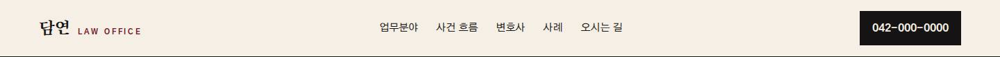 | [헤더 (모바일 가로 메뉴 포함) `header`](pro-law-firm/docket/README.md#헤더-모바일-가로-메뉴-포함-header) | `pro-law-firm/docket` |
|  | [공간 스튜디오 헤더 `header`](space-interior/forme/README.md#공간-스튜디오-헤더-header) | `space-interior/forme` |

### 히어로 `hero`

| 미리보기 | 모듈 | 사용 사이트 |
|---|---|---|
|  | [히어로 `home-hero`](medical-dermatology/lumiere/README.md#히어로-home-hero) | `medical-dermatology/lumiere` |
|  | [한 문장 히어로 `home-hero`](pro-tax-office/almanac/README.md#한-문장-히어로-home-hero) | `pro-tax-office/almanac` |
|  | [히어로 `home-hero`](pro-tax-office/trust/README.md#히어로-home-hero) | `pro-tax-office/trust` |
| 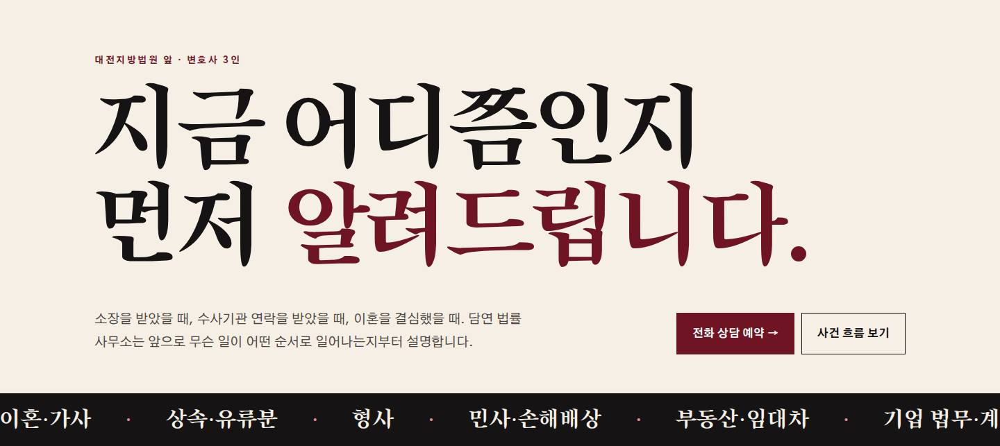 | [초대형 타이포 + 업무 띠 `home-hero`](pro-law-firm/docket/README.md#초대형-타이포--업무-띠-home-hero) | `pro-law-firm/docket` |
|  | [공간 사진과 프로젝트 캡션 `hero`](space-interior/forme/README.md#공간-사진과-프로젝트-캡션-hero) | `space-interior/forme` |

### 소개 `intro`

| 미리보기 | 모듈 | 사용 사이트 |
|---|---|---|
|  | [약속·소개 `home-promise`](medical-dermatology/lumiere/README.md#약속소개-home-promise) | `medical-dermatology/lumiere` |
|  | [대표 칼럼 `home-column`](pro-tax-office/almanac/README.md#대표-칼럼-home-column) | `pro-tax-office/almanac` |
|  | [세 가지 약속 `about-principles`](pro-tax-office/almanac/README.md#세-가지-약속-about-principles) | `pro-tax-office/almanac` |
| 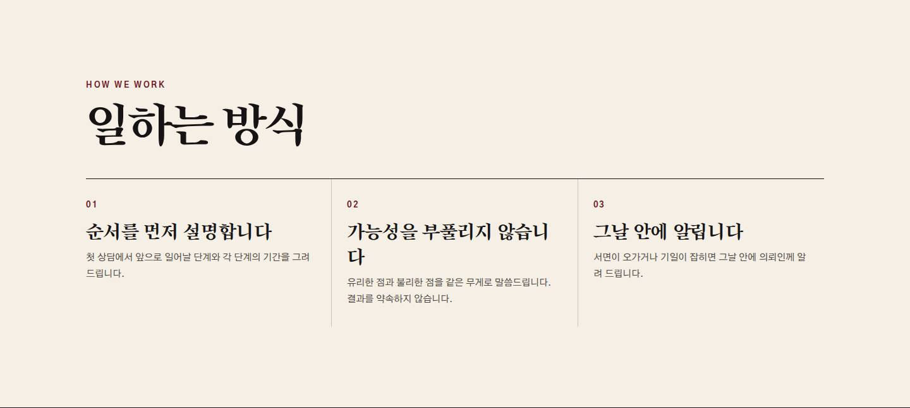 | [일하는 방식 `attorneys-principles`](pro-law-firm/docket/README.md#일하는-방식-attorneys-principles) | `pro-law-firm/docket` |

### 찾기·필터 `finder`

| 미리보기 | 모듈 | 사용 사이트 |
|---|---|---|
|  | [고민별 찾기 `home-concerns`](medical-dermatology/lumiere/README.md#고민별-찾기-home-concerns) | `medical-dermatology/lumiere` |
|  | [상담 준비 요약 `brief`](space-interior/forme/README.md#상담-준비-요약-brief) | `space-interior/forme` |

### 서비스 목록 `services`

| 미리보기 | 모듈 | 사용 사이트 |
|---|---|---|
|  | [시술 목록 `home-treatments`](medical-dermatology/lumiere/README.md#시술-목록-home-treatments) | `medical-dermatology/lumiere` |
|  | [업무 색인 `home-index`](pro-tax-office/almanac/README.md#업무-색인-home-index) | `pro-tax-office/almanac` |
|  | [업무 상세 (기사형) `service-article`](pro-tax-office/almanac/README.md#업무-상세-기사형-service-article) | `pro-tax-office/almanac` |
|  | [업무분야 `home-services`](pro-tax-office/trust/README.md#업무분야-home-services) | `pro-tax-office/trust` |
| 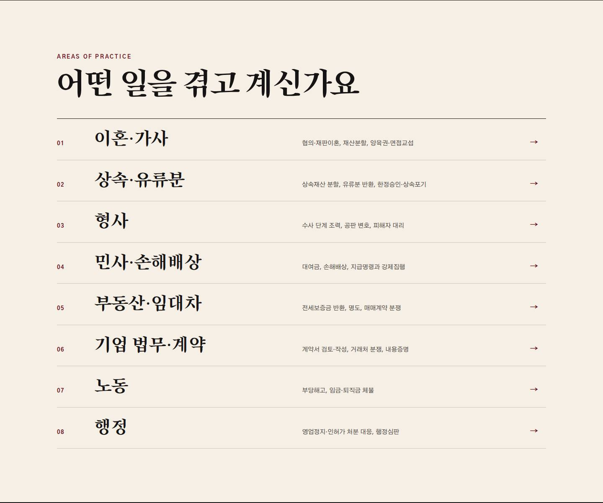 | [업무분야 타이포 목록 `home-areas`](pro-law-firm/docket/README.md#업무분야-타이포-목록-home-areas) | `pro-law-firm/docket` |
| 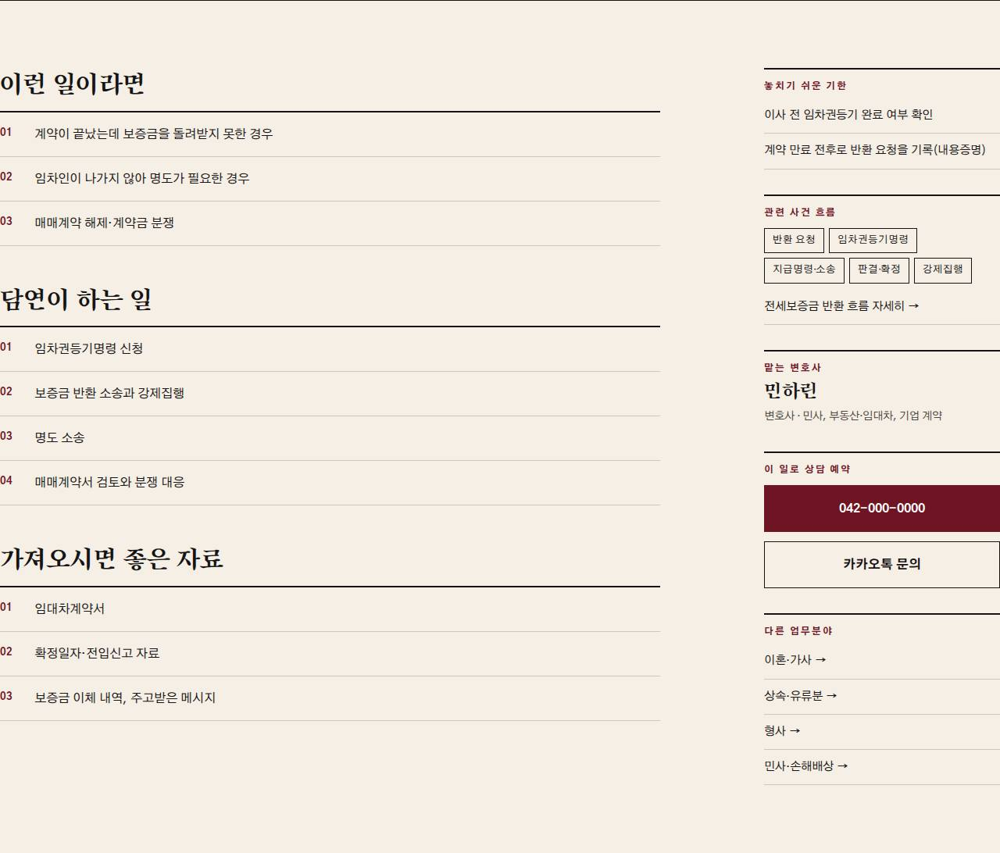 | [업무 상세 (본문 + 옆 칸) `area-detail`](pro-law-firm/docket/README.md#업무-상세-본문--옆-칸-area-detail) | `pro-law-firm/docket` |

### 시그니처 `signature`

| 미리보기 | 모듈 | 사용 사이트 |
|---|---|---|
|  | [시그니처 `home-signature`](medical-dermatology/lumiere/README.md#시그니처-home-signature) | `medical-dermatology/lumiere` |
|  | [세무 연감 (D-day) `home-almanac`](pro-tax-office/almanac/README.md#세무-연감-d-day-home-almanac) | `pro-tax-office/almanac` |
|  | [열두 달 신고 일정표 `calendar-ledger`](pro-tax-office/almanac/README.md#열두-달-신고-일정표-calendar-ledger) | `pro-tax-office/almanac` |
| 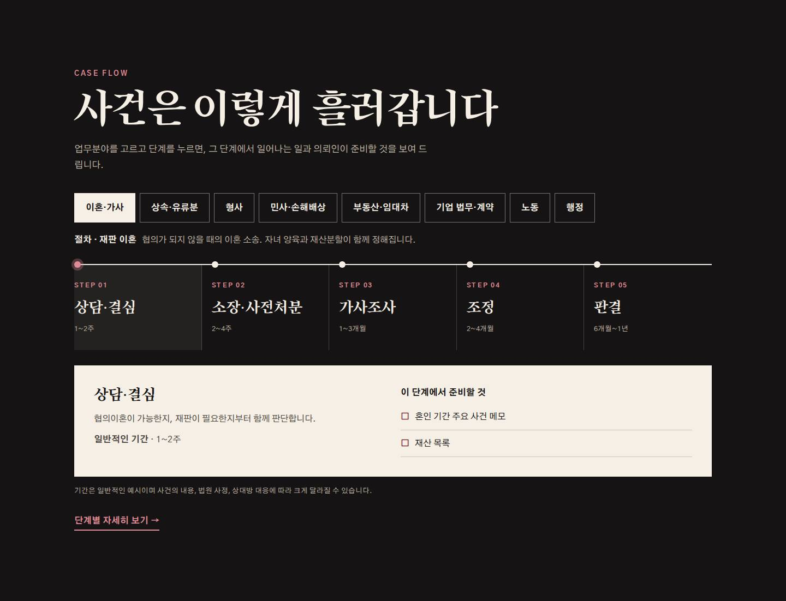 | [사건 흐름 타임라인 `home-flow`](pro-law-firm/docket/README.md#사건-흐름-타임라인-home-flow) | `pro-law-firm/docket` |
| 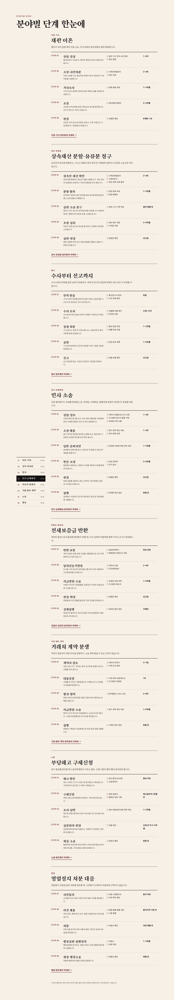 | [분야별 단계 + 왼쪽 바로가기 `flow-steps`](pro-law-firm/docket/README.md#분야별-단계--왼쪽-바로가기-flow-steps) | `pro-law-firm/docket` |

### 구성원 `team`

| 미리보기 | 모듈 | 사용 사이트 |
|---|---|---|
|  | [의료진 `home-doctors`](medical-dermatology/lumiere/README.md#의료진-home-doctors) | `medical-dermatology/lumiere` |
|  | [필진 (구성원) `about-bylines`](pro-tax-office/almanac/README.md#필진-구성원-about-bylines) | `pro-tax-office/almanac` |
|  | [구성원 `home-team`](pro-tax-office/trust/README.md#구성원-home-team) | `pro-tax-office/trust` |
| 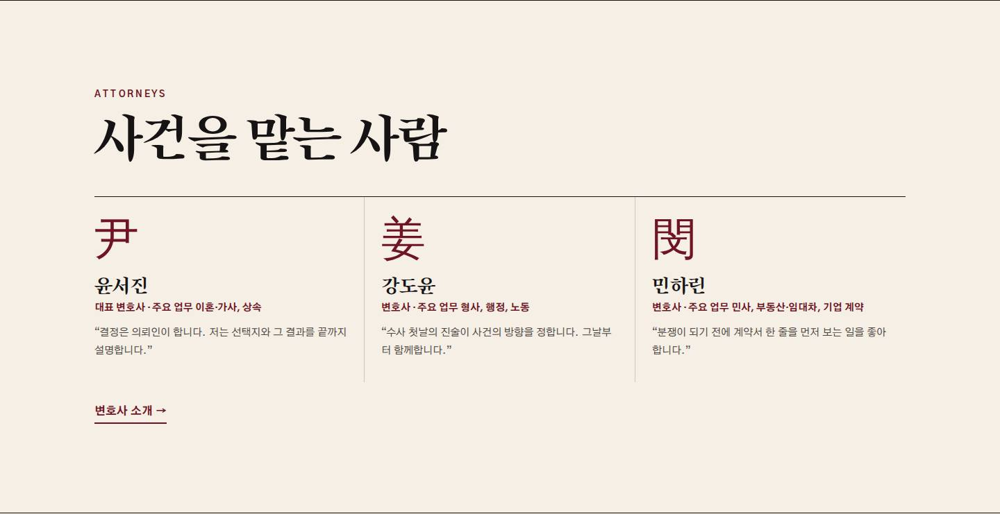 | [변호사 3단 `home-attorneys`](pro-law-firm/docket/README.md#변호사-3단-home-attorneys) | `pro-law-firm/docket` |

### 절차 `process`

| 미리보기 | 모듈 | 사용 사이트 |
|---|---|---|
|  | [진행 절차 `home-process`](medical-dermatology/lumiere/README.md#진행-절차-home-process) | `medical-dermatology/lumiere` |
|  | [진행 방식 `about-steps`](pro-tax-office/almanac/README.md#진행-방식-about-steps) | `pro-tax-office/almanac` |
|  | [진행 절차 `home-process`](pro-tax-office/trust/README.md#진행-절차-home-process) | `pro-tax-office/trust` |

### 갤러리 `gallery`

| 미리보기 | 모듈 | 사용 사이트 |
|---|---|---|
|  | [공간 갤러리 `home-space`](medical-dermatology/lumiere/README.md#공간-갤러리-home-space) | `medical-dermatology/lumiere` |
|  | [장비 스트립 `home-equipment`](medical-dermatology/lumiere/README.md#장비-스트립-home-equipment) | `medical-dermatology/lumiere` |
|  | [주제별 포트폴리오 그리드 `projects`](space-interior/forme/README.md#주제별-포트폴리오-그리드-projects) | `space-interior/forme` |
|  | [와이드 공간 사진과 캡션 `project-photo`](space-interior/forme/README.md#와이드-공간-사진과-캡션-project-photo) | `space-interior/forme` |

### 이벤트·프로모션 `promo`

| 미리보기 | 모듈 | 사용 사이트 |
|---|---|---|
|  | [이벤트 `home-events`](medical-dermatology/lumiere/README.md#이벤트-home-events) | `medical-dermatology/lumiere` |

### FAQ `faq`

| 미리보기 | 모듈 | 사용 사이트 |
|---|---|---|
|  | [자주 묻는 질문 `home-faq`](medical-dermatology/lumiere/README.md#자주-묻는-질문-home-faq) | `medical-dermatology/lumiere` |
|  | [묻고 답하기 `home-qa`](pro-tax-office/almanac/README.md#묻고-답하기-home-qa) | `pro-tax-office/almanac` |
|  | [자주 묻는 질문 `home-faq`](pro-tax-office/trust/README.md#자주-묻는-질문-home-faq) | `pro-tax-office/trust` |
| 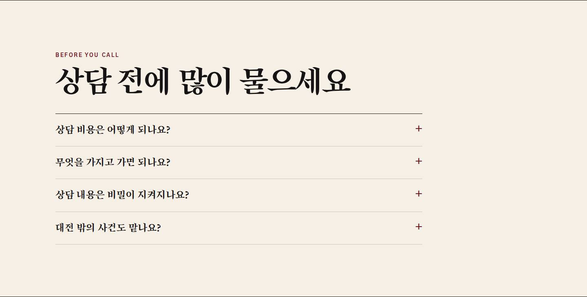 | [상담 전 질문 `home-faq`](pro-law-firm/docket/README.md#상담-전-질문-home-faq) | `pro-law-firm/docket` |

### 오시는 길 `visit`

| 미리보기 | 모듈 | 사용 사이트 |
|---|---|---|
|  | [오시는 길 `home-visit`](medical-dermatology/lumiere/README.md#오시는-길-home-visit) | `medical-dermatology/lumiere` |
|  | [찾아오는 길 `home-visit`](pro-tax-office/almanac/README.md#찾아오는-길-home-visit) | `pro-tax-office/almanac` |
|  | [오시는 길 `home-visit`](pro-tax-office/trust/README.md#오시는-길-home-visit) | `pro-tax-office/trust` |
| 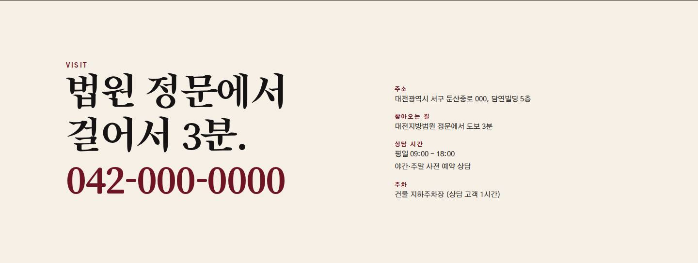 | [법원 앞 오시는 길 `home-visit`](pro-law-firm/docket/README.md#법원-앞-오시는-길-home-visit) | `pro-law-firm/docket` |

### 서브페이지 상단 `page-hero`

| 미리보기 | 모듈 | 사용 사이트 |
|---|---|---|
|  | [서브페이지 상단 `page-hero`](medical-dermatology/lumiere/README.md#서브페이지-상단-page-hero) | `medical-dermatology/lumiere` |
|  | [서브페이지 머리 (폴리오) `folio`](pro-tax-office/almanac/README.md#서브페이지-머리-폴리오-folio) | `pro-tax-office/almanac` |
|  | [서브페이지 상단 `page-hero`](pro-tax-office/trust/README.md#서브페이지-상단-page-hero) | `pro-tax-office/trust` |
| 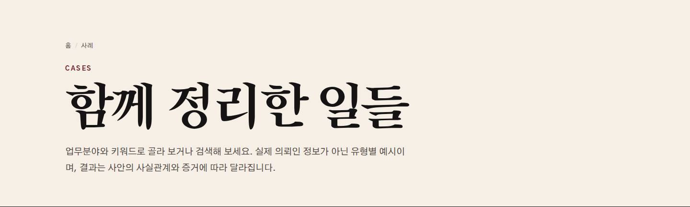 | [서브페이지 머리 `page-head`](pro-law-firm/docket/README.md#서브페이지-머리-page-head) | `pro-law-firm/docket` |

### CTA `cta`

| 미리보기 | 모듈 | 사용 사이트 |
|---|---|---|
|  | [상담 유도 띠 `cta-band`](medical-dermatology/lumiere/README.md#상담-유도-띠-cta-band) | `medical-dermatology/lumiere` |
|  | [상담 방법 `contact-channels`](pro-tax-office/almanac/README.md#상담-방법-contact-channels) | `pro-tax-office/almanac` |
|  | [상담 유도 띠 `cta-band`](pro-tax-office/trust/README.md#상담-유도-띠-cta-band) | `pro-tax-office/trust` |
| 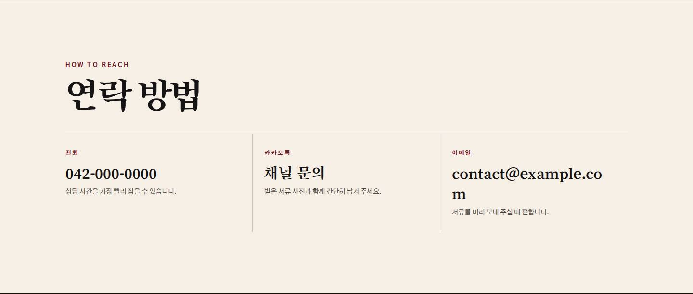 | [연락 방법 3단 `contact-channels`](pro-law-firm/docket/README.md#연락-방법-3단-contact-channels) | `pro-law-firm/docket` |

### 푸터 `footer`

| 미리보기 | 모듈 | 사용 사이트 |
|---|---|---|
|  | [푸터 `footer`](medical-dermatology/lumiere/README.md#푸터-footer) | `medical-dermatology/lumiere` |
|  | [판권란 (푸터) `colophon`](pro-tax-office/almanac/README.md#판권란-푸터-colophon) | `pro-tax-office/almanac` |
|  | [푸터 `footer`](pro-tax-office/trust/README.md#푸터-footer) | `pro-tax-office/trust` |
| 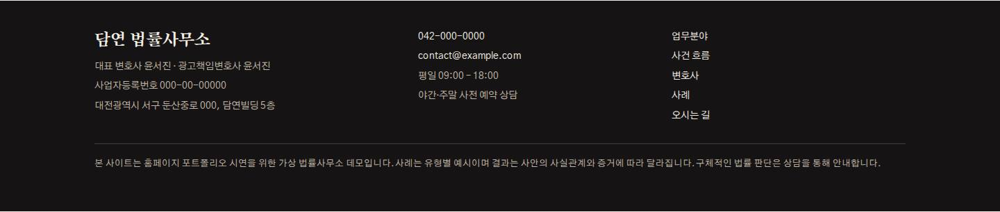 | [푸터 (광고책임변호사 표기) `footer`](pro-law-firm/docket/README.md#푸터-광고책임변호사-표기-footer) | `pro-law-firm/docket` |
|  | [차콜 스튜디오 푸터 `footer`](space-interior/forme/README.md#차콜-스튜디오-푸터-footer) | `space-interior/forme` |

### 고정 버튼 `floating`

| 미리보기 | 모듈 | 사용 사이트 |
|---|---|---|
|  | [고정 상담 버튼 `floating-contact`](medical-dermatology/lumiere/README.md#고정-상담-버튼-floating-contact) | `medical-dermatology/lumiere` |
|  | [고정 상담 버튼 `floating-contact`](pro-tax-office/trust/README.md#고정-상담-버튼-floating-contact) | `pro-tax-office/trust` |

### 사례 `cases`

| 미리보기 | 모듈 | 사용 사이트 |
|---|---|---|
|  | [사례 기사 단 `home-cases`](pro-tax-office/almanac/README.md#사례-기사-단-home-cases) | `pro-tax-office/almanac` |
|  | [업무 사례 `home-cases`](pro-tax-office/trust/README.md#업무-사례-home-cases) | `pro-tax-office/trust` |
| 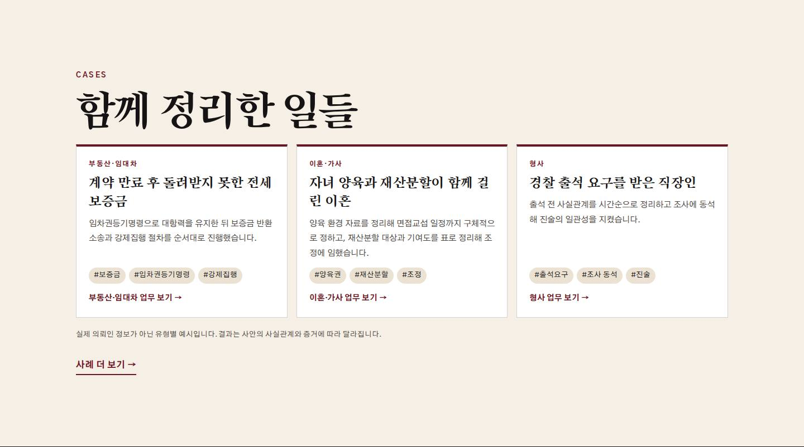 | [유형별 사례 카드 `home-cases`](pro-law-firm/docket/README.md#유형별-사례-카드-home-cases) | `pro-law-firm/docket` |
| 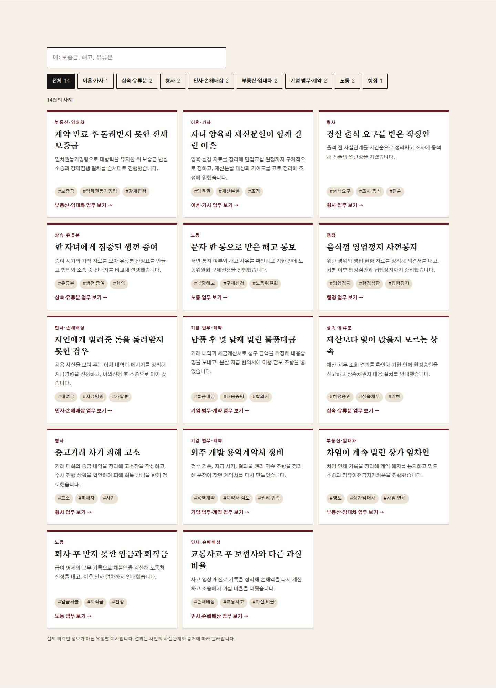 | [사례 검색·분야 필터 카드 `cases-browser`](pro-law-firm/docket/README.md#사례-검색분야-필터-카드-cases-browser) | `pro-law-firm/docket` |

### 수치 `stats`

| 미리보기 | 모듈 | 사용 사이트 |
|---|---|---|
|  | [현황 수치 `about-figures`](pro-tax-office/almanac/README.md#현황-수치-about-figures) | `pro-tax-office/almanac` |
|  | [수치 `home-stats`](pro-tax-office/trust/README.md#수치-home-stats) | `pro-tax-office/trust` |

### 고객군 `clients`

| 미리보기 | 모듈 | 사용 사이트 |
|---|---|---|
|  | [고객군 `home-clients`](pro-tax-office/trust/README.md#고객군-home-clients) | `pro-tax-office/trust` |

### interactive `interactive`

| 미리보기 | 모듈 | 사용 사이트 |
|---|---|---|
|  | [재료 분위기 선택 `materials`](space-interior/forme/README.md#재료-분위기-선택-materials) | `space-interior/forme` |

### content `content`

| 미리보기 | 모듈 | 사용 사이트 |
|---|---|---|
|  | [프로젝트 주제와 콘셉트 `project-masthead`](space-interior/forme/README.md#프로젝트-주제와-콘셉트-project-masthead) | `space-interior/forme` |
