# 모듈 스타일 라이브러리

완성 사이트의 화면 모듈을 캡처와 스타일 코드로 남긴 참고 자료. **참고만 하고 가져다 쓰지 않는다.**

- 사이트 소스는 서로 독립이다. 앱이 다른 앱이나 `library/` 를 import 하면 `scripts/check-isolation.mjs` 가 배포를 막는다.
- 새 사이트는 여기서 리듬·밀도·구조 아이디어만 얻고 레이아웃·서체·색·카피는 다시 설계한다(design-diversity 스킬).
- 스타일 코드는 렌더링된 마크업에서 문구를 `…` 로 바꾸고 반복 항목을 접은 것이다. 클래스는 Tailwind v4 + 각 사이트 globals.css 의 토큰을 따른다.
- 갱신: `npm run build:sites && npm run library` (사이트 하나만: `npm run library -- <slug>/<variant>`). 캡처 대상은 `library/config.json`.

## 사이트

| 사이트 | 지문 | 모듈 |
|---|---|---|
| [피부과 · lumiere](medical-dermatology/lumiere/README.md) | immersive / video / ivory·ink·champagne gold | 18 |
| [세무사무소 · trust](pro-tax-office/trust/README.md) | swiss-grid / split-media / navy·paper·brass | 15 |

## 종류별

### 상단 띠 `banner`

| 미리보기 | 모듈 | 사용 사이트 |
|---|---|---|
|  | [상단 공지 띠 `top-banner`](medical-dermatology/lumiere/README.md#상단-공지-띠-top-banner) | `medical-dermatology/lumiere` |
|  | [상단 공지 띠 `top-banner`](pro-tax-office/trust/README.md#상단-공지-띠-top-banner) | `pro-tax-office/trust` |

### 헤더 `header`

| 미리보기 | 모듈 | 사용 사이트 |
|---|---|---|
| 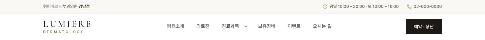 | [헤더 `header`](medical-dermatology/lumiere/README.md#헤더-header) | `medical-dermatology/lumiere` |
| 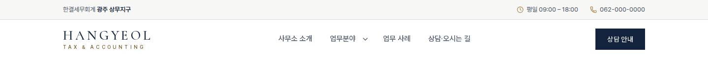 | [헤더 `header`](pro-tax-office/trust/README.md#헤더-header) | `pro-tax-office/trust` |

### 히어로 `hero`

| 미리보기 | 모듈 | 사용 사이트 |
|---|---|---|
|  | [히어로 `home-hero`](medical-dermatology/lumiere/README.md#히어로-home-hero) | `medical-dermatology/lumiere` |
| 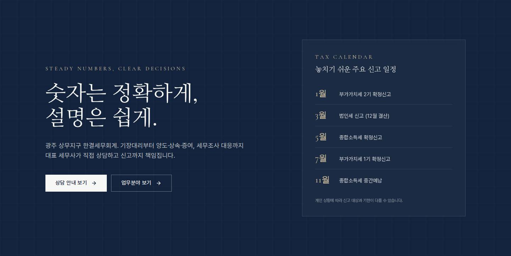 | [히어로 `home-hero`](pro-tax-office/trust/README.md#히어로-home-hero) | `pro-tax-office/trust` |

### 소개 `intro`

| 미리보기 | 모듈 | 사용 사이트 |
|---|---|---|
| 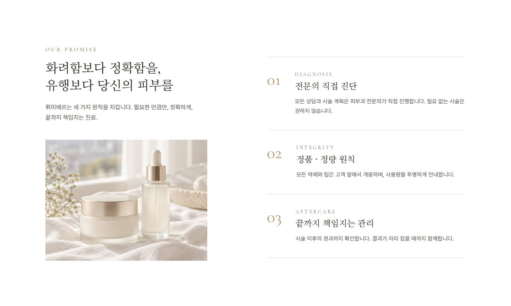 | [약속·소개 `home-promise`](medical-dermatology/lumiere/README.md#약속소개-home-promise) | `medical-dermatology/lumiere` |

### 찾기·필터 `finder`

| 미리보기 | 모듈 | 사용 사이트 |
|---|---|---|
| 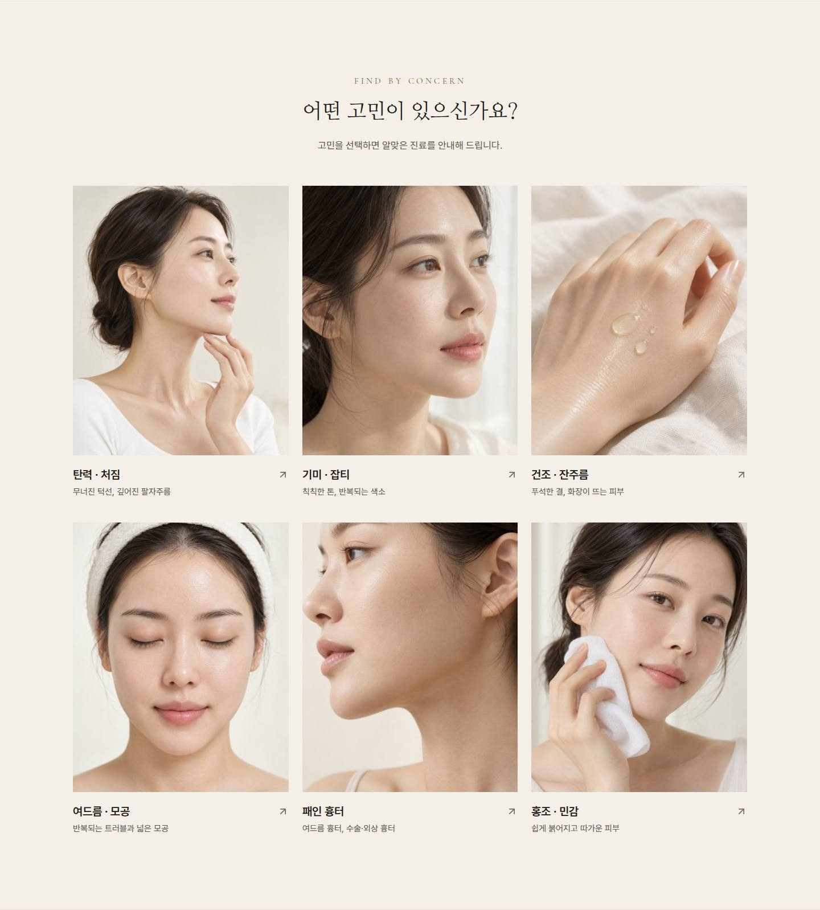 | [고민별 찾기 `home-concerns`](medical-dermatology/lumiere/README.md#고민별-찾기-home-concerns) | `medical-dermatology/lumiere` |

### 서비스 목록 `services`

| 미리보기 | 모듈 | 사용 사이트 |
|---|---|---|
| 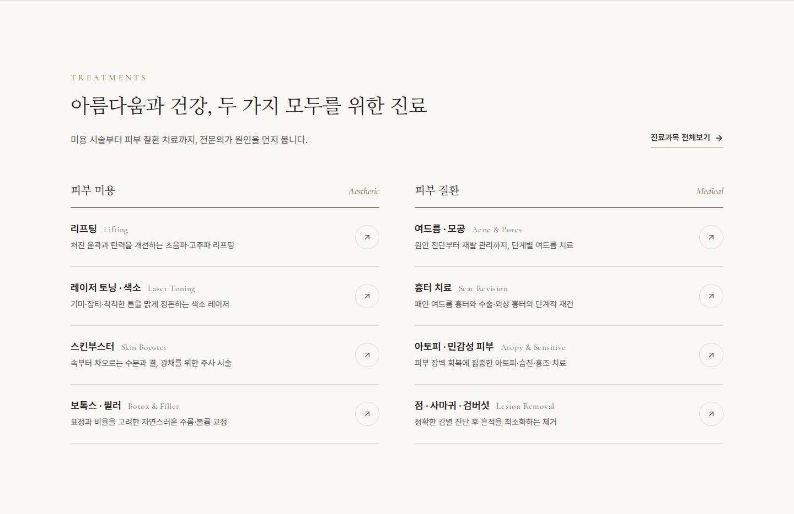 | [시술 목록 `home-treatments`](medical-dermatology/lumiere/README.md#시술-목록-home-treatments) | `medical-dermatology/lumiere` |
| 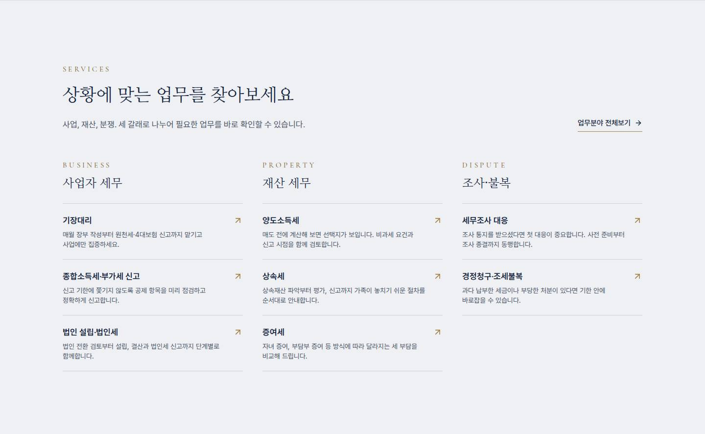 | [업무분야 `home-services`](pro-tax-office/trust/README.md#업무분야-home-services) | `pro-tax-office/trust` |

### 시그니처 `signature`

| 미리보기 | 모듈 | 사용 사이트 |
|---|---|---|
| 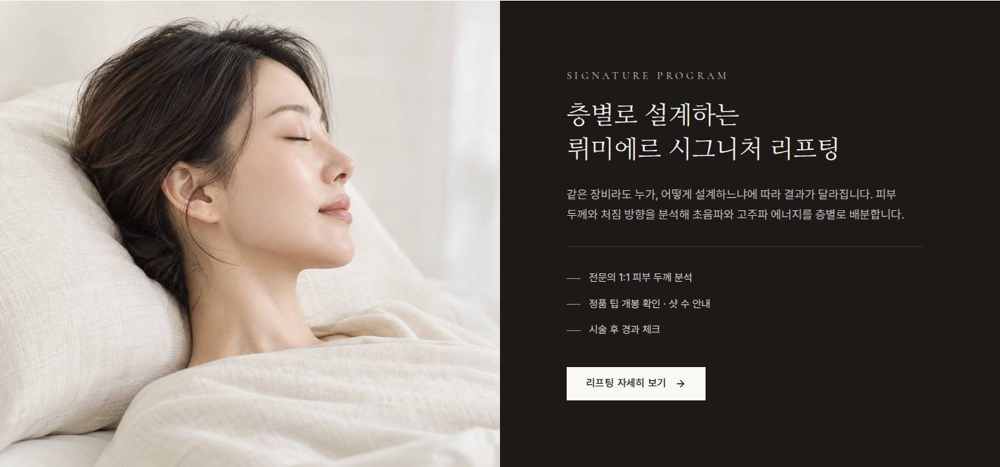 | [시그니처 `home-signature`](medical-dermatology/lumiere/README.md#시그니처-home-signature) | `medical-dermatology/lumiere` |

### 구성원 `team`

| 미리보기 | 모듈 | 사용 사이트 |
|---|---|---|
| 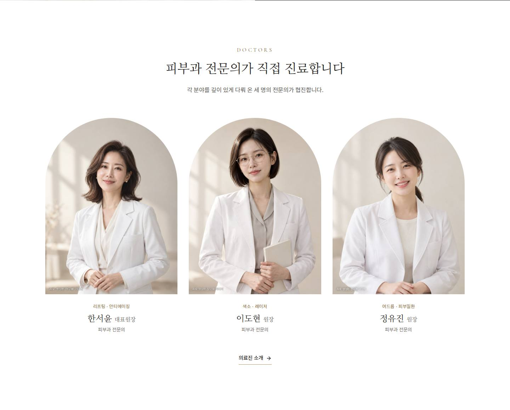 | [의료진 `home-doctors`](medical-dermatology/lumiere/README.md#의료진-home-doctors) | `medical-dermatology/lumiere` |
| 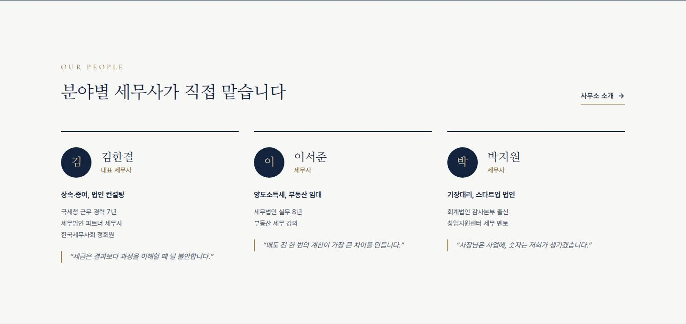 | [구성원 `home-team`](pro-tax-office/trust/README.md#구성원-home-team) | `pro-tax-office/trust` |

### 절차 `process`

| 미리보기 | 모듈 | 사용 사이트 |
|---|---|---|
| 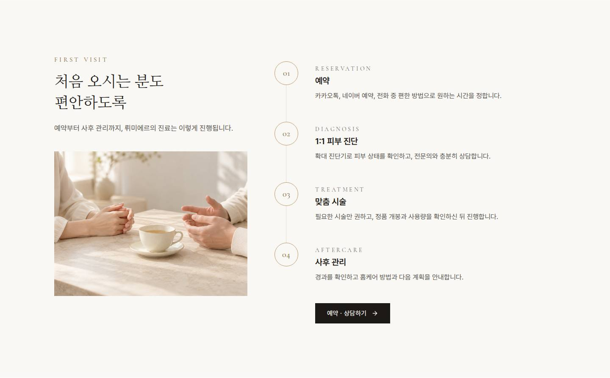 | [진행 절차 `home-process`](medical-dermatology/lumiere/README.md#진행-절차-home-process) | `medical-dermatology/lumiere` |
| 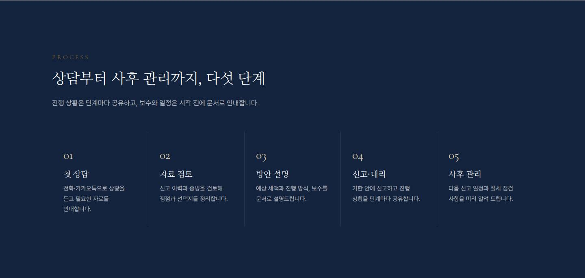 | [진행 절차 `home-process`](pro-tax-office/trust/README.md#진행-절차-home-process) | `pro-tax-office/trust` |

### 갤러리 `gallery`

| 미리보기 | 모듈 | 사용 사이트 |
|---|---|---|
| 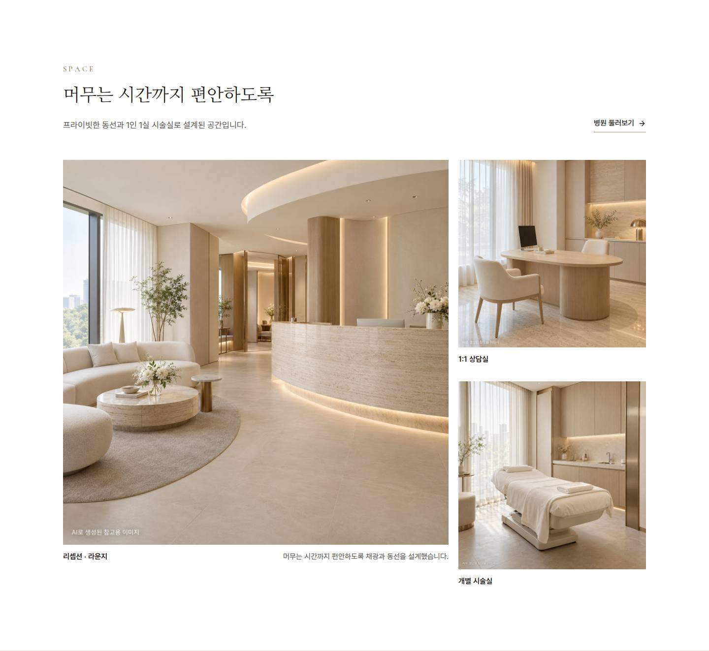 | [공간 갤러리 `home-space`](medical-dermatology/lumiere/README.md#공간-갤러리-home-space) | `medical-dermatology/lumiere` |
| 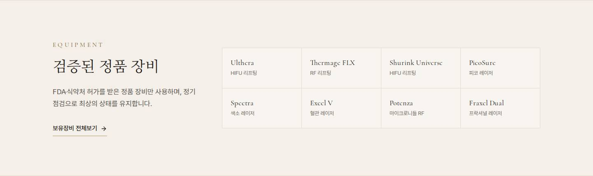 | [장비 스트립 `home-equipment`](medical-dermatology/lumiere/README.md#장비-스트립-home-equipment) | `medical-dermatology/lumiere` |

### 이벤트·프로모션 `promo`

| 미리보기 | 모듈 | 사용 사이트 |
|---|---|---|
| 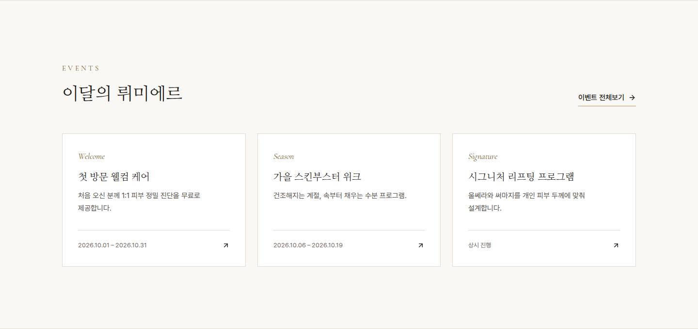 | [이벤트 `home-events`](medical-dermatology/lumiere/README.md#이벤트-home-events) | `medical-dermatology/lumiere` |

### FAQ `faq`

| 미리보기 | 모듈 | 사용 사이트 |
|---|---|---|
| 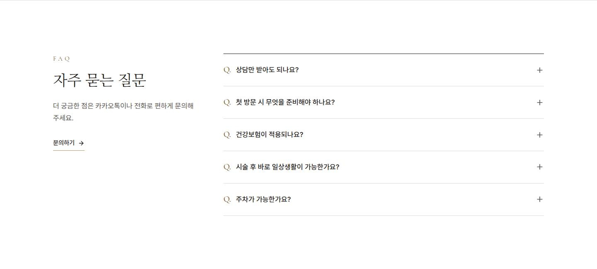 | [자주 묻는 질문 `home-faq`](medical-dermatology/lumiere/README.md#자주-묻는-질문-home-faq) | `medical-dermatology/lumiere` |
| 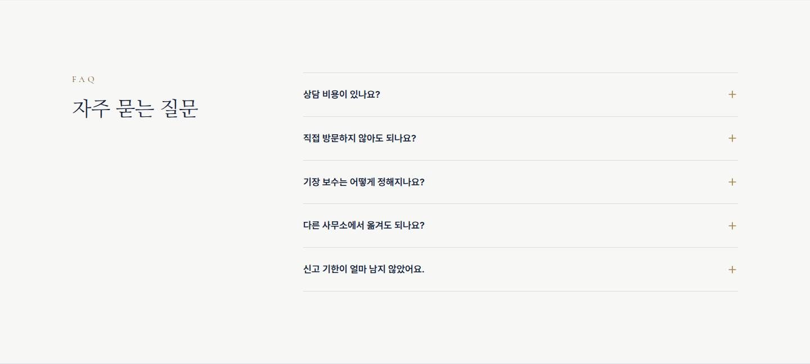 | [자주 묻는 질문 `home-faq`](pro-tax-office/trust/README.md#자주-묻는-질문-home-faq) | `pro-tax-office/trust` |

### 오시는 길 `visit`

| 미리보기 | 모듈 | 사용 사이트 |
|---|---|---|
| 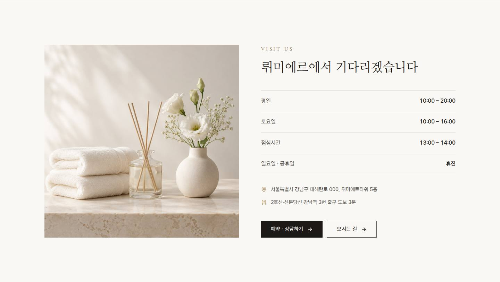 | [오시는 길 `home-visit`](medical-dermatology/lumiere/README.md#오시는-길-home-visit) | `medical-dermatology/lumiere` |
| 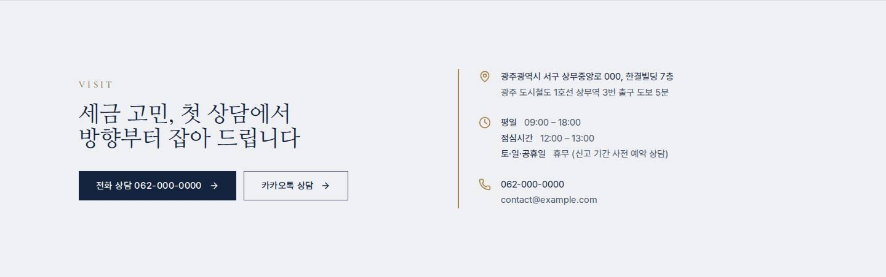 | [오시는 길 `home-visit`](pro-tax-office/trust/README.md#오시는-길-home-visit) | `pro-tax-office/trust` |

### 서브페이지 상단 `page-hero`

| 미리보기 | 모듈 | 사용 사이트 |
|---|---|---|
| 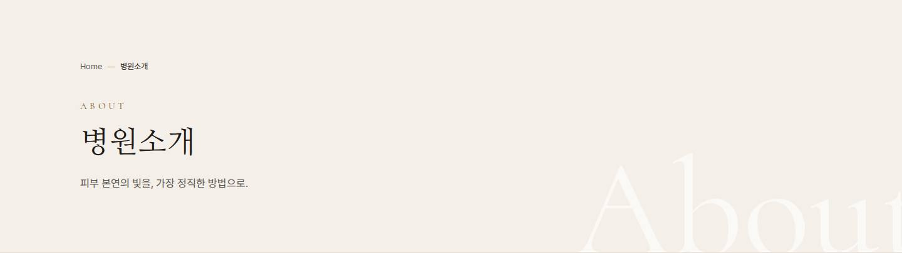 | [서브페이지 상단 `page-hero`](medical-dermatology/lumiere/README.md#서브페이지-상단-page-hero) | `medical-dermatology/lumiere` |
| 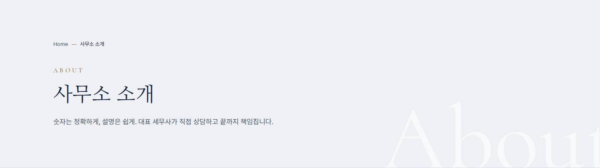 | [서브페이지 상단 `page-hero`](pro-tax-office/trust/README.md#서브페이지-상단-page-hero) | `pro-tax-office/trust` |

### CTA `cta`

| 미리보기 | 모듈 | 사용 사이트 |
|---|---|---|
| 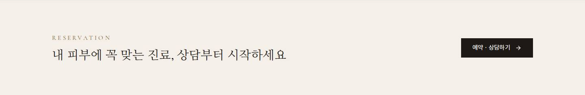 | [상담 유도 띠 `cta-band`](medical-dermatology/lumiere/README.md#상담-유도-띠-cta-band) | `medical-dermatology/lumiere` |
| 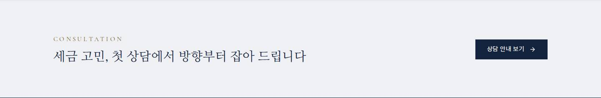 | [상담 유도 띠 `cta-band`](pro-tax-office/trust/README.md#상담-유도-띠-cta-band) | `pro-tax-office/trust` |

### 푸터 `footer`

| 미리보기 | 모듈 | 사용 사이트 |
|---|---|---|
| 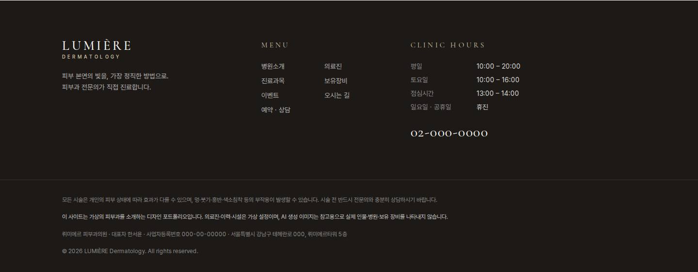 | [푸터 `footer`](medical-dermatology/lumiere/README.md#푸터-footer) | `medical-dermatology/lumiere` |
| 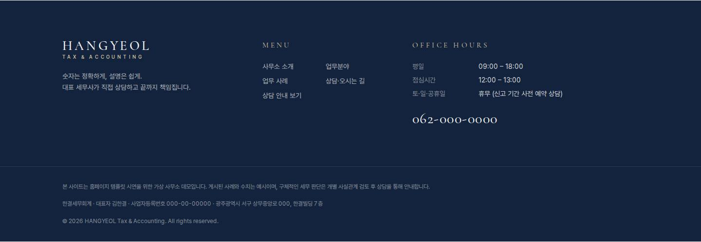 | [푸터 `footer`](pro-tax-office/trust/README.md#푸터-footer) | `pro-tax-office/trust` |

### 고정 버튼 `floating`

| 미리보기 | 모듈 | 사용 사이트 |
|---|---|---|
| 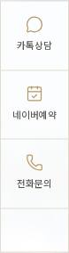 | [고정 상담 버튼 `floating-contact`](medical-dermatology/lumiere/README.md#고정-상담-버튼-floating-contact) | `medical-dermatology/lumiere` |
|  | [고정 상담 버튼 `floating-contact`](pro-tax-office/trust/README.md#고정-상담-버튼-floating-contact) | `pro-tax-office/trust` |

### 수치 `stats`

| 미리보기 | 모듈 | 사용 사이트 |
|---|---|---|
|  | [수치 `home-stats`](pro-tax-office/trust/README.md#수치-home-stats) | `pro-tax-office/trust` |

### 고객군 `clients`

| 미리보기 | 모듈 | 사용 사이트 |
|---|---|---|
| 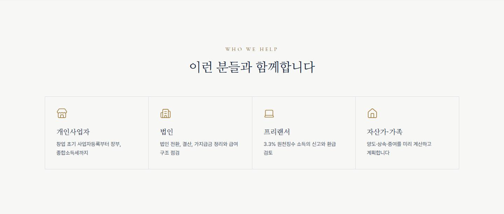 | [고객군 `home-clients`](pro-tax-office/trust/README.md#고객군-home-clients) | `pro-tax-office/trust` |

### 사례 `cases`

| 미리보기 | 모듈 | 사용 사이트 |
|---|---|---|
| 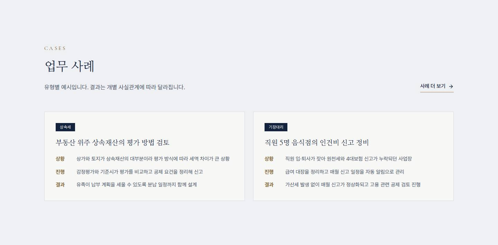 | [업무 사례 `home-cases`](pro-tax-office/trust/README.md#업무-사례-home-cases) | `pro-tax-office/trust` |
