# 중소 제조·B2B · fieldmap

> 자동 생성 문서(`npm run library`). 참고용 스타일 기록이며, 이 코드를 다른 사이트에 그대로 쓰지 않는다.

- 사용 사이트: `biz-manufacturing/fieldmap` (세로결정밀(가상))
- 배포 주소: https://hongjaang-star.github.io/agency-web-templates/biz-manufacturing/fieldmap/
- 소스: [`templates/biz-manufacturing/fieldmap`](../../../templates/biz-manufacturing/fieldmap)

## 디자인 지문

| 항목 | 값 |
|---|---|
| layout | split |
| hero | interactive |
| typePair | IBM Plex Sans KR + IBM Plex Mono |
| palette | graphite · aluminum · safety orange |
| imageTreatment | category line drawings with virtual product image descriptions |
| motion | none (instant filter, reduced-motion safe) |
| signature | 적용 분야 × 카테고리 제품 찾기와 견적 담기 |
| sectionOrder | application-picker, categories, featured-products, capability-numbers, certs-sectors, quote-cta |

## 디자인 토큰

서체 설정 (`src/app/layout.tsx`)

```ts
import { IBM_Plex_Mono, IBM_Plex_Sans_KR } from "next/font/google";

const plex = IBM_Plex_Sans_KR({ variable: "--font-plex", weight: ["400", "600", "700"], display: "swap", preload: false });

const mono = IBM_Plex_Mono({ variable: "--font-mono", subsets: ["latin"], weight: ["400", "600"], display: "swap" });
```

<details><summary>globals.css (색·서체 토큰, 공용 유틸리티)</summary>

```css
/* 세로결정밀 · fieldmap — 흑연·알루미늄·안전 주황. 품번·사양은 고정폭 숫자. */
:root {
  --ink: #1f2326;
  --steel: #5d656b;
  --alu: #d9dcdf;
  --paper: #f4f5f6;
  --white: #fff;
  --hot: #ff5a1f;
  --hot-ink: #b33a0c;
  --pad: clamp(16px, 4vw, 48px);
  --sans: var(--font-plex), "IBM Plex Sans KR", system-ui, sans-serif;
  --mono: var(--font-mono), "IBM Plex Mono", ui-monospace, monospace;
}
* { box-sizing: border-box; }
html { scroll-behavior: smooth; }
body { margin: 0; background: var(--paper); color: var(--ink); font: 16px/1.65 var(--sans); word-break: keep-all; }
a { color: inherit; }
h1, h2, h3 { letter-spacing: -0.02em; }
:focus-visible { outline: 3px solid var(--hot); outline-offset: 2px; }
.mono { font-family: var(--mono); }
.skip { position: absolute; left: -999px; top: 0; background: var(--ink); color: #fff; padding: 8px 12px; z-index: 20; }
.skip:focus { left: 8px; }
.demo { background: var(--ink); color: #fff; font-size: 13px; text-align: center; padding: 6px 12px; }

/* 머리 */
.top { display: flex; justify-content: space-between; align-items: center; gap: 16px; padding: 14px var(--pad); border-bottom: 1px solid var(--alu); background: var(--white); position: sticky; top: 0; z-index: 10; }
.logo { font-weight: 700; font-size: 20px; letter-spacing: -0.02em; display: flex; align-items: center; gap: 10px; text-decoration: none; margin: 0; }
.logo i { display: block; width: 22px; height: 22px; background: repeating-linear-gradient(90deg, var(--ink) 0 3px, transparent 3px 6px); }
.top nav ul { display: flex; gap: 24px; list-style: none; margin: 0; padding: 0; font-size: 15px; }
.top nav a { text-decoration: none; }
.top nav a:hover { color: var(--hot-ink); }
.quote-btn { background: var(--hot); color: #fff; text-decoration: none; font-weight: 700; padding: 9px 16px; border-radius: 4px; white-space: nowrap; display: inline-flex; gap: 8px; align-items: center; }
.badge { background: var(--white); color: var(--hot-ink); border-radius: 99px; min-width: 22px; height: 22px; display: inline-grid; place-items: center; font: 600 13px var(--mono); }

/* 첫 화면: 분야 고르기 */
.hero { padding: clamp(40px, 7vw, 88px) var(--pad) 40px; background: var(--white); border-bottom: 1px solid var(--alu); }
.eyebrow { font: 600 13px var(--mono); letter-spacing: 0.08em; color: var(--hot-ink); margin: 0; }
.hero h1 { font-size: clamp(36px, 6.4vw, 80px); line-height: 1.06; letter-spacing: -0.035em; margin: 12px 0 18px; max-width: 13ch; }
.lead { max-width: 640px; color: var(--steel); margin: 0 0 28px; }
.apps { display: grid; grid-template-columns: repeat(7, 1fr); gap: 10px; }
.app-tile { text-decoration: none; background: var(--paper); border: 1px solid var(--alu); border-radius: 6px; padding: 14px 14px 12px; min-height: 120px; display: flex; flex-direction: column; gap: 4px; transition: background 0.15s, border-color 0.15s; }
.app-tile b { font-size: 17px; }
.app-tile span { font-size: 13px; color: var(--steel); }
.app-tile em { margin-top: auto; font: 600 13px var(--mono); font-style: normal; }
.app-tile:hover { border-color: var(--ink); }
.app-tile.all { background: var(--ink); color: #fff; border-color: var(--ink); }
.app-tile.all span { color: var(--alu); }
.app-tile.all b::after { content: " →"; color: var(--hot); }

/* 공통 띠 */
.band { padding: clamp(40px, 6vw, 72px) var(--pad); border-top: 1px solid var(--alu); }
.band h2 { font-size: clamp(22px, 2.6vw, 32px); margin: 0 0 18px; }
.band-head { display: flex; justify-content: space-between; align-items: baseline; gap: 16px; flex-wrap: wrap; margin-bottom: 18px; }
.band-head h2 { margin: 0; }
.band-head a { font-weight: 600; text-decoration: none; color: var(--hot-ink); }
.band.two { display: grid; grid-template-columns: 1fr 1fr; gap: 32px; }
.band.dark { background: var(--ink); color: #fff; border-top: 0; }
.cta p { color: var(--alu); max-width: 620px; }
.btn { display: inline-block; background: var(--hot); color: #fff; font-weight: 700; text-decoration: none; padding: 12px 20px; border-radius: 4px; border: 0; }
.btn.ghost { background: none; color: var(--ink); border: 1px solid var(--ink); }

.cat-row { list-style: none; margin: 0; padding: 0; display: grid; grid-template-columns: repeat(4, 1fr); border: 1px solid var(--alu); background: var(--white); }
.cat-row li + li { border-left: 1px solid var(--alu); }
.cat-row a { display: flex; flex-direction: column; gap: 6px; padding: 20px; text-decoration: none; height: 100%; }
.cat-row a:hover { background: var(--paper); }
.cat-row .mono { font-size: 12px; color: var(--hot-ink); }
.cat-row b { font-size: 20px; }
.cat-row span:last-child { font-size: 14px; color: var(--steel); }

.nums { display: grid; grid-template-columns: repeat(4, 1fr); border: 1px solid var(--alu); background: var(--white); }
.nums div { padding: 22px; border-right: 1px solid var(--alu); }
.nums div:last-child { border-right: 0; }
.nums b { display: block; font: 600 clamp(28px, 4vw, 46px)/1 var(--mono); letter-spacing: -0.04em; }
.nums span { font-size: 14px; color: var(--steel); }

.rows { list-style: none; margin: 0; padding: 0; display: grid; gap: 8px; }
.rows li { background: var(--white); border: 1px solid var(--alu); padding: 12px 14px; border-radius: 6px; display: flex; justify-content: space-between; gap: 12px; }
.rows em { font-style: normal; font: 13px var(--mono); color: var(--steel); text-align: right; }
.rows.stack li { flex-direction: column; }
.rows.stack em { text-align: left; }

/* 제품 카드 */
.results { display: grid; grid-template-columns: repeat(auto-fill, minmax(260px, 1fr)); gap: 16px; align-content: start; }
.prod { background: var(--white); border: 1px solid var(--alu); border-radius: 8px; overflow: hidden; display: flex; flex-direction: column; }
.prod figure { margin: 0; background: linear-gradient(180deg, #eef0f2, #e2e5e8); position: relative; color: var(--ink); }
.drawing { display: block; width: 100%; height: 170px; }
.prod figcaption, .detail-fig figcaption { font-size: 13px; color: var(--steel); padding: 10px 14px; background: #f9fafa; border-top: 1px dashed var(--alu); }
.prod figcaption b, .detail-fig figcaption b { color: var(--ink); }
.code { position: absolute; top: 10px; left: 12px; font: 600 12px var(--mono); background: var(--white); padding: 2px 8px; border-radius: 3px; }
.prod-body { padding: 14px; display: flex; flex-direction: column; gap: 8px; flex: 1; }
.prod h3 { margin: 0; font-size: 18px; }
.prod h3 a { text-decoration: none; }
.prod h3 a:hover { text-decoration: underline; }
.tags { display: flex; flex-wrap: wrap; gap: 6px; font-size: 12px; margin: 0; }
.tags span, .tags a { border: 1px solid var(--alu); border-radius: 99px; padding: 1px 8px; text-decoration: none; }
.tags.big a { font-size: 15px; padding: 4px 12px; }
.tags.big a:hover { border-color: var(--ink); }
dl.spec { margin: 0; display: grid; gap: 3px; font-size: 14px; }
dl.spec div { display: grid; grid-template-columns: 76px 1fr; gap: 10px; }
dl.spec dt { color: var(--steel); }
dl.spec dd { margin: 0; font: 13px var(--mono); }
.add { margin-top: auto; font: inherit; font-weight: 600; background: none; border: 1px solid var(--ink); border-radius: 4px; padding: 8px; cursor: pointer; color: var(--ink); }
.add[aria-pressed="true"] { background: var(--hot); border-color: var(--hot); color: #fff; }
.add.wide { padding: 12px 20px; margin-top: 0; }

/* 제품 찾기 */
.finder-apps { display: grid; grid-template-columns: repeat(7, 1fr); gap: 8px; padding: 0 var(--pad) 24px; background: var(--white); border-bottom: 1px solid var(--alu); }
.finder-apps button { font: inherit; text-align: left; background: var(--paper); border: 1px solid var(--alu); border-radius: 6px; padding: 10px 12px; cursor: pointer; display: flex; flex-direction: column; color: var(--ink); }
.finder-apps button b { font-size: 15px; }
.finder-apps button span { font-size: 12px; color: var(--steel); }
.finder-apps button[aria-pressed="true"] { background: var(--ink); color: #fff; border-color: var(--ink); }
.finder-apps button[aria-pressed="true"] span { color: var(--alu); }
.finder-grid { display: grid; grid-template-columns: 260px 1fr; }
.side { border-right: 1px solid var(--alu); padding: 28px var(--pad) 28px; position: sticky; top: 72px; align-self: start; }
.side h2 { font: 600 13px var(--mono); letter-spacing: 0.06em; color: var(--steel); margin: 0 0 12px; }
.cats { display: grid; gap: 4px; margin-bottom: 24px; }
.cats button { font: inherit; text-align: left; background: none; border: 0; border-left: 3px solid transparent; padding: 6px 10px; cursor: pointer; color: var(--steel); }
.cats button[aria-pressed="true"] { border-color: var(--hot); color: var(--ink); font-weight: 700; }
.count { margin: 0; }
.count span { display: block; font: 600 44px/1 var(--mono); letter-spacing: -0.04em; }
.count small { display: block; font-size: 13px; color: var(--steel); margin-top: 6px; }
.finder .results { padding: 28px var(--pad); }
.empty { grid-column: 1 / -1; color: var(--steel); }

/* 하위 페이지 머리 */
.page-head { padding: clamp(32px, 5vw, 64px) var(--pad) 28px; background: var(--white); }
.page-head h1 { font-size: clamp(32px, 5vw, 60px); line-height: 1.1; margin: 10px 0 14px; }
.crumbs { font-size: 13px; color: var(--steel); margin-bottom: 18px; }
.crumbs a { text-decoration: none; }
.crumbs a:hover { text-decoration: underline; }

/* 제품 상세 */
.detail { display: grid; grid-template-columns: minmax(280px, 1fr) 1.2fr; gap: clamp(20px, 4vw, 48px); padding: 32px var(--pad) 56px; background: var(--white); border-bottom: 1px solid var(--alu); }
.detail-fig { margin: 0; border: 1px solid var(--alu); border-radius: 8px; overflow: hidden; background: linear-gradient(180deg, #eef0f2, #e2e5e8); align-self: start; position: sticky; top: 84px; }
.detail-fig .drawing { height: auto; aspect-ratio: 200 / 190; padding: 24px; }
.detail-body h2 { font-size: 15px; font-family: var(--mono); letter-spacing: 0.04em; color: var(--steel); margin: 24px 0 10px; }
.detail-body h2:first-child { margin-top: 0; }
.spec-table { width: 100%; border-collapse: collapse; font-size: 15px; background: var(--white); }
.spec-table th, .spec-table td { border-bottom: 1px solid var(--alu); padding: 10px 0; text-align: left; vertical-align: top; }
.spec-table th { color: var(--steel); font-weight: 400; width: 34%; }
.spec-table td { font-family: var(--mono); font-size: 14px; }
.spec-table small { color: var(--steel); }
.checks { list-style: none; margin: 0; padding: 0; display: grid; gap: 8px; }
.checks li { padding-left: 26px; position: relative; }
.checks li::before { content: ""; position: absolute; left: 0; top: 0.55em; width: 14px; height: 3px; background: var(--hot); }
.mono-line { font: 14px var(--mono); background: var(--paper); padding: 10px 12px; border-radius: 4px; margin: 0; }
.detail-cta { display: flex; gap: 12px; flex-wrap: wrap; margin-top: 28px; }

/* 분야 */
.app-list { list-style: none; margin: 0; padding: 0; border-top: 2px solid var(--ink); }
.app-list a { display: grid; grid-template-columns: 56px 220px 1fr 90px; gap: 16px; align-items: baseline; padding: 20px 0; border-bottom: 1px solid var(--alu); text-decoration: none; }
.app-list a:hover b { color: var(--hot-ink); }
.app-list b { font-size: 22px; }
.app-list span:not(.mono) { color: var(--steel); }
.app-list em { font: 600 14px var(--mono); font-style: normal; text-align: right; }
.note-box { background: var(--white); border: 1px solid var(--alu); border-left: 4px solid var(--hot); border-radius: 6px; padding: 20px; align-self: start; }
.note-box h2 { margin-top: 0; }
.app-nav { display: flex; flex-wrap: wrap; gap: 8px; }
.app-nav a { border: 1px solid var(--alu); border-radius: 99px; padding: 6px 14px; text-decoration: none; background: var(--white); }
.app-nav a:hover { border-color: var(--ink); }

/* 설비·회사 */
.steps { list-style: none; margin: 0; padding: 0; display: grid; grid-template-columns: repeat(6, 1fr); border: 1px solid var(--alu); background: var(--white); }
.steps li { padding: 18px; border-right: 1px solid var(--alu); }
.steps li:last-child { border-right: 0; }
.steps .mono { color: var(--hot-ink); font-size: 13px; font-weight: 600; }
.steps b { display: block; font-size: 18px; margin: 4px 0; }
.steps p { margin: 0; font-size: 14px; color: var(--steel); }
.history { list-style: none; margin: 0; padding: 0; display: grid; gap: 0; border-left: 2px solid var(--ink); }
.history li { display: grid; grid-template-columns: 90px 1fr; gap: 16px; padding: 12px 0 12px 20px; position: relative; }
.history li::before { content: ""; position: absolute; left: -7px; top: 20px; width: 12px; height: 12px; background: var(--hot); }
.history b { font-size: 20px; }

/* 견적 */
.qform { display: grid; grid-template-columns: 1fr 1fr; gap: 16px; max-width: 980px; }
.qform label { display: grid; gap: 6px; font-size: 14px; }
.qform input, .qform select, .qform textarea { font: inherit; padding: 10px; border-radius: 4px; border: 1px solid #4a5056; background: #2a2f33; color: #fff; }
.qform .full { grid-column: 1 / -1; }
.qform > button { font: inherit; font-weight: 700; background: var(--hot); color: #fff; border: 0; border-radius: 4px; padding: 12px 20px; cursor: pointer; justify-self: start; }
.picked { font-size: 15px; color: var(--alu); }
.picked b { color: #fff; }
.picked ul { list-style: none; padding: 0; margin: 8px 0 0; display: flex; flex-wrap: wrap; gap: 8px; }
.picked li { background: #2a2f33; border-radius: 4px; padding: 6px 10px; display: flex; gap: 10px; align-items: center; }
.picked li button { font: inherit; font-size: 13px; background: none; border: 1px solid #4a5056; color: var(--alu); border-radius: 3px; cursor: pointer; padding: 1px 8px; }
.out { background: #2a2f33; border-radius: 6px; padding: 14px; }
.out pre { margin: 0 0 10px; white-space: pre-wrap; font: 13px var(--mono); }
.out p { margin: 0; font-size: 14px; color: var(--alu); }
.faq { margin: 0; display: grid; gap: 14px; }
.faq dt { font-weight: 700; }
.faq dd { margin: 4px 0 0; color: var(--steel); }

/* 바닥 */
.foot { display: grid; grid-template-columns: 2fr 1fr 1fr; gap: 24px; padding: 40px var(--pad); background: var(--white); border-top: 1px solid var(--alu); font-size: 14px; color: var(--steel); }
.foot .logo { color: var(--ink); margin-bottom: 10px; }
.foot-h { font: 600 13px var(--mono); color: var(--ink); margin: 0 0 8px; }
.foot ul { list-style: none; margin: 0; padding: 0; display: grid; gap: 4px; }
.foot a { text-decoration: none; }
.foot a:hover { color: var(--ink); text-decoration: underline; }
.foot-demo { grid-column: 1 / -1; border-top: 1px solid var(--alu); padding-top: 16px; margin: 0; font-size: 13px; }

@media (max-width: 1100px) {
  .apps, .finder-apps { grid-template-columns: repeat(4, 1fr); }
  .steps { grid-template-columns: repeat(3, 1fr); }
  .steps li:nth-child(3) { border-right: 0; }
  .steps li:nth-child(-n + 3) { border-bottom: 1px solid var(--alu); }
}
@media (max-width: 900px) {
  .top { flex-wrap: wrap; row-gap: 10px; }
  .top nav { order: 3; width: 100%; overflow-x: auto; }
  .top nav ul { gap: 18px; font-size: 14px; white-space: nowrap; }
  .finder-grid, .detail, .band.two { grid-template-columns: 1fr; }
  .side { position: static; border-right: 0; border-bottom: 1px solid var(--alu); }
  .cats { grid-template-columns: repeat(3, 1fr); }
  .detail-fig { position: static; }
  .cat-row, .nums { grid-template-columns: repeat(2, 1fr); }
  .cat-row li:nth-child(3) { border-left: 0; }
  .cat-row li:nth-child(-n + 2) { border-bottom: 1px solid var(--alu); }
  .nums div:nth-child(2) { border-right: 0; }
  .nums div:nth-child(-n + 2) { border-bottom: 1px solid var(--alu); }
  .app-list a { grid-template-columns: 40px 1fr; }
  .app-list a span:not(.mono), .app-list em { grid-column: 2; text-align: left; }
  .foot { grid-template-columns: 1fr 1fr; }
  .foot > div:first-child { grid-column: 1 / -1; }
}
@media (max-width: 640px) {
  .apps, .finder-apps { grid-template-columns: repeat(2, 1fr); }
  .cats { grid-template-columns: repeat(2, 1fr); }
  .qform { grid-template-columns: 1fr; }
  .results { grid-template-columns: 1fr; }
  .steps { grid-template-columns: 1fr; }
  .steps li { border-right: 0; border-bottom: 1px solid var(--alu); }
  .history li { grid-template-columns: 64px 1fr; }
}
@media (prefers-reduced-motion: reduce) { html { scroll-behavior: auto; } * { transition: none !important; } }
```

</details>

## 모듈

### 헤더 (견적 담은 수 배지, 모바일 가로 메뉴) `header`

- 종류: `header` · 사용 사이트: `biz-manufacturing/fieldmap` · 페이지: `/`
- 소스: [`src/components/Header.tsx`](../../../templates/biz-manufacturing/fieldmap/src/components/Header.tsx)

| 데스크톱 1440 | 모바일 390 |
|---|---|
| 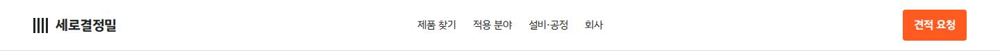 | 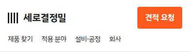 |

<details><summary>스타일 코드 (마크업 구조 + 클래스, 문구는 …) · <a href="code/header.html">code/header.html</a></summary>

```html
<header class="top">
  <a class="logo">
    <i></i>
    …
  </a>
  <nav>
    <ul>
      <li>
        <a>…</a>
      </li>
      <!-- ↑ 같은 구조 4개 반복 -->
    </ul>
  </nav>
  <a class="quote-btn">…</a>
</header>
```

</details>

### 분야 고르기 히어로 (타일 7개) `home-hero`

- 종류: `hero` · 사용 사이트: `biz-manufacturing/fieldmap` · 페이지: `/`
- 소스: [`src/app/page.tsx`](../../../templates/biz-manufacturing/fieldmap/src/app/page.tsx)

| 데스크톱 1440 | 모바일 390 |
|---|---|
| 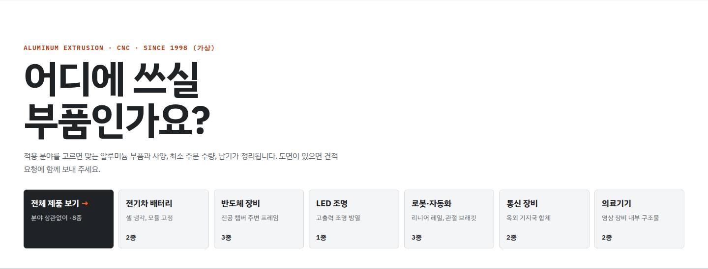 | 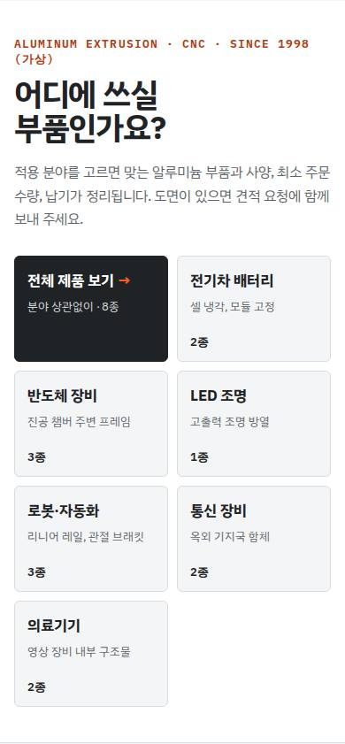 |

<details><summary>스타일 코드 (마크업 구조 + 클래스, 문구는 …) · <a href="code/home-hero.html">code/home-hero.html</a></summary>

```html
<section class="hero">
  <p class="eyebrow">…</p>
  <h1>…</h1>
  <p class="lead">…</p>
  <div class="apps">
    <a class="app-tile all">
      <b>…</b>
      <span>
        …
        …
        …
        …
      </span>
    </a>
    <a class="app-tile">
      <b>…</b>
      <span>…</span>
      <em>
        …
        …
      </em>
    </a>
    <!-- ↑ 같은 구조 6개 반복 -->
  </div>
</section>
```

</details>

### 카테고리 4칸 띠 `home-categories`

- 종류: `services` · 사용 사이트: `biz-manufacturing/fieldmap` · 페이지: `/`
- 소스: [`src/app/page.tsx`](../../../templates/biz-manufacturing/fieldmap/src/app/page.tsx)

| 데스크톱 1440 | 모바일 390 |
|---|---|
| 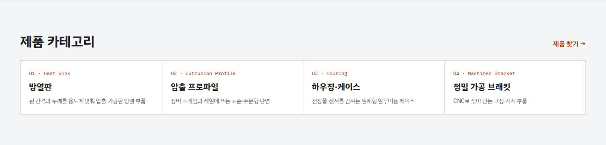 | 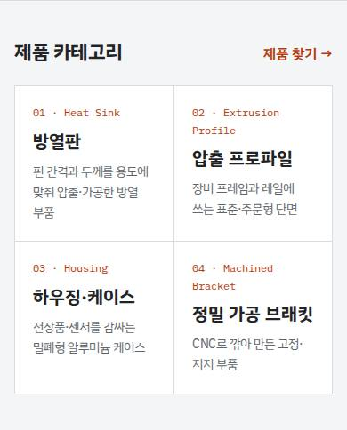 |

<details><summary>스타일 코드 (마크업 구조 + 클래스, 문구는 …) · <a href="code/home-categories.html">code/home-categories.html</a></summary>

```html
<section class="band">
  <div class="band-head">
    <h2>…</h2>
    <a>…</a>
  </div>
  <ol class="cat-row">
    <li>
      <a>
        <span class="mono">
          …
          …
          …
          …
        </span>
        <b>…</b>
        <span>…</span>
      </a>
    </li>
    <!-- ↑ 같은 구조 4개 반복 -->
  </ol>
</section>
```

</details>

### 제품 카드 (선화 + 이미지 설명 + 사양 + 견적 담기) `product-card`

- 종류: `cards` · 사용 사이트: `biz-manufacturing/fieldmap` · 페이지: `/`
- 소스: [`src/components/ProductCard.tsx`](../../../templates/biz-manufacturing/fieldmap/src/components/ProductCard.tsx)

| 데스크톱 1440 | 모바일 390 |
|---|---|
| 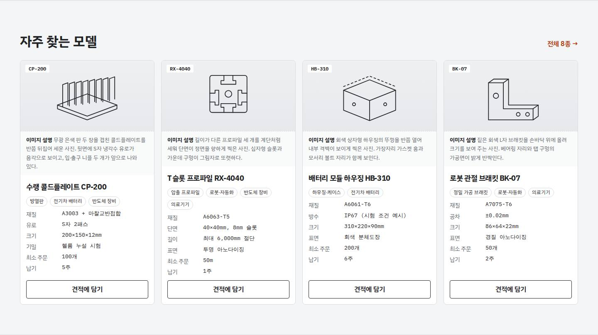 | 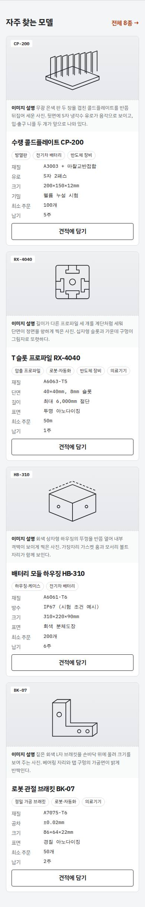 |

<details><summary>스타일 코드 (마크업 구조 + 클래스, 문구는 …) · <a href="code/product-card.html">code/product-card.html</a></summary>

```html
<section class="band">
  <div class="band-head">
    <h2>…</h2>
    <a>
      …
      …
      …
    </a>
  </div>
  <div class="results">
    <article class="prod">
      <figure>
        <span class="code">…</span>
        <svg viewBox="0 0 200 190" aria-hidden="true" class="drawing"><g fill="none" stroke="currentColor" stroke-width="2" stroke-linejoin="round" stroke-linecap="round"><path d="M20 120 L100 150 L180 120 L100 90 Z"></path><path d="M20 120 v10 L100 160 L180 130 v-10"></path><path d="M34 125 v-60 l14 -5 v60"></path><path d="M52 122.7 v-60 l14 -5 v60"></path><path d="M70 120.4 v-60 l14 -5 v60"></path><path d="M88 118.1 v-60 l14 -5 v60"></path><path d="M106 115.8 v-60 l14 -5 v60"></path><path d="M124 113.5 v-60 l14 -5 v60"></path><path d="M142 111.2 v-60 l14 -5 v60"></path><path d="M160 108.9 v-60 l14 -5 v60"></path></g></svg>
        <figcaption>
          <b>…</b>
          …
        </figcaption>
      </figure>
      <div class="prod-body">
        <h3>
          <a>…</a>
        </h3>
        <div class="tags">
          <span>…</span>
          <!-- ↑ 같은 구조 3개 반복 -->
        </div>
        <dl class="spec">
          <div>
            <dt>…</dt>
            <dd>…</dd>
          </div>
          <!-- ↑ 같은 구조 6개 반복 -->
        </dl>
        <button class="add">…</button>
      </div>
    </article>
    <!-- ↑ 같은 구조 4개 반복 -->
  </div>
</section>
```

</details>

### 설비 수치 4칸 `home-numbers`

- 종류: `stats` · 사용 사이트: `biz-manufacturing/fieldmap` · 페이지: `/`
- 소스: [`src/app/page.tsx`](../../../templates/biz-manufacturing/fieldmap/src/app/page.tsx)

| 데스크톱 1440 | 모바일 390 |
|---|---|
| 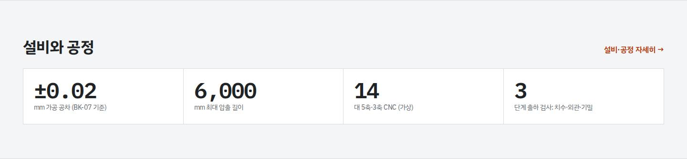 | 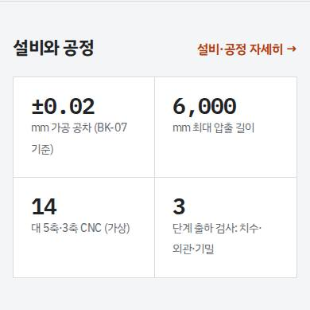 |

<details><summary>스타일 코드 (마크업 구조 + 클래스, 문구는 …) · <a href="code/home-numbers.html">code/home-numbers.html</a></summary>

```html
<section class="band">
  <div class="band-head">
    <h2>…</h2>
    <a>…</a>
  </div>
  <div class="nums">
    <div>
      <b>…</b>
      <span>
        …
        …
      </span>
    </div>
    <!-- ↑ 같은 구조 4개 반복 -->
  </div>
</section>
```

</details>

### 견적 CTA 띠 `home-cta`

- 종류: `cta` · 사용 사이트: `biz-manufacturing/fieldmap` · 페이지: `/`
- 소스: [`src/app/page.tsx`](../../../templates/biz-manufacturing/fieldmap/src/app/page.tsx)

| 데스크톱 1440 | 모바일 390 |
|---|---|
|  | 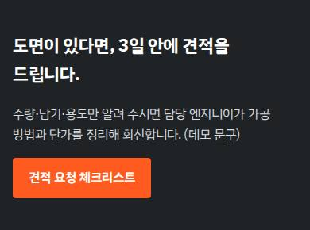 |

<details><summary>스타일 코드 (마크업 구조 + 클래스, 문구는 …) · <a href="code/home-cta.html">code/home-cta.html</a></summary>

```html
<section class="band dark cta">
  <h2>…</h2>
  <p>…</p>
  <a class="btn">…</a>
</section>
```

</details>

### 제품 찾기 (분야 × 카테고리 필터) `finder`

- 종류: `signature` · 사용 사이트: `biz-manufacturing/fieldmap` · 페이지: `/products/`
- 소스: [`src/components/Finder.tsx`](../../../templates/biz-manufacturing/fieldmap/src/components/Finder.tsx)

| 데스크톱 1440 | 모바일 390 |
|---|---|
| 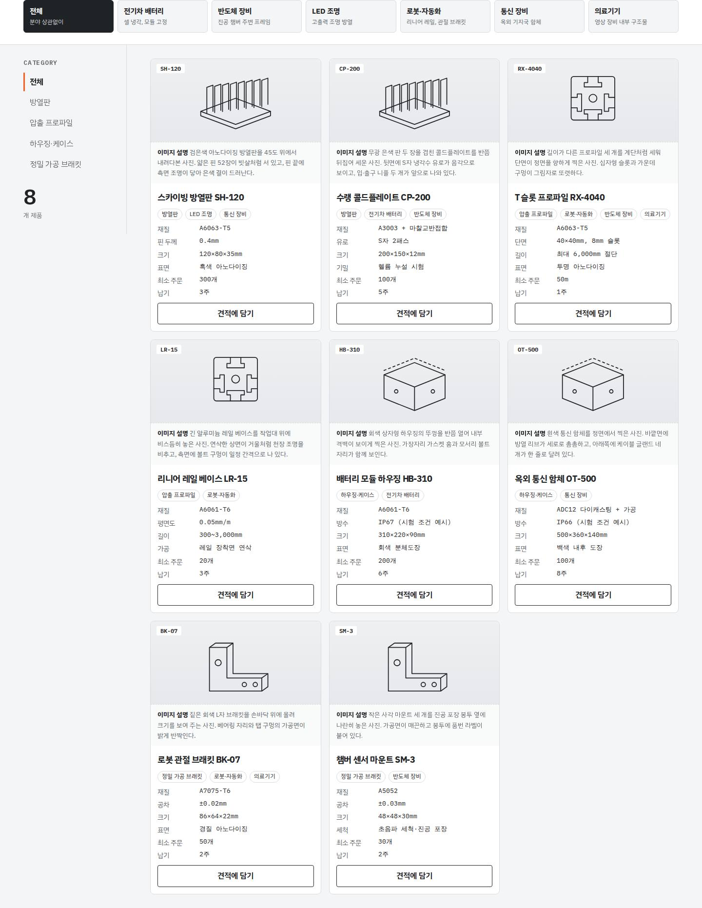 | 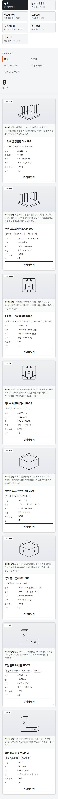 |

<details><summary>스타일 코드 (마크업 구조 + 클래스, 문구는 …) · <a href="code/finder.html">code/finder.html</a></summary>

```html
<div class="finder">
  <div class="finder-apps">
    <button>
      <b>…</b>
      <span>…</span>
    </button>
    <!-- ↑ 같은 구조 7개 반복 -->
  </div>
  <div class="finder-grid">
    <aside class="side">
      <h2>…</h2>
      <div class="cats">
        <button>…</button>
        <!-- ↑ 같은 구조 5개 반복 -->
      </div>
      <p class="count">
        <span>…</span>
        <small>…</small>
      </p>
    </aside>
    <div class="results">
      <article class="prod">
        <figure>
          <span class="code">…</span>
          <svg viewBox="0 0 200 190" aria-hidden="true" class="drawing"><g fill="none" stroke="currentColor" stroke-width="2" stroke-linejoin="round" stroke-linecap="round"><path d="M20 120 L100 150 L180 120 L100 90 Z"></path><path d="M20 120 v10 L100 160 L180 130 v-10"></path><path d="M34 125 v-60 l14 -5 v60"></path><path d="M52 122.7 v-60 l14 -5 v60"></path><path d="M70 120.4 v-60 l14 -5 v60"></path><path d="M88 118.1 v-60 l14 -5 v60"></path><path d="M106 115.8 v-60 l14 -5 v60"></path><path d="M124 113.5 v-60 l14 -5 v60"></path><path d="M142 111.2 v-60 l14 -5 v60"></path><path d="M160 108.9 v-60 l14 -5 v60"></path></g></svg>
          <figcaption>
            <b>…</b>
            …
          </figcaption>
        </figure>
        <div class="prod-body">
          <h3>
            <a>…</a>
          </h3>
          <div class="tags">
            <span>…</span>
            <!-- ↑ 같은 구조 3개 반복 -->
          </div>
          <dl class="spec">
            <div>
              <dt>…</dt>
              <dd>…</dd>
            </div>
            <!-- ↑ 같은 구조 6개 반복 -->
          </dl>
          <button class="add">…</button>
        </div>
      </article>
      <!-- ↑ 같은 구조 8개 반복 -->
    </div>
  </div>
</div>
```

</details>

### 제품 상세 (고정 그림 + 사양표) `product-detail`

- 종류: `detail` · 사용 사이트: `biz-manufacturing/fieldmap` · 페이지: `/products/HB-310/`
- 소스: [`src/app/products/[id]/page.tsx`](../../../templates/biz-manufacturing/fieldmap/src/app/products/[id]/page.tsx)

| 데스크톱 1440 | 모바일 390 |
|---|---|
| 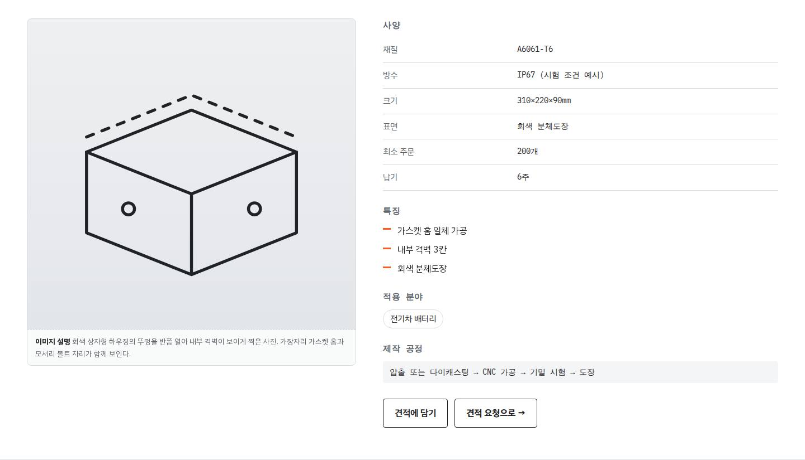 | 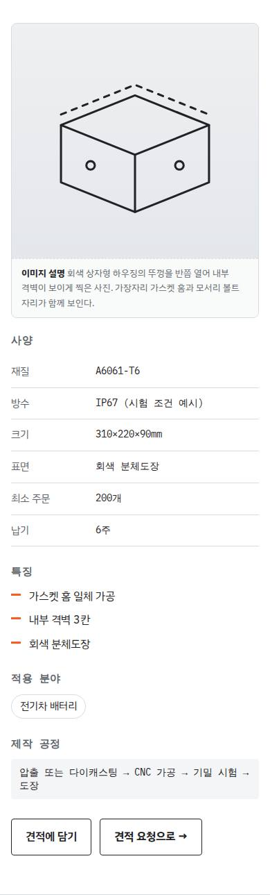 |

<details><summary>스타일 코드 (마크업 구조 + 클래스, 문구는 …) · <a href="code/product-detail.html">code/product-detail.html</a></summary>

```html
<section class="detail">
  <figure class="detail-fig">
    <svg viewBox="0 0 200 190" aria-hidden="true" class="drawing"><g fill="none" stroke="currentColor" stroke-width="2" stroke-linejoin="round" stroke-linecap="round"><path d="M30 80 L100 52 L170 80 L100 108 Z"></path><path d="M30 80 v54 L100 162 L170 134 v-54 M100 108 v54"></path><path d="M30 70 L100 42 L170 70" stroke-dasharray="5 6"></path><circle cx="58" cy="118" r="4"></circle><circle cx="142" cy="118" r="4"></circle></g></svg>
    <figcaption>
      <b>…</b>
      …
    </figcaption>
  </figure>
  <div class="detail-body">
    <h2>…</h2>
    <table class="spec-table">
      <tbody>
        <tr>
          <th>…</th>
          <td>…</td>
        </tr>
        <!-- ↑ 같은 구조 6개 반복 -->
      </tbody>
    </table>
    <h2>…</h2>
    <ul class="checks">
      <li>…</li>
      <!-- ↑ 같은 구조 3개 반복 -->
    </ul>
    <h2>…</h2>
    <p class="tags big">
      <a>…</a>
    </p>
    <h2>…</h2>
    <p class="mono-line">…</p>
    <div class="detail-cta">
      <button class="add wide">…</button>
      <a class="btn ghost">…</a>
    </div>
  </div>
</section>
```

</details>

### 적용 분야 번호 목록 `app-list`

- 종류: `list` · 사용 사이트: `biz-manufacturing/fieldmap` · 페이지: `/applications/`
- 소스: [`src/app/applications/page.tsx`](../../../templates/biz-manufacturing/fieldmap/src/app/applications/page.tsx)

| 데스크톱 1440 | 모바일 390 |
|---|---|
| 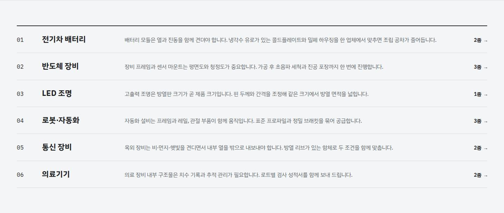 | 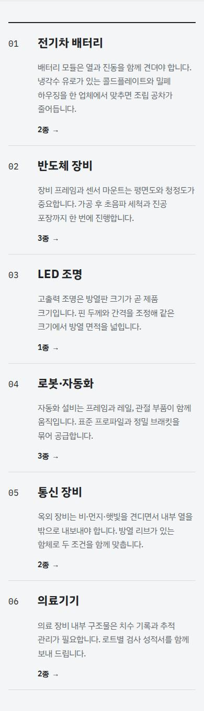 |

<details><summary>스타일 코드 (마크업 구조 + 클래스, 문구는 …) · <a href="code/app-list.html">code/app-list.html</a></summary>

```html
<section class="band">
  <ol class="app-list">
    <li>
      <a>
        <span class="mono">…</span>
        <b>…</b>
        <span>…</span>
        <em>
          …
          …
        </em>
      </a>
    </li>
    <!-- ↑ 같은 구조 6개 반복 -->
  </ol>
</section>
```

</details>

### 공정 6단계 `steps`

- 종류: `process` · 사용 사이트: `biz-manufacturing/fieldmap` · 페이지: `/capability/`
- 소스: [`src/app/capability/page.tsx`](../../../templates/biz-manufacturing/fieldmap/src/app/capability/page.tsx)

| 데스크톱 1440 | 모바일 390 |
|---|---|
| 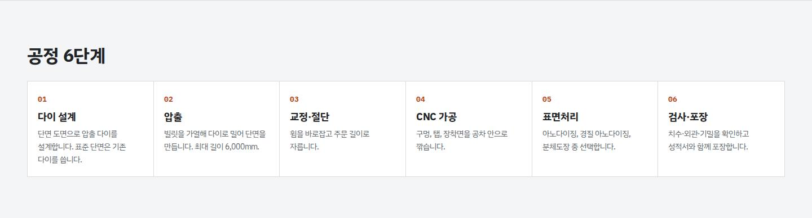 | 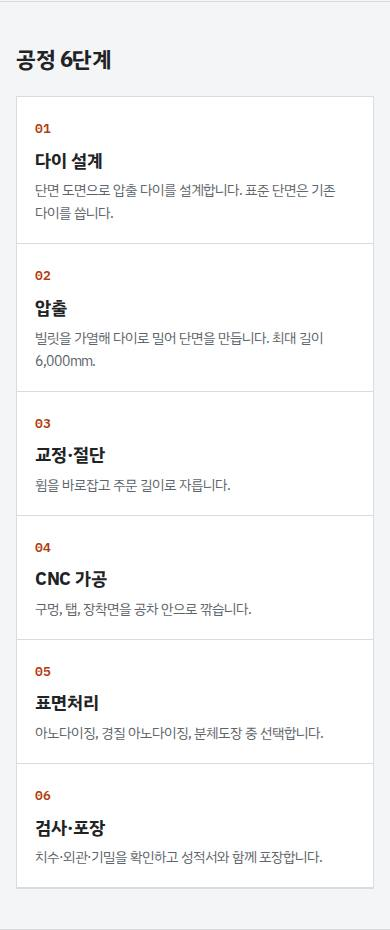 |

<details><summary>스타일 코드 (마크업 구조 + 클래스, 문구는 …) · <a href="code/steps.html">code/steps.html</a></summary>

```html
<section class="band">
  <h2>…</h2>
  <ol class="steps">
    <li>
      <span class="mono">…</span>
      <b>…</b>
      <p>…</p>
    </li>
    <!-- ↑ 같은 구조 6개 반복 -->
  </ol>
</section>
```

</details>

### 견적 요청 체크리스트 `quote-form`

- 종류: `form` · 사용 사이트: `biz-manufacturing/fieldmap` · 페이지: `/quote/`
- 소스: [`src/components/QuoteForm.tsx`](../../../templates/biz-manufacturing/fieldmap/src/components/QuoteForm.tsx)

| 데스크톱 1440 | 모바일 390 |
|---|---|
| 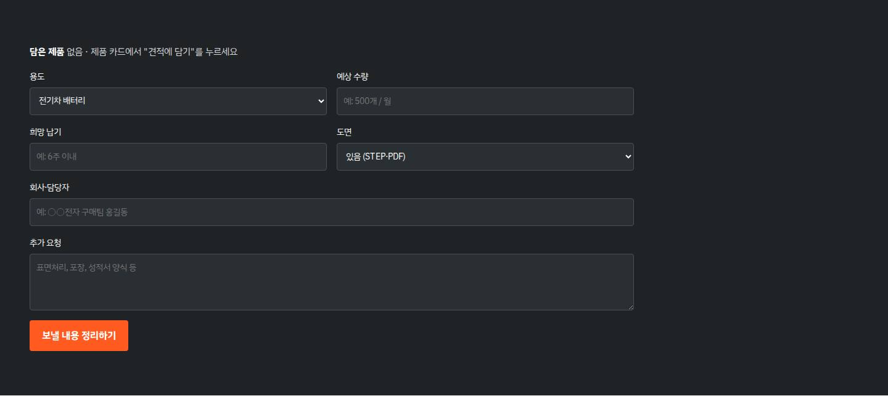 | 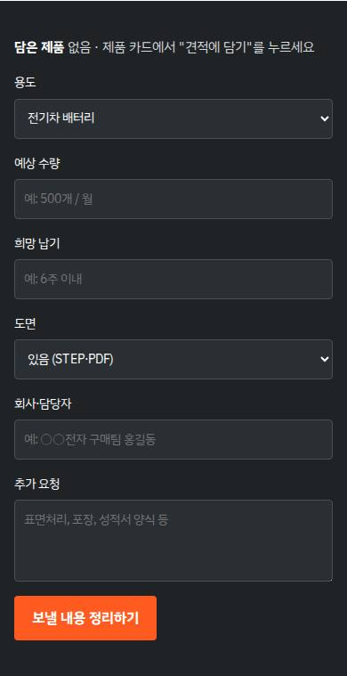 |

<details><summary>스타일 코드 (마크업 구조 + 클래스, 문구는 …) · <a href="code/quote-form.html">code/quote-form.html</a></summary>

```html
<section class="band dark">
  <form class="qform">
    <div class="full picked">
      <b>…</b>
      <span>…</span>
    </div>
    <label>
      …
      <select>
        <option>…</option>
        <!-- ↑ 같은 구조 7개 반복 -->
      </select>
    </label>
    <!-- ↑ 같은 구조 4개 반복 -->
    <label class="full">
      …
      <input style="" />
    </label>
    <!-- ↑ 같은 구조 2개 반복 -->
    <button>…</button>
  </form>
</section>
```

</details>

### 푸터 3단 `footer`

- 종류: `footer` · 사용 사이트: `biz-manufacturing/fieldmap` · 페이지: `/`
- 소스: [`src/components/Footer.tsx`](../../../templates/biz-manufacturing/fieldmap/src/components/Footer.tsx)

| 데스크톱 1440 | 모바일 390 |
|---|---|
| 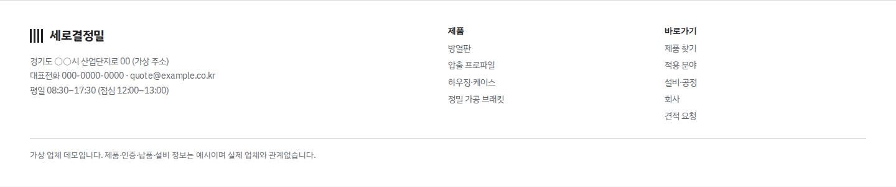 | 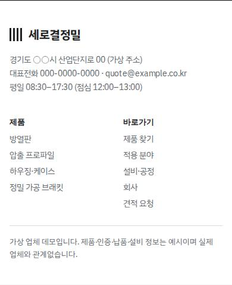 |

<details><summary>스타일 코드 (마크업 구조 + 클래스, 문구는 …) · <a href="code/footer.html">code/footer.html</a></summary>

```html
<footer class="foot">
  <div>
    <p class="logo">
      <i></i>
      …
    </p>
    <p>
      …
      <br />
      …
      …
      …
      …
      <br />
      …
    </p>
  </div>
  <!-- ↑ 같은 구조 3개 반복 -->
  <p class="foot-demo">…</p>
</footer>
```

</details>
