# 중소 제조·B2B · isoline

> 자동 생성 문서(`npm run library`). 참고용 스타일 기록이며, 이 코드를 다른 사이트에 그대로 쓰지 않는다.

- 사용 사이트: `biz-manufacturing/isoline` (세로결정밀(가상))
- 배포 주소: https://hongjaang-star.github.io/agency-web-templates/biz-manufacturing/isoline/
- 소스: [`templates/biz-manufacturing/isoline`](../../../templates/biz-manufacturing/isoline)

## 디자인 지문

| 항목 | 값 |
|---|---|
| layout | immersive |
| hero | exploded line drawing + numbers |
| typePair | Pretendard + Space Grotesk |
| palette | forest black · chartreuse · mist |
| imageTreatment | isometric line drawings on grid paper with title blocks and virtual image descriptions |
| motion | exploded/assembled hero toggle, reduced-motion safe |
| signature | 외곽선 글자 분야 링과 도면 표제란 부품 상세 |
| sectionOrder | exploded-hero, field-ring, drawing-index, process, certs, rfq-cta |

## 디자인 토큰

서체 설정 (`src/app/layout.tsx`)

```ts
import { Space_Grotesk } from "next/font/google";

const grotesk = Space_Grotesk({ variable: "--font-grotesk", subsets: ["latin"], weight: ["400", "500", "700"], display: "swap" });
```

<details><summary>globals.css (색·서체 토큰, 공용 유틸리티)</summary>

```css
/* 세로결정밀 · isoline — 짙은 숲빛 검정 바탕에 연두 선. 한글 Pretendard(자체 호스팅), 숫자 Space Grotesk. */
@import "pretendard/dist/web/variable/pretendardvariable-dynamic-subset.css";

:root {
  --bg: #0f1714;
  --panel: #16211d;
  --line: #2b3a34;
  --text: #e6ece8;
  --muted: #8fa199;
  --lime: #c6f432;
  --pad: clamp(16px, 4vw, 56px);
  --sans: "Pretendard Variable", Pretendard, system-ui, sans-serif;
  --num: var(--font-grotesk), "Space Grotesk", var(--sans);
  color-scheme: dark;
}
* { box-sizing: border-box; }
html { scroll-behavior: smooth; }
body { margin: 0; background: var(--bg); color: var(--text); font: 16px/1.65 var(--sans); word-break: keep-all; }
a { color: inherit; }
:focus-visible { outline: 3px solid var(--lime); outline-offset: 3px; }
.num { font-family: var(--num); }
.skip { position: absolute; left: -999px; top: 0; background: var(--lime); color: var(--bg); padding: 8px 12px; z-index: 30; }
.skip:focus { left: 8px; }
.demo { font-size: 12px; letter-spacing: 0.04em; color: var(--bg); background: var(--lime); text-align: center; padding: 5px 12px; font-weight: 600; }
.kicker { font: 500 13px var(--num); letter-spacing: 0.12em; color: var(--lime); text-transform: uppercase; margin: 0; }
h1, h2 { letter-spacing: -0.03em; }
.lead { color: var(--muted); max-width: 560px; }

/* 머리 */
.bar { display: flex; justify-content: space-between; align-items: center; gap: 20px; padding: 18px var(--pad); border-bottom: 1px solid var(--line); position: sticky; top: 0; background: rgba(15, 23, 20, 0.92); backdrop-filter: blur(8px); z-index: 20; }
.mark, .foot-mark { font-weight: 800; font-size: 19px; text-decoration: none; letter-spacing: -0.02em; }
.mark span, .foot-mark span { color: var(--lime); }
.bar nav { display: flex; gap: 26px; font-size: 14px; color: var(--muted); }
.bar nav a { text-decoration: none; }
.bar nav a:hover { color: var(--text); }
.pill { border: 1px solid var(--lime); color: var(--lime); border-radius: 99px; padding: 7px 16px; text-decoration: none; font-size: 14px; font-weight: 600; white-space: nowrap; }
.pill:hover { background: var(--lime); color: var(--bg); }

/* 첫 화면 */
.hero { display: grid; grid-template-columns: 1.1fr 1fr; align-items: center; gap: 24px; padding: 32px var(--pad) 72px; min-height: 78vh; }
.hero h1 { font-size: clamp(38px, 6vw, 84px); line-height: 1.02; letter-spacing: -0.045em; margin: 10px 0 20px; }
.hero h1 em { font-style: normal; color: var(--lime); }
.stats { display: flex; gap: 32px; margin-top: 28px; flex-wrap: wrap; }
.stats b { display: block; font: 700 clamp(30px, 4vw, 50px)/1 var(--num); color: var(--lime); }
.stats span { font-size: 13px; color: var(--muted); }
.stats.big { gap: 0; display: grid; grid-template-columns: repeat(3, 1fr); border: 1px solid var(--line); }
.stats.big div { padding: 26px; border-right: 1px solid var(--line); }
.stats.big div:last-child { border-right: 0; }
.explode { position: relative; color: var(--muted); }
.explode svg { width: 100%; height: auto; display: block; }
.explode .part { transition: transform 1.2s cubic-bezier(0.2, 0.8, 0.2, 1); }
.explode.open .lid { transform: translateY(-46px); }
.explode.open .tray { transform: translateY(-18px); }
.explode.open .base { transform: translateY(22px); }
.explode .lbl text { font: 500 12px var(--num); fill: var(--muted); }
.explode .lbl { opacity: 0; transition: opacity 0.6s 0.8s; }
.explode.open .lbl { opacity: 1; }
.explode button { position: absolute; right: 0; bottom: -10px; font: inherit; font-size: 13px; background: none; color: var(--lime); border: 1px solid var(--lime); border-radius: 99px; padding: 6px 14px; cursor: pointer; }

/* 띠 */
.sec { padding: clamp(48px, 7vw, 96px) var(--pad); border-top: 1px solid var(--line); }
.sec.flush { border-top: 0; padding-top: 16px; }
.sec h2 { font-size: clamp(26px, 4vw, 48px); line-height: 1.1; margin: 8px 0 28px; }
.sec-head { display: flex; justify-content: space-between; align-items: flex-end; gap: 16px; flex-wrap: wrap; margin-bottom: 8px; }
.more { color: var(--lime); text-decoration: none; font-weight: 600; margin-bottom: 28px; }
.go { display: inline-block; background: var(--lime); color: var(--bg); font-weight: 700; text-decoration: none; padding: 12px 22px; border-radius: 99px; border: 0; }
.cta p { color: var(--muted); }

/* 분야 링 */
.ring { display: flex; flex-wrap: wrap; gap: 4px 20px; margin-bottom: 36px; }
.ring button { font: 700 clamp(24px, 3.4vw, 44px)/1.25 var(--sans); letter-spacing: -0.03em; background: none; border: 0; color: transparent; -webkit-text-stroke: 1px var(--muted); cursor: pointer; padding: 2px 0; }
.ring button:hover { color: var(--line); }
.ring button[aria-pressed="true"] { color: var(--lime); -webkit-text-stroke: 0; }
.scene { display: grid; grid-template-columns: 320px 1fr; gap: 36px; }
.scene .about { position: sticky; top: 90px; align-self: start; }
.scene .about b { font-size: 26px; display: block; margin-bottom: 8px; }
.scene .about p { color: var(--muted); margin: 0 0 12px; }
.scene .about ul { margin: 0 0 12px; padding: 0; list-style: none; }
.scene .about li { padding: 4px 0 4px 18px; position: relative; }
.scene .about li::before { content: ""; position: absolute; left: 0; top: 0.9em; width: 10px; height: 1px; background: var(--lime); }
.scene .about .check { font-size: 14px; border-left: 2px solid var(--lime); padding-left: 10px; }

/* 부품 한 장 */
.sheet { display: grid; grid-template-columns: 250px 1fr; gap: 22px; border-top: 1px solid var(--line); padding: 24px 0; }
.sheet:first-child { border-top: 0; padding-top: 0; }
.sheet figure { margin: 0; }
.lines { display: block; width: 100%; height: auto; color: var(--lime); }
.sheet .lines { background: var(--panel); border-radius: 6px; padding: 10px; }
.sheet figcaption, .caption { font-size: 13px; color: var(--muted); margin-top: 8px; }
.sheet figcaption b, .caption b { color: var(--text); font-weight: 600; }
.sheet h3 { margin: 0; font-size: 22px; letter-spacing: -0.02em; }
.sheet h3 a { text-decoration: none; }
.sheet h3 a:hover { color: var(--lime); }
.code { font: 500 13px var(--num); color: var(--lime); }
.cat { font-size: 13px; color: var(--muted); margin: 2px 0 0; }
table.spec { border-collapse: collapse; width: 100%; margin-top: 12px; font-size: 14px; }
table.spec th, table.spec td { border-bottom: 1px solid var(--line); padding: 8px 0; text-align: left; font-weight: 400; vertical-align: top; }
table.spec th { color: var(--muted); width: 34%; }
table.spec.wide th { width: 22%; }

/* 도면 목록 */
.index { list-style: none; margin: 0; padding: 0; display: grid; grid-template-columns: repeat(4, 1fr); gap: 12px; }
.index a { display: flex; flex-direction: column; gap: 6px; padding: 18px; border: 1px solid var(--line); border-radius: 8px; text-decoration: none; background: var(--panel); height: 100%; }
.index a:hover { border-color: var(--lime); }
.index .num { font-size: 12px; color: var(--lime); }
.index b { font-size: 20px; }
.index small { color: var(--muted); font-size: 12px; }
.cat-sec { display: grid; grid-template-columns: 300px 1fr; gap: 32px; }
.cat-head { position: sticky; top: 90px; align-self: start; }
.cat-head .num { color: var(--lime); font-size: 13px; }
.cat-head h2 { margin: 6px 0 10px; }
.cat-head p { color: var(--muted); margin: 0 0 10px; }
.proc { font-size: 13px; color: var(--text); background: var(--panel); border-radius: 4px; padding: 8px 10px; }
.cards { list-style: none; margin: 0; padding: 0; display: grid; grid-template-columns: repeat(auto-fill, minmax(240px, 1fr)); gap: 14px; }
.cards a { display: flex; flex-direction: column; gap: 6px; border: 1px solid var(--line); border-radius: 8px; padding: 16px; text-decoration: none; height: 100%; }
.cards a:hover { border-color: var(--lime); }
.cards b { font-size: 18px; }
.cards small { color: var(--muted); }

/* 상세 도면 */
.ptop { padding: clamp(40px, 6vw, 80px) var(--pad) 32px; }
.ptop h1 { font-size: clamp(34px, 5.4vw, 70px); line-height: 1.05; margin: 10px 0 14px; letter-spacing: -0.04em; }
.trail { font-size: 12px; letter-spacing: 0.08em; color: var(--muted); margin-bottom: 22px; }
.trail a { text-decoration: none; }
.trail a:hover { color: var(--lime); }
.drawing-sheet { display: grid; grid-template-columns: 1.2fr 1fr; gap: clamp(20px, 4vw, 48px); }
.paper { border: 1px solid var(--line); border-radius: 8px; background: var(--panel) linear-gradient(var(--line) 1px, transparent 1px) 0 0 / 24px 24px; padding: 24px; align-self: start; position: sticky; top: 90px; }
.paper .lines { max-height: 420px; }
.tblock { display: grid; grid-template-columns: repeat(3, 1fr); margin: 20px 0 0; border: 1px solid var(--muted); background: var(--bg); font-size: 13px; }
.tblock div { border-right: 1px solid var(--line); border-bottom: 1px solid var(--line); padding: 8px 10px; }
.tblock .wide { grid-column: 1 / -1; }
.tblock dt { color: var(--muted); font-size: 11px; letter-spacing: 0.04em; }
.tblock dd { margin: 2px 0 0; }
.side h2 { font-size: 15px; font-family: var(--num); letter-spacing: 0.1em; color: var(--lime); margin: 26px 0 8px; text-transform: uppercase; }
.ticks { list-style: none; margin: 0; padding: 0; }
.ticks li { padding: 4px 0 4px 20px; position: relative; }
.ticks li::before { content: "+"; position: absolute; left: 0; color: var(--lime); font-family: var(--num); }
.apps { display: flex; flex-wrap: wrap; gap: 8px; margin: 0; }
.apps a { border: 1px solid var(--line); border-radius: 99px; padding: 4px 12px; text-decoration: none; }
.apps a:hover { border-color: var(--lime); color: var(--lime); }
.side .go { margin-top: 28px; }
.pager { display: flex; justify-content: space-between; gap: 16px; flex-wrap: wrap; }
.pager a { text-decoration: none; color: var(--muted); }
.pager a:hover { color: var(--lime); }

/* 공정 */
.flow { display: grid; grid-template-columns: repeat(5, 1fr); padding: 0; margin: 0; counter-reset: s; }
.flow li { list-style: none; border-left: 1px solid var(--line); padding: 0 18px 0 16px; }
.flow li::before { counter-increment: s; content: "0" counter(s); display: block; font: 700 40px/1 var(--num); color: var(--lime); margin-bottom: 10px; }
.flow b { display: block; }
.flow span { font-size: 14px; color: var(--muted); }
.track { list-style: none; margin: 0; padding: 0; position: relative; }
.track::before { content: ""; position: absolute; left: 34px; top: 8px; bottom: 8px; width: 1px; background: var(--lime); opacity: 0.5; }
.track li { display: grid; grid-template-columns: 70px 1fr; gap: 20px; padding: 20px 0; }
.track .step { width: 70px; height: 70px; border: 1px solid var(--lime); border-radius: 50%; display: grid; place-items: center; font-size: 22px; font-weight: 700; color: var(--lime); background: var(--bg); position: relative; }
.track h2 { margin: 8px 0 6px; font-size: clamp(22px, 3vw, 34px); }
.track p { margin: 0 0 4px; color: var(--muted); }
.track small { color: var(--lime); }

/* 회사 */
.certs { display: grid; grid-template-columns: repeat(3, 1fr); gap: 12px; }
.certs div { background: var(--panel); border: 1px solid var(--line); border-radius: 6px; padding: 18px; }
.certs b { display: block; font-size: 18px; }
.certs span { font-size: 13px; color: var(--muted); }
.years { list-style: none; margin: 0; padding: 0; display: grid; grid-template-columns: repeat(5, 1fr); border-top: 1px solid var(--lime); }
.years li { padding: 16px 16px 0 0; position: relative; }
.years li::before { content: ""; position: absolute; top: -5px; left: 0; width: 9px; height: 9px; border-radius: 50%; background: var(--lime); }
.years b { display: block; font-size: 28px; color: var(--lime); }
.years span { color: var(--muted); font-size: 14px; }

/* 견적 */
.rfq { display: grid; grid-template-columns: 1fr 1fr; gap: 28px; }
.rfq fieldset { border: 1px solid var(--line); border-radius: 8px; padding: 14px 16px; margin: 0 0 14px; }
.rfq legend { padding: 0 6px; color: var(--lime); font-size: 14px; }
.rfq label { display: flex; gap: 10px; align-items: center; padding: 5px 0; cursor: pointer; }
.rfq input { accent-color: var(--lime); width: 18px; height: 18px; }
.chips { display: flex; flex-wrap: wrap; gap: 0 18px; }
.memo { flex-direction: column; align-items: stretch !important; }
.memo textarea { font: inherit; background: var(--panel); color: var(--text); border: 1px solid var(--line); border-radius: 6px; padding: 10px; }
.summary-col { position: sticky; top: 90px; align-self: start; }
.summary { background: var(--panel); border-radius: 8px; padding: 18px; font-size: 14px; white-space: pre-wrap; margin: 0 0 14px; min-height: 160px; }
.hint { color: var(--muted); font-size: 13px; }
.faq { margin: 0; display: grid; gap: 16px; max-width: 820px; }
.faq dt { font-weight: 700; }
.faq dd { margin: 4px 0 0; color: var(--muted); }

/* 바닥 */
.foot { padding: 36px var(--pad); border-top: 1px solid var(--line); font-size: 13px; color: var(--muted); display: grid; gap: 10px; }
.foot p { margin: 0; }
.foot nav { display: flex; flex-wrap: wrap; gap: 18px; }
.foot nav a { text-decoration: none; }
.foot nav a:hover { color: var(--lime); }

@media (max-width: 960px) {
  .hero, .scene, .rfq, .drawing-sheet, .cat-sec { grid-template-columns: 1fr; }
  .scene .about, .cat-head, .paper, .summary-col { position: static; }
  .flow { grid-template-columns: 1fr 1fr; row-gap: 24px; }
  .index { grid-template-columns: 1fr 1fr; }
  .certs { grid-template-columns: 1fr; }
  .years { grid-template-columns: 1fr 1fr; row-gap: 18px; }
  .bar { flex-wrap: wrap; row-gap: 10px; }
  .bar nav { order: 3; width: 100%; overflow-x: auto; white-space: nowrap; gap: 18px; }
}
@media (max-width: 560px) {
  .sheet { grid-template-columns: 1fr; }
  .stats.big { grid-template-columns: 1fr; }
  .stats.big div { border-right: 0; border-bottom: 1px solid var(--line); }
  .tblock { grid-template-columns: 1fr 1fr; }
  .track li { grid-template-columns: 54px 1fr; }
  .track .step { width: 54px; height: 54px; font-size: 18px; }
  .track::before { left: 27px; }
}
@media (prefers-reduced-motion: reduce) {
  html { scroll-behavior: auto; }
  .explode .part, .explode .lbl { transition: none; }
}
```

</details>

## 모듈

### 다크 헤더 (라임 점 워드마크, 견적 알약 버튼) `header`

- 종류: `header` · 사용 사이트: `biz-manufacturing/isoline` · 페이지: `/`
- 소스: [`src/components/TopBar.tsx`](../../../templates/biz-manufacturing/isoline/src/components/TopBar.tsx)

| 데스크톱 1440 | 모바일 390 |
|---|---|
| 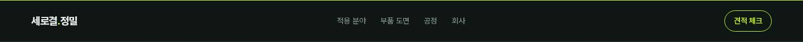 | 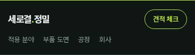 |

<details><summary>스타일 코드 (마크업 구조 + 클래스, 문구는 …) · <a href="code/header.html">code/header.html</a></summary>

```html
<header class="bar">
  <a class="mark">
    …
    <span>…</span>
    …
  </a>
  <nav>
    <a>…</a>
    <!-- ↑ 같은 구조 4개 반복 -->
  </nav>
  <a class="pill">…</a>
</header>
```

</details>

### 분해 선화 히어로 + 큰 숫자 `home-hero`

- 종류: `hero` · 사용 사이트: `biz-manufacturing/isoline` · 페이지: `/`
- 소스: [`src/components/Exploded.tsx`](../../../templates/biz-manufacturing/isoline/src/components/Exploded.tsx)

| 데스크톱 1440 | 모바일 390 |
|---|---|
| 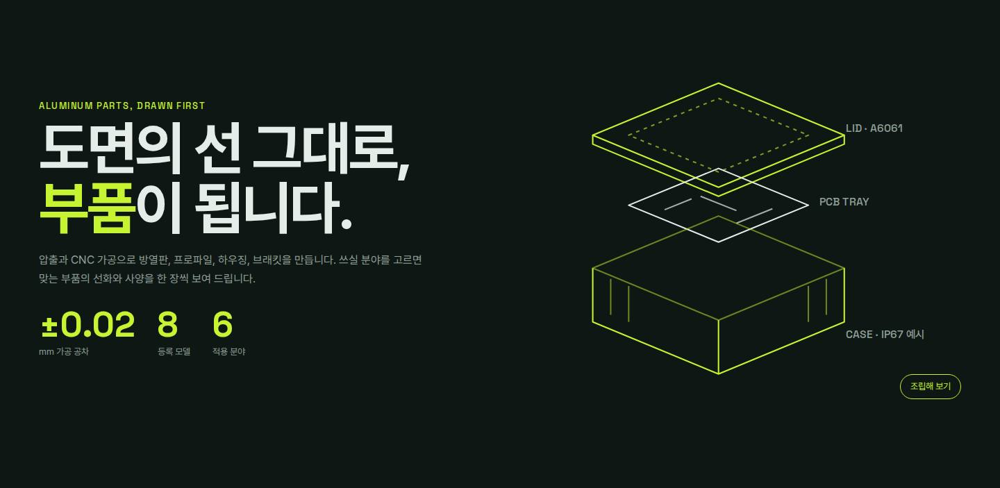 | 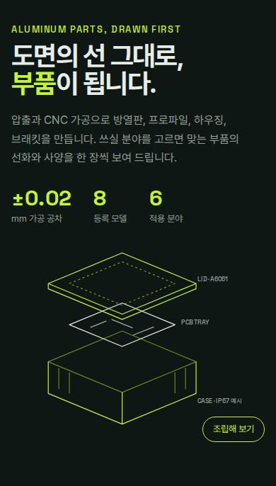 |

<details><summary>스타일 코드 (마크업 구조 + 클래스, 문구는 …) · <a href="code/home-hero.html">code/home-hero.html</a></summary>

```html
<section class="hero">
  <div>
    <p class="kicker">…</p>
    <h1>
      …
      <br />
      <em>…</em>
      …
    </h1>
    <p class="lead">…</p>
    <div class="stats">
      <div>
        <b class="num">…</b>
        <span>…</span>
      </div>
      <!-- ↑ 같은 구조 3개 반복 -->
    </div>
  </div>
  <div class="explode open">
    <svg viewBox="0 0 480 360" role="img" aria-label="배터리 모듈 하우징 분해 선화: 뚜껑, 기판 트레이, 바닥 케이스"><g fill="none" stroke="var(--lime)" stroke-width="1.6" stroke-linejoin="round"><g class="part lid"><path d="M70 120 L210 62 L350 120 L210 178 Z"></path><path d="M70 120 v10 L210 188 L350 130 v-10"></path><path d="M110 120 L210 79 L310 120 L210 161 Z" stroke-dasharray="4 5" opacity=".6"></path></g><g class="part tray" stroke="var(--text)"><path d="M110 170 L210 129 L310 170 L210 211 Z"></path><path d="M150 175 l30 -12 M230 190 l40 -16 M190 160 l40 16" opacity=".7"></path></g><g class="part base"><path d="M70 200 L210 142 L350 200 L210 258 Z" opacity=".5"></path><path d="M70 200 v60 L210 318 L350 260 v-60"></path><path d="M210 258 v60"></path><path d="M90 212 v40 M110 220 v40 M310 220 v40 M330 212 v40" opacity=".5"></path></g></g><g class="lbl"><text x="352" y="70">LID · A6061</text><text x="322" y="152">PCB TRAY</text><text x="352" y="300">CASE · IP67 예시</text></g></svg>
    <button>…</button>
  </div>
</section>
```

</details>

### 외곽선 글자 분야 링 + 부품 도면 `field-ring`

- 종류: `signature` · 사용 사이트: `biz-manufacturing/isoline` · 페이지: `/`
- 소스: [`src/components/FieldRing.tsx`](../../../templates/biz-manufacturing/isoline/src/components/FieldRing.tsx)

| 데스크톱 1440 | 모바일 390 |
|---|---|
| 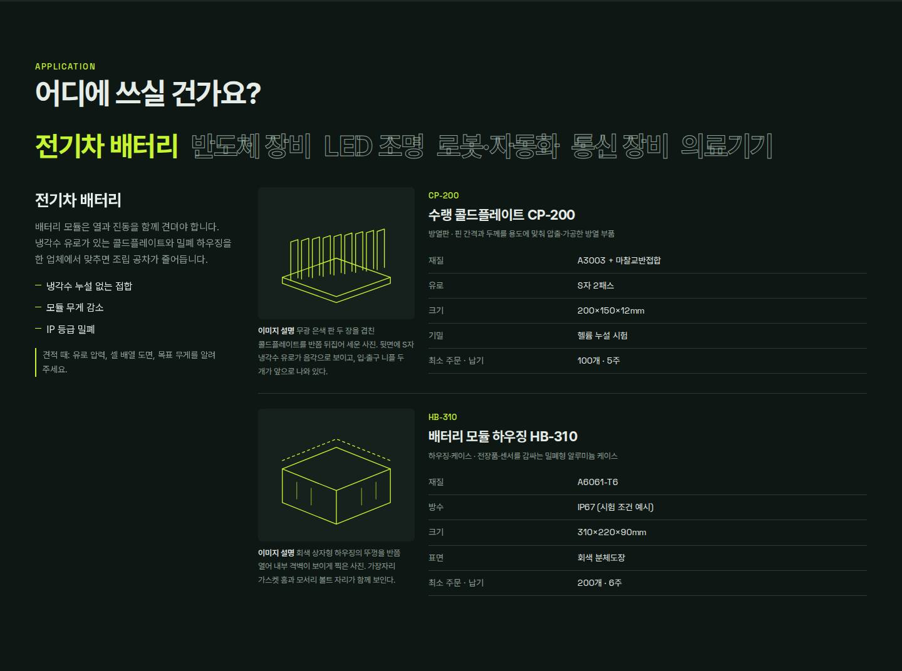 | 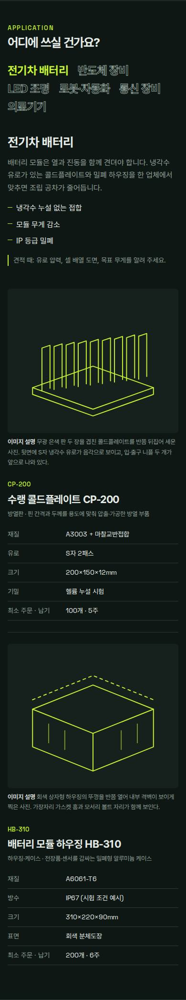 |

<details><summary>스타일 코드 (마크업 구조 + 클래스, 문구는 …) · <a href="code/field-ring.html">code/field-ring.html</a></summary>

```html
<section class="sec">
  <p class="kicker">…</p>
  <h2>…</h2>
  <div class="field">
    <div class="ring">
      <button>…</button>
      <!-- ↑ 같은 구조 6개 반복 -->
    </div>
    <div class="scene">
      <div class="about" style="">
        <b>…</b>
        <p>…</p>
        <ul>
          <li>…</li>
          <!-- ↑ 같은 구조 3개 반복 -->
        </ul>
        <p class="check">
          …
          …
        </p>
      </div>
      <div class="sheets">
        <article class="sheet">
          <figure>
            <svg class="lines" viewBox="0 0 240 200" aria-hidden="true"><g fill="none" stroke="currentColor" stroke-width="1.4" stroke-linejoin="round" stroke-linecap="round"><path d="M30 140 L120 172 L210 140 L120 108 Z"></path><path d="M30 140 v10 L120 182 L210 150 v-10"></path><path d="M44 145 v-64 l12 -4 v64"></path><path d="M62 142.8 v-64 l12 -4 v64"></path><path d="M80 140.6 v-64 l12 -4 v64"></path><path d="M98 138.4 v-64 l12 -4 v64"></path><path d="M116 136.2 v-64 l12 -4 v64"></path><path d="M134 134 v-64 l12 -4 v64"></path><path d="M152 131.8 v-64 l12 -4 v64"></path><path d="M170 129.6 v-64 l12 -4 v64"></path><path d="M188 127.4 v-64 l12 -4 v64"></path></g></svg>
            <figcaption>
              <b>…</b>
              …
            </figcaption>
          </figure>
          <div>
            <span class="code num">…</span>
            <h3>
              <a>…</a>
            </h3>
            <p class="cat">
              …
              …
              …
            </p>
            <table class="spec">
              <tbody>
                <tr>
                  <th>…</th>
                  <td class="num">…</td>
                </tr>
                <!-- ↑ 같은 구조 5개 반복 -->
              </tbody>
            </table>
          </div>
        </article>
        <!-- ↑ 같은 구조 2개 반복 -->
      </div>
    </div>
  </div>
</section>
```

</details>

### 카테고리 도면 목록 4장 `drawing-index`

- 종류: `cards` · 사용 사이트: `biz-manufacturing/isoline` · 페이지: `/`
- 소스: [`src/app/page.tsx`](../../../templates/biz-manufacturing/isoline/src/app/page.tsx)

| 데스크톱 1440 | 모바일 390 |
|---|---|
| 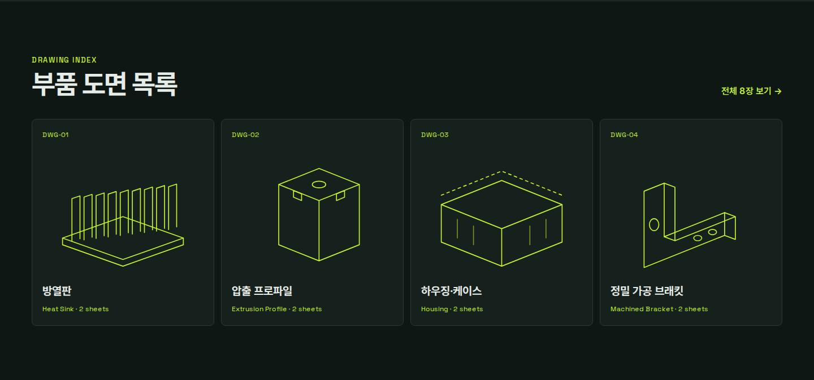 | 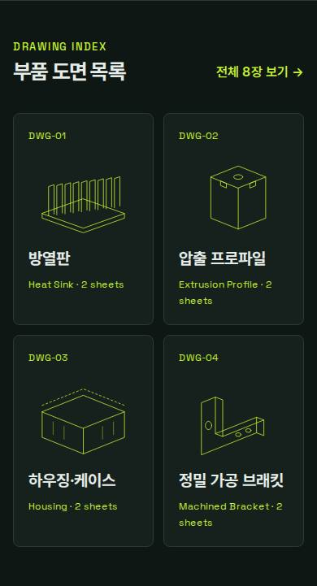 |

<details><summary>스타일 코드 (마크업 구조 + 클래스, 문구는 …) · <a href="code/drawing-index.html">code/drawing-index.html</a></summary>

```html
<section class="sec">
  <div class="sec-head">
    <div>
      <p class="kicker">…</p>
      <h2>…</h2>
    </div>
    <a class="more">
      …
      …
      …
    </a>
  </div>
  <ol class="index">
    <li>
      <a>
        <span class="num">
          …
          …
        </span>
        <svg class="lines" viewBox="0 0 240 200" aria-hidden="true"><g fill="none" stroke="currentColor" stroke-width="1.4" stroke-linejoin="round" stroke-linecap="round"><path d="M30 140 L120 172 L210 140 L120 108 Z"></path><path d="M30 140 v10 L120 182 L210 150 v-10"></path><path d="M44 145 v-64 l12 -4 v64"></path><path d="M62 142.8 v-64 l12 -4 v64"></path><path d="M80 140.6 v-64 l12 -4 v64"></path><path d="M98 138.4 v-64 l12 -4 v64"></path><path d="M116 136.2 v-64 l12 -4 v64"></path><path d="M134 134 v-64 l12 -4 v64"></path><path d="M152 131.8 v-64 l12 -4 v64"></path><path d="M170 129.6 v-64 l12 -4 v64"></path><path d="M188 127.4 v-64 l12 -4 v64"></path></g></svg>
        <b>…</b>
        <small class="num">
          …
          …
          …
          …
        </small>
      </a>
    </li>
    <!-- ↑ 같은 구조 4개 반복 -->
  </ol>
</section>
```

</details>

### 공정 5단계 큰 번호 `home-flow`

- 종류: `process` · 사용 사이트: `biz-manufacturing/isoline` · 페이지: `/`
- 소스: [`src/app/page.tsx`](../../../templates/biz-manufacturing/isoline/src/app/page.tsx)

| 데스크톱 1440 | 모바일 390 |
|---|---|
| 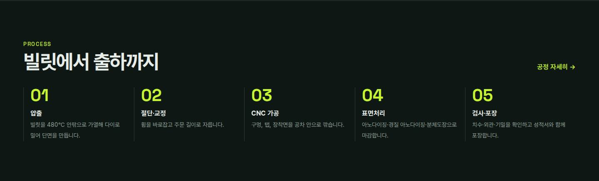 | 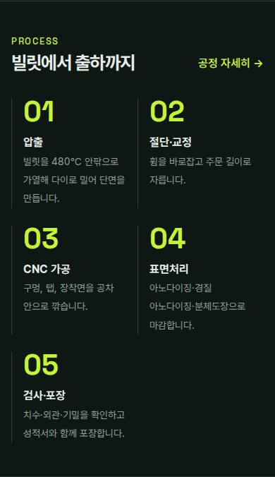 |

<details><summary>스타일 코드 (마크업 구조 + 클래스, 문구는 …) · <a href="code/home-flow.html">code/home-flow.html</a></summary>

```html
<section class="sec">
  <div class="sec-head">
    <div>
      <p class="kicker">…</p>
      <h2>…</h2>
    </div>
    <a class="more">…</a>
  </div>
  <ol class="flow">
    <li>
      <b>…</b>
      <span>…</span>
    </li>
    <!-- ↑ 같은 구조 5개 반복 -->
  </ol>
</section>
```

</details>

### 인증 카드 3칸 `certs`

- 종류: `trust` · 사용 사이트: `biz-manufacturing/isoline` · 페이지: `/`
- 소스: [`src/app/page.tsx`](../../../templates/biz-manufacturing/isoline/src/app/page.tsx)

| 데스크톱 1440 | 모바일 390 |
|---|---|
| 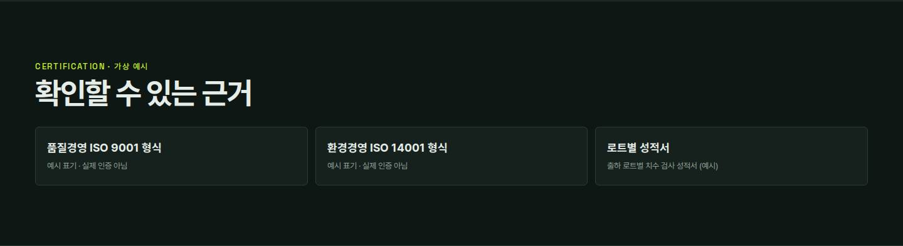 | 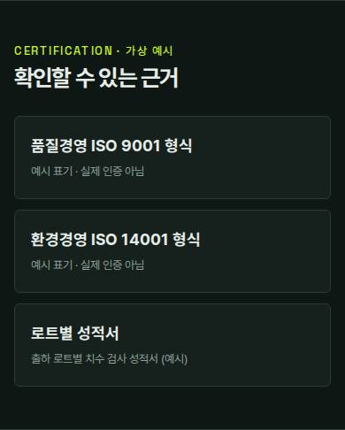 |

<details><summary>스타일 코드 (마크업 구조 + 클래스, 문구는 …) · <a href="code/certs.html">code/certs.html</a></summary>

```html
<section class="sec">
  <p class="kicker">…</p>
  <h2>…</h2>
  <div class="certs">
    <div>
      <b>…</b>
      <span>…</span>
    </div>
    <!-- ↑ 같은 구조 3개 반복 -->
  </div>
</section>
```

</details>

### 서브페이지 머리 (영문 경로) `page-top`

- 종류: `page-hero` · 사용 사이트: `biz-manufacturing/isoline` · 페이지: `/parts/`
- 소스: [`src/components/PageTop.tsx`](../../../templates/biz-manufacturing/isoline/src/components/PageTop.tsx)

| 데스크톱 1440 | 모바일 390 |
|---|---|
| 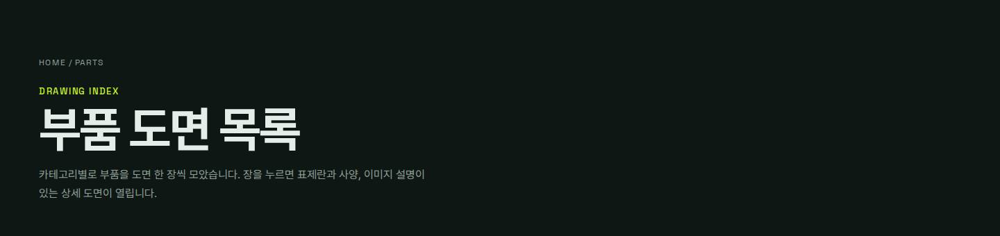 | 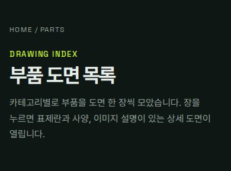 |

<details><summary>스타일 코드 (마크업 구조 + 클래스, 문구는 …) · <a href="code/page-top.html">code/page-top.html</a></summary>

```html
<section class="ptop">
  <nav class="trail num">
    <a>…</a>
    <span>
      …
      <a>…</a>
    </span>
  </nav>
  <p class="kicker">…</p>
  <h1>…</h1>
  <p class="lead">…</p>
</section>
```

</details>

### 카테고리 고정 제목 + 도면 카드 `category-section`

- 종류: `list` · 사용 사이트: `biz-manufacturing/isoline` · 페이지: `/parts/`
- 소스: [`src/app/parts/page.tsx`](../../../templates/biz-manufacturing/isoline/src/app/parts/page.tsx)

| 데스크톱 1440 | 모바일 390 |
|---|---|
| 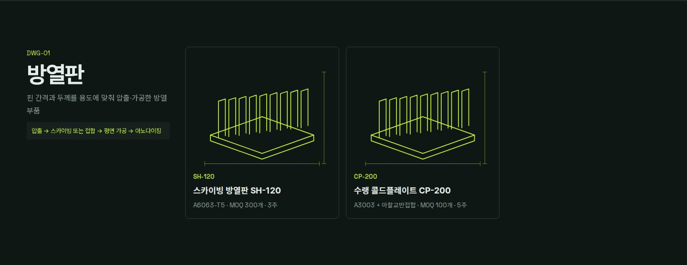 | 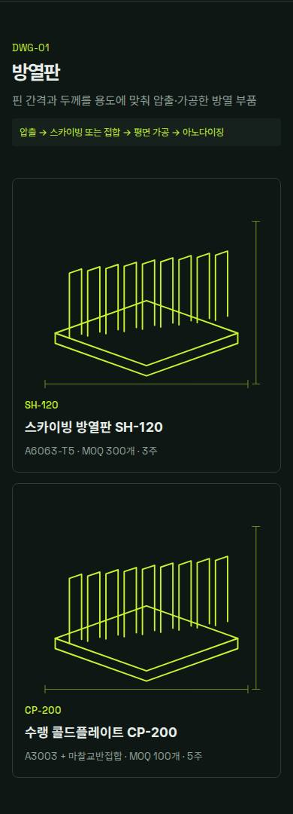 |

<details><summary>스타일 코드 (마크업 구조 + 클래스, 문구는 …) · <a href="code/category-section.html">code/category-section.html</a></summary>

```html
<section class="sec cat-sec">
  <div class="cat-head" style="">
    <span class="num">
      …
      …
    </span>
    <h2>…</h2>
    <p>…</p>
    <p class="num proc">…</p>
  </div>
  <ul class="cards">
    <li>
      <a>
        <svg class="lines" viewBox="0 0 240 200" aria-hidden="true"><g fill="none" stroke="currentColor" stroke-width="1.4" stroke-linejoin="round" stroke-linecap="round"><path d="M30 140 L120 172 L210 140 L120 108 Z"></path><path d="M30 140 v10 L120 182 L210 150 v-10"></path><path d="M44 145 v-64 l12 -4 v64"></path><path d="M62 142.8 v-64 l12 -4 v64"></path><path d="M80 140.6 v-64 l12 -4 v64"></path><path d="M98 138.4 v-64 l12 -4 v64"></path><path d="M116 136.2 v-64 l12 -4 v64"></path><path d="M134 134 v-64 l12 -4 v64"></path><path d="M152 131.8 v-64 l12 -4 v64"></path><path d="M170 129.6 v-64 l12 -4 v64"></path><path d="M188 127.4 v-64 l12 -4 v64"></path></g><g class="dims" fill="none" stroke="currentColor" stroke-width="0.8" opacity=".5"><path d="M20 190 h200 M20 186 v8 M220 186 v8"></path><path d="M228 30 v160 M224 30 h8 M224 190 h8"></path></g></svg>
        <span class="num code">…</span>
        <b>…</b>
        <small class="num">
          …
          …
          …
          …
          …
        </small>
      </a>
    </li>
    <!-- ↑ 같은 구조 2개 반복 -->
  </ul>
</section>
```

</details>

### 도면지 + 표제란 상세 `drawing-sheet`

- 종류: `detail` · 사용 사이트: `biz-manufacturing/isoline` · 페이지: `/parts/CP-200/`
- 소스: [`src/components/TitleBlock.tsx`](../../../templates/biz-manufacturing/isoline/src/components/TitleBlock.tsx)

| 데스크톱 1440 | 모바일 390 |
|---|---|
| 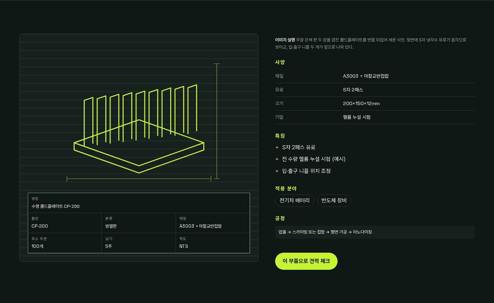 | 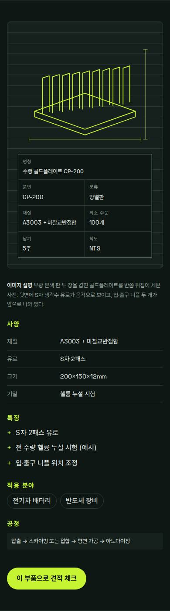 |

<details><summary>스타일 코드 (마크업 구조 + 클래스, 문구는 …) · <a href="code/drawing-sheet.html">code/drawing-sheet.html</a></summary>

```html
<section class="sec drawing-sheet">
  <div class="paper">
    <svg class="lines" viewBox="0 0 240 200" aria-hidden="true"><g fill="none" stroke="currentColor" stroke-width="1.4" stroke-linejoin="round" stroke-linecap="round"><path d="M30 140 L120 172 L210 140 L120 108 Z"></path><path d="M30 140 v10 L120 182 L210 150 v-10"></path><path d="M44 145 v-64 l12 -4 v64"></path><path d="M62 142.8 v-64 l12 -4 v64"></path><path d="M80 140.6 v-64 l12 -4 v64"></path><path d="M98 138.4 v-64 l12 -4 v64"></path><path d="M116 136.2 v-64 l12 -4 v64"></path><path d="M134 134 v-64 l12 -4 v64"></path><path d="M152 131.8 v-64 l12 -4 v64"></path><path d="M170 129.6 v-64 l12 -4 v64"></path><path d="M188 127.4 v-64 l12 -4 v64"></path></g><g class="dims" fill="none" stroke="currentColor" stroke-width="0.8" opacity=".5"><path d="M20 190 h200 M20 186 v8 M220 186 v8"></path><path d="M228 30 v160 M224 30 h8 M224 190 h8"></path></g></svg>
    <dl class="tblock">
      <div class="wide">
        <dt>…</dt>
        <dd>…</dd>
      </div>
      <div>
        <dt>…</dt>
        <dd class="num">…</dd>
      </div>
      <!-- ↑ 같은 구조 6개 반복 -->
    </dl>
  </div>
  <div class="side">
    <p class="caption">
      <b>…</b>
      …
    </p>
    <h2>…</h2>
    <table class="spec">
      <tbody>
        <tr>
          <th>…</th>
          <td class="num">…</td>
        </tr>
        <!-- ↑ 같은 구조 4개 반복 -->
      </tbody>
    </table>
    <h2>…</h2>
    <ul class="ticks">
      <li>…</li>
      <!-- ↑ 같은 구조 3개 반복 -->
    </ul>
    <h2>…</h2>
    <p class="apps">
      <a>…</a>
      <!-- ↑ 같은 구조 2개 반복 -->
    </p>
    <h2>…</h2>
    <p class="num proc">…</p>
    <a class="go">…</a>
  </div>
</section>
```

</details>

### 세로 공정 트랙 `track`

- 종류: `process` · 사용 사이트: `biz-manufacturing/isoline` · 페이지: `/process/`
- 소스: [`src/app/process/page.tsx`](../../../templates/biz-manufacturing/isoline/src/app/process/page.tsx)

| 데스크톱 1440 | 모바일 390 |
|---|---|
| 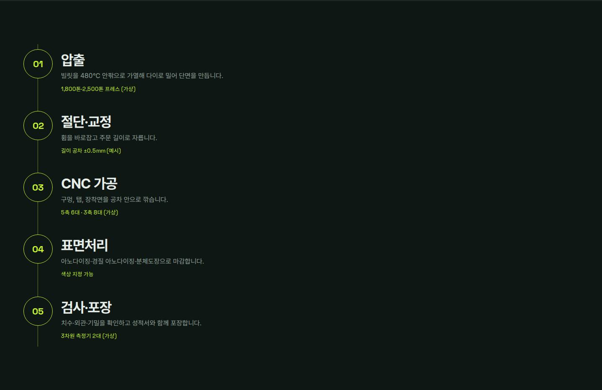 | 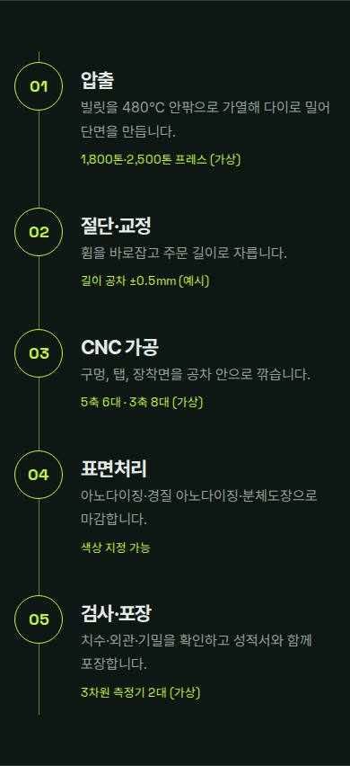 |

<details><summary>스타일 코드 (마크업 구조 + 클래스, 문구는 …) · <a href="code/track.html">code/track.html</a></summary>

```html
<section class="sec">
  <ol class="track">
    <li>
      <span class="num step">
        …
        …
      </span>
      <div>
        <h2>…</h2>
        <p>…</p>
        <small class="num">…</small>
      </div>
    </li>
    <!-- ↑ 같은 구조 5개 반복 -->
  </ol>
</section>
```

</details>

### 견적 체크리스트 + 요청서 문안 `rfq`

- 종류: `form` · 사용 사이트: `biz-manufacturing/isoline` · 페이지: `/rfq/`
- 소스: [`src/components/Rfq.tsx`](../../../templates/biz-manufacturing/isoline/src/components/Rfq.tsx)

| 데스크톱 1440 | 모바일 390 |
|---|---|
| 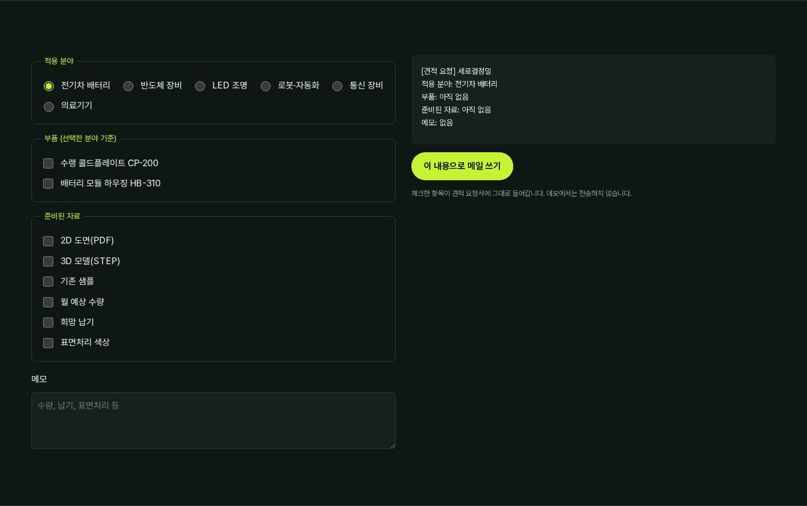 | 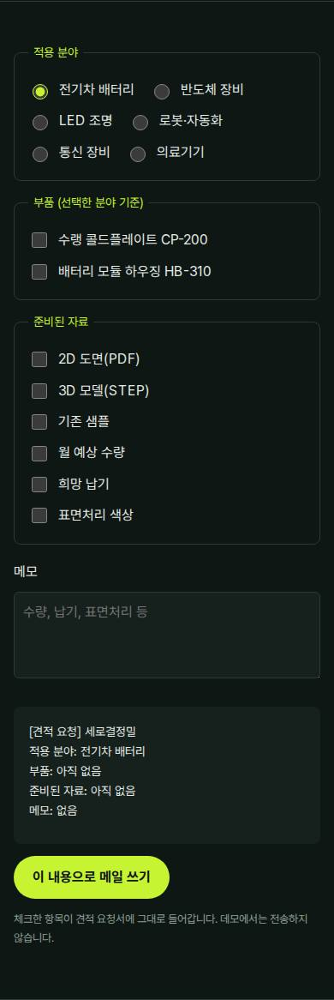 |

<details><summary>스타일 코드 (마크업 구조 + 클래스, 문구는 …) · <a href="code/rfq.html">code/rfq.html</a></summary>

```html
<section class="sec">
  <div class="rfq">
    <div>
      <fieldset>
        <legend>…</legend>
        <div class="chips">
          <label>
            <input style="" />
            …
          </label>
          <!-- ↑ 같은 구조 6개 반복 -->
        </div>
      </fieldset>
      <!-- ↑ 같은 구조 3개 반복 -->
      <label class="memo">
        …
        <textarea style=""></textarea>
      </label>
    </div>
    <div class="summary-col">
      <pre class="summary num">…</pre>
      <a class="go">…</a>
      <p class="hint">…</p>
    </div>
  </div>
</section>
```

</details>

### 다크 푸터 `footer`

- 종류: `footer` · 사용 사이트: `biz-manufacturing/isoline` · 페이지: `/`
- 소스: [`src/components/Foot.tsx`](../../../templates/biz-manufacturing/isoline/src/components/Foot.tsx)

| 데스크톱 1440 | 모바일 390 |
|---|---|
| 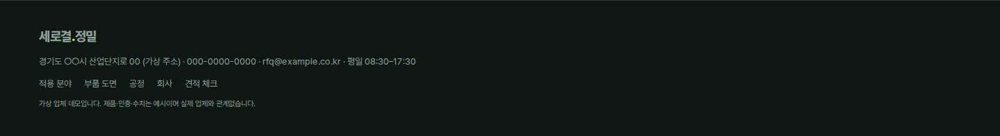 | 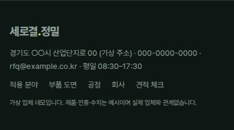 |

<details><summary>스타일 코드 (마크업 구조 + 클래스, 문구는 …) · <a href="code/footer.html">code/footer.html</a></summary>

```html
<footer class="foot">
  <div class="foot-mark">
    …
    <span>…</span>
    …
  </div>
  <p>
    …
    …
    …
    …
    …
    …
    …
  </p>
  <nav>
    <a>…</a>
    <!-- ↑ 같은 구조 5개 반복 -->
  </nav>
  <small>…</small>
</footer>
```

</details>
