# 법률사무소 · docket

> 자동 생성 문서(`npm run library`). 참고용 스타일 기록이며, 이 코드를 다른 사이트에 그대로 쓰지 않는다.

- 사용 사이트: `pro-law-firm/docket` (담연 법률사무소(가상))
- 배포 주소: https://hongjaang-star.github.io/agency-web-templates/pro-law-firm/docket/
- 소스: [`templates/pro-law-firm/docket`](../../../templates/pro-law-firm/docket)

## 디자인 지문

| 항목 | 값 |
|---|---|
| layout | typographic |
| hero | ticker |
| typePair | Song Myung + Gothic A1 |
| palette | oxblood·cream·ink |
| imageTreatment | no photo, giant type·rules·case labels |
| motion | area ticker + rise |
| signature | 사건 흐름 타임라인 |
| sectionOrder | hero, areas, flow, attorneys, cases, faq, visit |

## 디자인 토큰

서체 설정 (`src/app/layout.tsx`)

```ts
import { Gothic_A1, Song_Myung } from "next/font/google";

const song = Song_Myung({ variable: "--font-song", weight: "400", display: "swap" });

const gothic = Gothic_A1({ variable: "--font-gothic", subsets: ["latin"], weight: ["400", "700"], display: "swap" });
```

<details><summary>globals.css (색·서체 토큰, 공용 유틸리티)</summary>

```css
/* docket — 초대형 타이포 · oxblood·cream·ink
   서체: Song Myung(제목) + Gothic A1(본문), next/font 로 self-host */
:root {
  --cream: #f5efe6;
  --cream-2: #ebe2d4;
  --ink: #151313;
  --ink-2: #4b4440; /* 8.6:1 on cream */
  --ox: #6e1423; /* 11:1 on cream */
  --ox-soft: #e08a96; /* on ink 7:1 */
  --muted-dark: #c2b7a8; /* on ink 9:1 */
  --line: rgba(21, 19, 19, 0.18);
  --display: var(--font-song), "Noto Serif KR", serif;
  --sans: var(--font-gothic), system-ui, sans-serif;
  --gut: clamp(16px, 4vw, 56px);
}

*, *::before, *::after { box-sizing: border-box; margin: 0; padding: 0; }
html { scroll-behavior: smooth; }
body { background: var(--cream); color: var(--ink); font: 400 16px/1.75 var(--sans); overflow-x: hidden; -webkit-font-smoothing: antialiased; }
a { color: inherit; }
button { font: inherit; color: inherit; background: none; border: 0; cursor: pointer; }
:focus-visible { outline: 3px solid var(--ox); outline-offset: 3px; }
.on-dark :focus-visible { outline-color: var(--ox-soft); }
.sr-only { position: absolute; width: 1px; height: 1px; overflow: hidden; clip: rect(0 0 0 0); white-space: nowrap; }
.skip { position: absolute; left: -9999px; top: 8px; z-index: 100; background: var(--ink); color: var(--cream); padding: 10px 14px; }
.skip:focus { left: 8px; }
.wrap { max-width: 1280px; margin: 0 auto; padding: 0 var(--gut); }

.demo { background: var(--ox); color: #fff; font-size: 12px; letter-spacing: 0.06em; text-align: center; padding: 6px 12px; }

/* ── 헤더 ── */
.top { position: sticky; top: 0; z-index: 30; background: var(--cream); border-bottom: 1px solid var(--ink); }
.top-row { display: flex; align-items: center; justify-content: space-between; gap: 16px; padding: 16px var(--gut); }
.logo { font: 400 26px/1 var(--display); text-decoration: none; display: flex; align-items: baseline; gap: 10px; white-space: nowrap; }
.logo small { font: 700 11px var(--sans); letter-spacing: 0.24em; color: var(--ox); }
.top nav ul { display: flex; gap: 26px; list-style: none; font-size: 15px; font-weight: 500; }
.top nav a { text-decoration: none; border-bottom: 2px solid transparent; padding: 4px 0; white-space: nowrap; }
.top nav a:hover { border-color: var(--ox); }
.top nav a[aria-current="page"] { color: var(--ox); border-color: var(--ox); }
.call { background: var(--ink); color: var(--cream); text-decoration: none; padding: 11px 18px; font-weight: 700; white-space: nowrap; }
.call:hover { background: var(--ox); }

/* ── 버튼 ── */
.btn { display: inline-flex; align-items: center; gap: 8px; padding: 15px 22px; font-weight: 700; text-decoration: none; border: 1.5px solid var(--ink); }
.btn.solid { background: var(--ox); border-color: var(--ox); color: #fff; }
.btn:hover { background: var(--ink); border-color: var(--ink); color: var(--cream); }
.more { display: inline-block; margin-top: 28px; font-weight: 700; color: var(--ox); text-decoration: none; border-bottom: 2px solid currentColor; padding-bottom: 2px; }
.on-dark .more { color: var(--ox-soft); }

/* ── 메인 히어로 ── */
.hero { padding: clamp(40px, 6vw, 80px) 0 0; border-bottom: 1px solid var(--ink); }
.label { font: 700 13px var(--sans); letter-spacing: 0.2em; color: var(--ox); }
.hero h1 { font: 400 clamp(48px, 10vw, 160px)/0.98 var(--display); letter-spacing: -0.04em; margin-top: 18px; word-break: keep-all; }
.hero h1 span { color: var(--ox); }
.hero-row { display: grid; grid-template-columns: 1.2fr 1fr; gap: 32px; align-items: end; margin-top: clamp(24px, 4vw, 48px); padding-bottom: clamp(32px, 5vw, 56px); }
.hero-row p { font-size: clamp(16px, 1.5vw, 19px); color: var(--ink-2); max-width: 34em; }
.acts { display: flex; gap: 10px; justify-content: flex-end; flex-wrap: wrap; }
.ticker { overflow: hidden; white-space: nowrap; background: var(--ink); color: var(--cream); }
.ticker-track { display: inline-flex; gap: 48px; padding: 16px 0; animation: tick 40s linear infinite; font: 400 clamp(22px, 2.6vw, 34px) var(--display); }
.ticker-track span::after { content: "·"; margin-left: 48px; color: var(--ox-soft); }
.ticker:hover .ticker-track { animation-play-state: paused; }
@keyframes tick { to { transform: translateX(-50%); } }

/* ── 섹션 ── */
.sec { padding: clamp(64px, 9vw, 128px) 0; border-bottom: 1px solid var(--ink); }
.sec:last-of-type { border-bottom: 0; }
.eyebrow { font: 700 13px var(--sans); letter-spacing: 0.2em; color: var(--ox); }
.sec h2, .h2 { font: 400 clamp(36px, 5.6vw, 80px)/1.08 var(--display); letter-spacing: -0.03em; margin-top: 12px; word-break: keep-all; }
.sec .lead { color: var(--ink-2); margin-top: 16px; max-width: 38em; font-size: 17px; }
.dark { background: var(--ink); color: var(--cream); }
.dark .eyebrow { color: var(--ox-soft); }
.dark .lead { color: var(--muted-dark); }

/* ── 서브페이지 머리 ── */
.page-head { padding: clamp(40px, 6vw, 88px) 0 clamp(36px, 5vw, 64px); border-bottom: 1px solid var(--ink); }
.crumbs { display: flex; gap: 8px; list-style: none; font-size: 13px; color: var(--ink-2); flex-wrap: wrap; }
.crumbs li + li::before { content: "/"; margin-right: 8px; color: var(--line); }
.crumbs a { text-decoration: none; }
.crumbs a:hover { text-decoration: underline; }
.page-head .label { display: block; margin-top: 28px; }
.page-head h1 { font: 400 clamp(44px, 8vw, 128px)/1 var(--display); letter-spacing: -0.04em; margin-top: 14px; word-break: keep-all; }
.page-head p { color: var(--ink-2); font-size: clamp(16px, 1.5vw, 19px); margin-top: 20px; max-width: 38em; }

/* ── 업무분야 목록 ── */
.areas { list-style: none; margin-top: 40px; border-top: 1px solid var(--ink); }
.areas li { border-bottom: 1px solid var(--line); }
.areas a { display: grid; grid-template-columns: 70px 1fr 1.1fr 40px; gap: 20px; align-items: baseline; padding: 22px 0; text-decoration: none; transition: background 0.2s, padding 0.2s; }
.areas .n { font: 700 13px var(--sans); color: var(--ox); letter-spacing: 0.1em; }
.areas b { font: 400 clamp(26px, 3.4vw, 46px)/1.1 var(--display); }
.areas em { font-style: normal; color: var(--ink-2); font-size: 15px; }
.areas .ar { font-size: 22px; color: var(--ox); transition: transform 0.2s; }
.areas a:hover { background: var(--cream-2); padding-left: 14px; }
.areas a:hover .ar { transform: translateX(6px); }

/* ── 사건 흐름 (시그니처) ── */
.tabs { display: flex; gap: 8px; margin-top: 36px; flex-wrap: wrap; }
.tab { border: 1.5px solid rgba(245, 239, 230, 0.45); padding: 12px 20px; font-weight: 700; color: var(--cream); }
.tab[aria-selected="true"] { background: var(--cream); color: var(--ink); border-color: var(--cream); }
.flow-intro { color: var(--muted-dark); margin-top: 18px; max-width: 40em; }
.flow { list-style: none; margin-top: 30px; display: grid; grid-template-columns: repeat(var(--n, 6), 1fr); border-top: 2px solid var(--cream); }
.step { width: 100%; height: 100%; padding: 22px 18px 26px 0; border-right: 1px solid rgba(245, 239, 230, 0.2); position: relative; text-align: left; color: var(--cream); }
.flow li + li .step { padding-left: 18px; }
.flow li:last-child .step { border-right: 0; }
.step .k { font: 700 12px var(--sans); letter-spacing: 0.14em; color: var(--ox-soft); }
.step b { display: block; font: 400 clamp(22px, 2.2vw, 30px)/1.2 var(--display); margin: 10px 0 6px; }
.step small { font-size: 13px; color: var(--muted-dark); }
.step::before { content: ""; position: absolute; top: -7px; left: 0; width: 12px; height: 12px; background: var(--cream); border-radius: 50%; }
.flow li + li .step::before { left: 18px; }
.step[aria-pressed="true"] { background: rgba(245, 239, 230, 0.07); }
.step[aria-pressed="true"]::before { background: var(--ox-soft); box-shadow: 0 0 0 5px rgba(224, 138, 150, 0.3); }
.detail { margin-top: 28px; display: grid; grid-template-columns: 1fr 1fr; gap: 28px; background: var(--cream); color: var(--ink); padding: clamp(22px, 3vw, 36px); }
.detail h3 { font: 400 30px/1.25 var(--display); }
.detail p { color: var(--ink-2); margin-top: 10px; }
.detail .prep { margin: 0 0 6px; font-weight: 700; color: var(--ink); }
.detail ul { list-style: none; }
.detail li { padding: 10px 0; border-bottom: 1px solid var(--line); display: flex; gap: 10px; }
.detail li::before { content: "□"; color: var(--ox); font-weight: 700; }
.flow-note { font-size: 13px; color: var(--muted-dark); margin-top: 16px; }
/* 전체 흐름 페이지: 단계 표 */
.flow-table { margin-top: 36px; border-top: 2px solid var(--ink); }
.flow-table article { display: grid; grid-template-columns: 90px 1fr 1fr 140px; gap: 24px; padding: 26px 0; border-bottom: 1px solid var(--line); }
.flow-table .k { font: 700 13px var(--sans); color: var(--ox); letter-spacing: 0.12em; }
.flow-table h3 { font: 400 28px/1.2 var(--display); }
.flow-table p { color: var(--ink-2); font-size: 15px; }
.flow-table ul { list-style: none; font-size: 15px; }
.flow-table li::before { content: "□ "; color: var(--ox); }
.flow-table .period { font-weight: 700; font-size: 15px; }

/* ── 변호사 ── */
.lawyers { display: grid; grid-template-columns: repeat(3, 1fr); margin-top: 40px; border-top: 1px solid var(--ink); }
.lawyer { padding: 28px 24px 32px 0; border-right: 1px solid var(--line); }
.lawyer + .lawyer { padding-left: 24px; }
.lawyer:last-child { border-right: 0; }
.mono { font: 400 64px/1 var(--display); color: var(--ox); }
.lawyer h3 { font: 400 30px var(--display); margin-top: 18px; }
.lawyer .role { font-size: 14px; font-weight: 700; color: var(--ox); }
.lawyer q { display: block; color: var(--ink-2); font-size: 15px; margin-top: 10px; quotes: "\201C" "\201D"; }
.lawyer ul { list-style: none; margin-top: 16px; font-size: 14px; color: var(--ink-2); }
.lawyer li { padding: 6px 0; border-top: 1px solid var(--line); }
.principles { display: grid; grid-template-columns: repeat(3, 1fr); gap: 0; margin-top: 40px; border-top: 1px solid var(--ink); }
.principles article { padding: 26px 24px 30px 0; border-right: 1px solid var(--line); }
.principles article + article { padding-left: 24px; }
.principles article:last-child { border-right: 0; }
.principles span { font: 700 13px var(--sans); color: var(--ox); letter-spacing: 0.12em; }
.principles h3 { font: 400 clamp(24px, 2.4vw, 32px)/1.25 var(--display); margin: 10px 0 8px; }
.principles p { color: var(--ink-2); font-size: 15px; }

/* ── 사례 ── */
.cases { display: grid; grid-template-columns: repeat(2, 1fr); gap: 0 48px; margin-top: 40px; }
.case { padding: 26px 0; border-top: 1px solid var(--ink); }
.case .tag { font: 700 12px var(--sans); letter-spacing: 0.14em; color: var(--ox); }
.case h3 { font: 400 clamp(24px, 2.4vw, 32px)/1.3 var(--display); margin: 8px 0 10px; }
.case p { color: var(--ink-2); font-size: 15px; }
.case a { display: inline-block; margin-top: 10px; font-size: 14px; font-weight: 700; color: var(--ox); text-decoration: none; }
.note { font-size: 13px; color: var(--ink-2); margin-top: 20px; }

/* ── FAQ ── */
.faq { margin-top: 36px; max-width: 900px; border-top: 1px solid var(--ink); }
.faq details { border-bottom: 1px solid var(--line); }
.faq summary { list-style: none; cursor: pointer; padding: 22px 0; display: flex; justify-content: space-between; gap: 16px; font: 400 clamp(20px, 2vw, 26px)/1.35 var(--display); }
.faq summary::-webkit-details-marker { display: none; }
.faq summary::after { content: "+"; font: 400 30px/1 var(--sans); color: var(--ox); transition: transform 0.2s; }
.faq details[open] summary::after { transform: rotate(45deg); }
.faq p { padding: 0 0 22px; color: var(--ink-2); }

/* ── 업무 상세 ── */
.area-body { display: grid; grid-template-columns: repeat(12, 1fr); gap: 24px; padding: clamp(48px, 6vw, 88px) 0; }
.area-main { grid-column: 1 / span 8; }
.area-side { grid-column: 10 / span 3; }
.area-main section + section { margin-top: 48px; }
.area-main h2 { font: 400 clamp(26px, 2.6vw, 34px)/1.25 var(--display); padding-bottom: 12px; border-bottom: 2px solid var(--ink); }
.area-main ol { list-style: none; counter-reset: n; }
.area-main ol li { counter-increment: n; display: grid; grid-template-columns: 44px 1fr; padding: 14px 0; border-bottom: 1px solid var(--line); }
.area-main ol li::before { content: counter(n, decimal-leading-zero); font: 700 13px/2 var(--sans); color: var(--ox); }
.side-box { border-top: 2px solid var(--ink); padding-top: 14px; }
.side-box + .side-box { margin-top: 32px; }
.side-box h2 { font: 700 12px var(--sans); letter-spacing: 0.16em; color: var(--ox); }
.side-box ul { list-style: none; margin-top: 8px; }
.side-box li { padding: 9px 0; border-bottom: 1px solid var(--line); font-size: 15px; }
.side-box li a { text-decoration: none; }
.side-box li a:hover { color: var(--ox); }
.side-box .btn { width: 100%; justify-content: center; margin-top: 12px; }
.side-lawyer b { display: block; font: 400 26px var(--display); margin-top: 6px; }
.side-lawyer span { font-size: 14px; color: var(--ink-2); }
.mini-flow { list-style: none; display: flex; flex-wrap: wrap; gap: 6px; margin-top: 12px; }
.mini-flow li { font-size: 13px; padding: 4px 10px; border: 1px solid var(--ink); }

/* ── 오시는 길 ── */
.visit { display: grid; grid-template-columns: 1.3fr 1fr; gap: 40px; align-items: end; }
.visit .big { font: 400 clamp(40px, 6vw, 88px)/1.05 var(--display); letter-spacing: -0.03em; }
.visit .big a { color: var(--ox); text-decoration: none; }
.visit dl { font-size: 15px; }
.visit dt { font: 700 12px var(--sans); letter-spacing: 0.16em; color: var(--ox); margin-top: 16px; }
.visit dt:first-child { margin-top: 0; }
.maps { display: flex; gap: 10px; margin-top: 24px; flex-wrap: wrap; }
.channels { display: grid; grid-template-columns: repeat(3, 1fr); margin-top: 36px; border-top: 1px solid var(--ink); }
.channels a { display: block; padding: 24px 24px 28px 0; text-decoration: none; border-right: 1px solid var(--line); }
.channels a + a { padding-left: 24px; }
.channels a:last-child { border-right: 0; }
.channels span { font: 700 12px var(--sans); letter-spacing: 0.16em; color: var(--ox); }
.channels b { display: block; font: 400 clamp(24px, 2.6vw, 34px)/1.25 var(--display); margin-top: 8px; word-break: break-all; }
.channels p { font-size: 14px; color: var(--ink-2); margin-top: 6px; }
.channels a:hover b { color: var(--ox); }
.bring { list-style: none; margin-top: 32px; border-top: 1px solid var(--ink); max-width: 900px; }
.bring li { padding: 16px 0; border-bottom: 1px solid var(--line); display: flex; gap: 12px; font-size: 17px; }
.bring li::before { content: "□"; color: var(--ox); font-weight: 700; }

/* ── 404 ── */
.lost { padding: clamp(80px, 12vw, 160px) 0; }
.lost b { font: 400 clamp(90px, 16vw, 220px)/0.9 var(--display); color: var(--ox); display: block; }
.lost h1 { font: 400 clamp(28px, 3vw, 40px) var(--display); margin: 20px 0 10px; }
.lost p { color: var(--ink-2); margin-bottom: 28px; }

/* ── 푸터 ── */
.foot { background: var(--ink); color: var(--muted-dark); padding: 40px 0 56px; font-size: 14px; }
.foot .wrap { display: grid; grid-template-columns: 1.3fr 1fr 1fr; gap: 28px; }
.foot b { display: block; font: 400 26px var(--display); color: var(--cream); margin-bottom: 10px; }
.foot ul { list-style: none; }
.foot li + li { margin-top: 4px; }
.foot a { text-decoration: none; color: var(--cream); }
.foot a:hover { text-decoration: underline; }
.foot .notice { grid-column: 1 / -1; border-top: 1px solid rgba(245, 239, 230, 0.2); padding-top: 18px; font-size: 13px; }

/* ── 모션 ── */
.js .up { opacity: 0; transform: translateY(18px); transition: opacity 0.8s, transform 0.8s; }
.js .up.on { opacity: 1; transform: none; }
@media (prefers-reduced-motion: reduce) {
  html { scroll-behavior: auto; }
  .ticker-track { animation: none; }
  .js .up { opacity: 1; transform: none; }
  *, *::before, *::after { transition: none !important; }
}

/* ── 반응형 ── */
@media (max-width: 960px) {
  .top nav { display: none; }
  .hero-row, .detail, .visit { grid-template-columns: 1fr; }
  .acts { justify-content: flex-start; }
  .areas a { grid-template-columns: 44px 1fr 28px; }
  .areas em { grid-column: 2; grid-row: 2; }
  .flow { grid-template-columns: 1fr; border-top: 0; border-left: 2px solid var(--cream); margin-left: 6px; }
  .step, .flow li + li .step { padding: 16px 0 16px 22px; border-right: 0; border-bottom: 1px solid rgba(245, 239, 230, 0.15); }
  .step::before, .flow li + li .step::before { top: 22px; left: -7px; }
  .flow-table article { grid-template-columns: 1fr; gap: 8px; }
  .lawyers, .cases, .principles, .channels { grid-template-columns: 1fr; }
  .lawyer, .lawyer + .lawyer, .principles article, .principles article + article, .channels a, .channels a + a { padding: 24px 0; border-right: 0; border-bottom: 1px solid var(--line); }
  .area-main, .area-side { grid-column: 1 / -1; }
  .foot .wrap { grid-template-columns: 1fr; }
}
@media (max-width: 960px) {
  .mnav { display: block; }
}
.mnav { display: none; border-top: 1px solid var(--line); overflow-x: auto; }
.mnav ul { display: flex; gap: 20px; list-style: none; padding: 10px var(--gut); font-size: 14px; font-weight: 500; }
.mnav a { text-decoration: none; white-space: nowrap; }
.mnav a[aria-current="page"] { color: var(--ox); font-weight: 700; }
@media (max-width: 420px) {
  .logo small { display: none; }
  .call { padding: 10px 12px; font-size: 14px; }
}
```

</details>

## 모듈

### 헤더 (모바일 가로 메뉴 포함) `header`

- 종류: `header` · 사용 사이트: `pro-law-firm/docket` · 페이지: `/`
- 소스: [`src/components/Top.tsx`](../../../templates/pro-law-firm/docket/src/components/Top.tsx)

| 데스크톱 1440 | 모바일 390 |
|---|---|
|  | 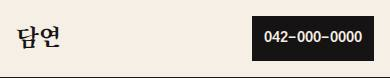 |

<details><summary>스타일 코드 (마크업 구조 + 클래스, 문구는 …) · <a href="code/header.html">code/header.html</a></summary>

```html
<header class="top">
  <div class="top-row">
    <a class="logo">
      …
      <small>…</small>
    </a>
    <nav>
      <ul>
        <li>
          <a>…</a>
        </li>
        <!-- ↑ 같은 구조 5개 반복 -->
      </ul>
    </nav>
    <a class="call">…</a>
  </div>
  <nav class="mnav">
    <ul>
      <li>
        <a>…</a>
      </li>
      <!-- ↑ 같은 구조 5개 반복 -->
    </ul>
  </nav>
</header>
```

</details>

### 초대형 타이포 + 업무 띠 `home-hero`

- 종류: `hero` · 사용 사이트: `pro-law-firm/docket` · 페이지: `/`
- 소스: [`src/app/page.tsx`](../../../templates/pro-law-firm/docket/src/app/page.tsx)

| 데스크톱 1440 | 모바일 390 |
|---|---|
|  | 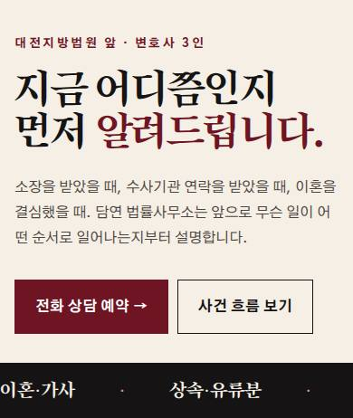 |

<details><summary>스타일 코드 (마크업 구조 + 클래스, 문구는 …) · <a href="code/home-hero.html">code/home-hero.html</a></summary>

```html
<section class="hero">
  <div class="wrap">
    <p class="label">…</p>
    <h1>
      …
      <br />
      …
      <span>…</span>
    </h1>
    <div class="hero-row">
      <p>…</p>
      <div class="acts">
        <a class="btn solid">…</a>
        <a class="btn">…</a>
      </div>
    </div>
  </div>
  <div class="ticker">
    <div class="ticker-track">
      <span>…</span>
      <!-- ↑ 같은 구조 16개 반복 -->
    </div>
  </div>
</section>
```

</details>

### 업무분야 타이포 목록 `home-areas`

- 종류: `services` · 사용 사이트: `pro-law-firm/docket` · 페이지: `/`
- 소스: [`src/components/AreaList.tsx`](../../../templates/pro-law-firm/docket/src/components/AreaList.tsx)

| 데스크톱 1440 | 모바일 390 |
|---|---|
|  | 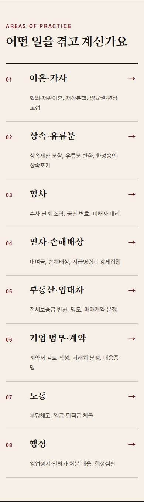 |

<details><summary>스타일 코드 (마크업 구조 + 클래스, 문구는 …) · <a href="code/home-areas.html">code/home-areas.html</a></summary>

```html
<section class="sec">
  <div class="wrap">
    <p class="eyebrow up on">…</p>
    <h2 class="up on">…</h2>
    <ol class="areas up on">
      <li>
        <a>
          <span class="n">…</span>
          <b>…</b>
          <em>…</em>
          <span class="ar">…</span>
        </a>
      </li>
      <!-- ↑ 같은 구조 8개 반복 -->
    </ol>
  </div>
</section>
```

</details>

### 사건 흐름 타임라인 `home-flow`

- 종류: `signature` · 사용 사이트: `pro-law-firm/docket` · 페이지: `/`
- 소스: [`src/components/CaseFlow.tsx`](../../../templates/pro-law-firm/docket/src/components/CaseFlow.tsx)

| 데스크톱 1440 | 모바일 390 |
|---|---|
|  | 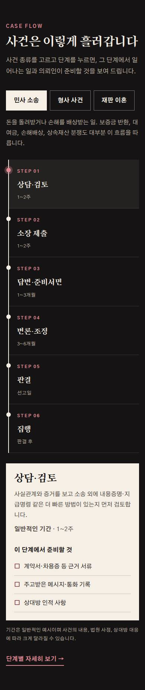 |

<details><summary>스타일 코드 (마크업 구조 + 클래스, 문구는 …) · <a href="code/home-flow.html">code/home-flow.html</a></summary>

```html
<section class="sec dark on-dark">
  <div class="wrap">
    <p class="eyebrow up">…</p>
    <h2 class="up on">…</h2>
    <p class="lead up on">…</p>
    <div class="tabs">
      <button class="tab">…</button>
      <!-- ↑ 같은 구조 3개 반복 -->
    </div>
    <p class="flow-intro">…</p>
    <ol class="flow" style="--n:6">
      <li>
        <button class="step">
          <span class="k">
            …
            …
          </span>
          <b>…</b>
          <small>…</small>
        </button>
      </li>
      <!-- ↑ 같은 구조 6개 반복 -->
    </ol>
    <div class="detail">
      <div>
        <h3>…</h3>
        <p>…</p>
        <!-- ↑ 같은 구조 2개 반복 -->
      </div>
      <!-- ↑ 같은 구조 2개 반복 -->
    </div>
    <p class="flow-note">…</p>
    <a class="more">…</a>
  </div>
</section>
```

</details>

### 변호사 3단 `home-attorneys`

- 종류: `team` · 사용 사이트: `pro-law-firm/docket` · 페이지: `/`
- 소스: [`src/components/Lawyers.tsx`](../../../templates/pro-law-firm/docket/src/components/Lawyers.tsx)

| 데스크톱 1440 | 모바일 390 |
|---|---|
|  | 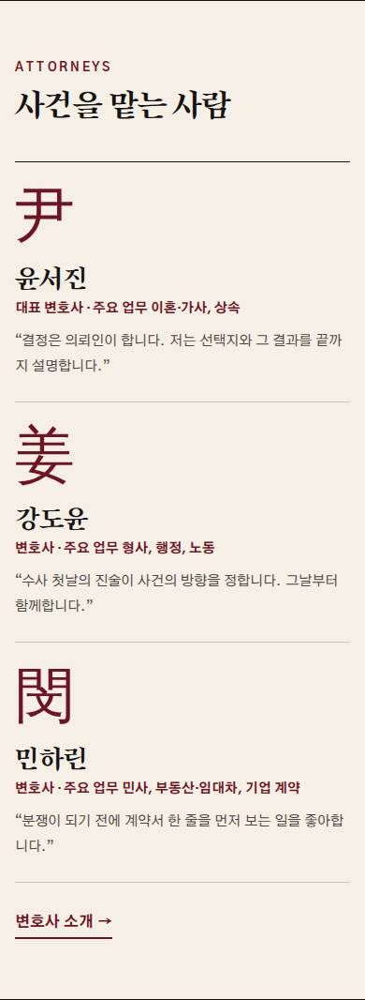 |

<details><summary>스타일 코드 (마크업 구조 + 클래스, 문구는 …) · <a href="code/home-attorneys.html">code/home-attorneys.html</a></summary>

```html
<section class="sec">
  <div class="wrap">
    <p class="eyebrow up on">…</p>
    <h2 class="up on">…</h2>
    <div class="lawyers up on">
      <article class="lawyer">
        <div class="mono">…</div>
        <h3>…</h3>
        <p class="role">
          …
          …
          …
          …
        </p>
        <q>…</q>
      </article>
      <!-- ↑ 같은 구조 3개 반복 -->
    </div>
    <a class="more">…</a>
  </div>
</section>
```

</details>

### 유형별 사례 2단 `home-cases`

- 종류: `cases` · 사용 사이트: `pro-law-firm/docket` · 페이지: `/`
- 소스: [`src/components/CaseList.tsx`](../../../templates/pro-law-firm/docket/src/components/CaseList.tsx)

| 데스크톱 1440 | 모바일 390 |
|---|---|
|  | 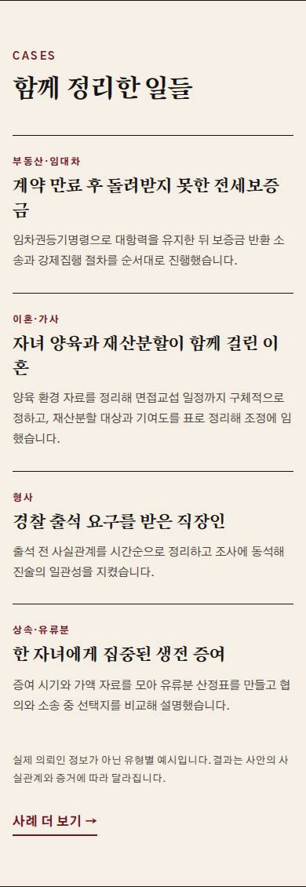 |

<details><summary>스타일 코드 (마크업 구조 + 클래스, 문구는 …) · <a href="code/home-cases.html">code/home-cases.html</a></summary>

```html
<section class="sec">
  <div class="wrap">
    <p class="eyebrow up on">…</p>
    <h2 class="up on">…</h2>
    <div class="cases up on">
      <article class="case">
        <p class="tag">…</p>
        <h3>…</h3>
        <p>…</p>
      </article>
      <!-- ↑ 같은 구조 4개 반복 -->
    </div>
    <p class="note">…</p>
    <a class="more">…</a>
  </div>
</section>
```

</details>

### 상담 전 질문 `home-faq`

- 종류: `faq` · 사용 사이트: `pro-law-firm/docket` · 페이지: `/`
- 소스: [`src/components/Faq.tsx`](../../../templates/pro-law-firm/docket/src/components/Faq.tsx)

| 데스크톱 1440 | 모바일 390 |
|---|---|
|  | 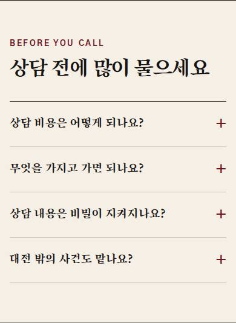 |

<details><summary>스타일 코드 (마크업 구조 + 클래스, 문구는 …) · <a href="code/home-faq.html">code/home-faq.html</a></summary>

```html
<section class="sec">
  <div class="wrap">
    <p class="eyebrow up on">…</p>
    <h2 class="up on">…</h2>
    <div class="faq up on">
      <details>
        <summary>…</summary>
        <p>…</p>
      </details>
      <!-- ↑ 같은 구조 4개 반복 -->
    </div>
    <script>…</script>
  </div>
</section>
```

</details>

### 법원 앞 오시는 길 `home-visit`

- 종류: `visit` · 사용 사이트: `pro-law-firm/docket` · 페이지: `/`
- 소스: [`src/components/Visit.tsx`](../../../templates/pro-law-firm/docket/src/components/Visit.tsx)

| 데스크톱 1440 | 모바일 390 |
|---|---|
|  | 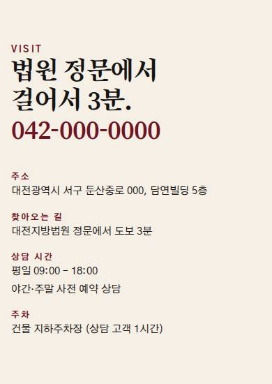 |

<details><summary>스타일 코드 (마크업 구조 + 클래스, 문구는 …) · <a href="code/home-visit.html">code/home-visit.html</a></summary>

```html
<section class="sec">
  <div class="wrap">
    <p class="eyebrow up on">…</p>
    <div class="visit up on">
      <p class="big">
        <span>
          …
          <br />
        </span>
        <!-- ↑ 같은 구조 2개 반복 -->
        <a>…</a>
      </p>
      <dl>
        <dt>…</dt>
        <dd>…</dd>
        <dt>…</dt>
        <dd>…</dd>
        <dt>…</dt>
        <dd>
          <span>
            …
            …
            <br />
          </span>
          <!-- ↑ 같은 구조 2개 반복 -->
        </dd>
        <dt>…</dt>
        <dd>…</dd>
      </dl>
    </div>
  </div>
</section>
```

</details>

### 서브페이지 머리 `page-head`

- 종류: `page-hero` · 사용 사이트: `pro-law-firm/docket` · 페이지: `/cases/`
- 소스: [`src/components/PageHead.tsx`](../../../templates/pro-law-firm/docket/src/components/PageHead.tsx)

| 데스크톱 1440 | 모바일 390 |
|---|---|
|  | 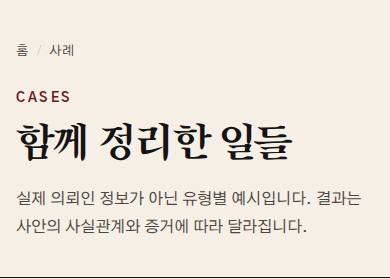 |

<details><summary>스타일 코드 (마크업 구조 + 클래스, 문구는 …) · <a href="code/page-head.html">code/page-head.html</a></summary>

```html
<section class="page-head">
  <script>…</script>
  <div class="wrap">
    <nav>
      <ol class="crumbs">
        <li>
          <a>…</a>
        </li>
        <!-- ↑ 같은 구조 2개 반복 -->
      </ol>
    </nav>
    <span class="label">…</span>
    <h1>…</h1>
    <p>…</p>
  </div>
</section>
```

</details>

### 업무 상세 (본문 + 옆 칸) `area-detail`

- 종류: `services` · 사용 사이트: `pro-law-firm/docket` · 페이지: `/areas/real-estate/`
- 소스: [`src/app/areas/[slug]/page.tsx`](../../../templates/pro-law-firm/docket/src/app/areas/[slug]/page.tsx)

| 데스크톱 1440 | 모바일 390 |
|---|---|
|  | 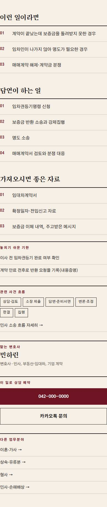 |

<details><summary>스타일 코드 (마크업 구조 + 클래스, 문구는 …) · <a href="code/area-detail.html">code/area-detail.html</a></summary>

```html
<div class="wrap area-body">
  <div class="area-main">
    <section class="up on">
      <h2>…</h2>
      <ol>
        <li>…</li>
        <!-- ↑ 같은 구조 3개 반복 -->
      </ol>
    </section>
    <!-- ↑ 같은 구조 3개 반복 -->
  </div>
  <aside class="area-side">
    <div class="side-box">
      <h2>…</h2>
      <ul>
        <li>…</li>
        <!-- ↑ 같은 구조 2개 반복 -->
      </ul>
    </div>
    <!-- ↑ 같은 구조 2개 반복 -->
    <div class="side-box side-lawyer">
      <h2>…</h2>
      <b>…</b>
      <span>
        …
        …
        …
      </span>
    </div>
    <div class="side-box">
      <h2>…</h2>
      <a class="btn solid">…</a>
      <a class="btn">
        …
        <span class="sr-only">…</span>
      </a>
    </div>
    <!-- ↑ 같은 구조 2개 반복 -->
  </aside>
</div>
```

</details>

### 단계별 표 (민사 소송) `flow-table`

- 종류: `signature` · 사용 사이트: `pro-law-firm/docket` · 페이지: `/flow/`
- 소스: [`src/app/flow/page.tsx`](../../../templates/pro-law-firm/docket/src/app/flow/page.tsx)

| 데스크톱 1440 | 모바일 390 |
|---|---|
| 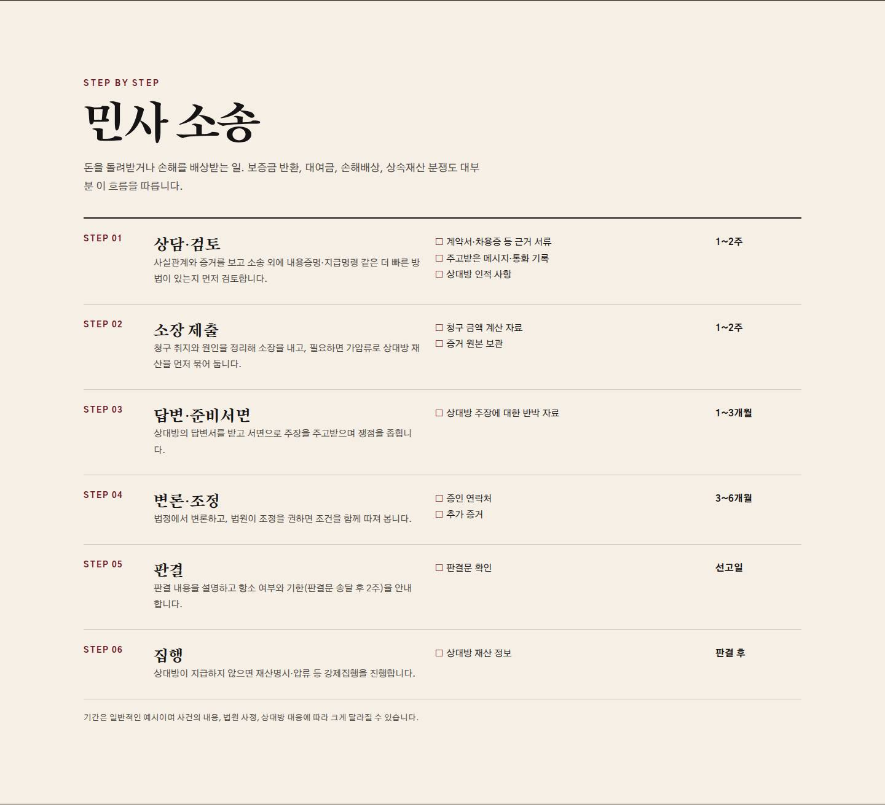 | 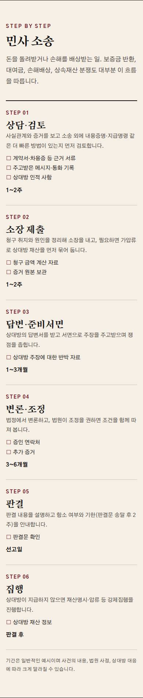 |

<details><summary>스타일 코드 (마크업 구조 + 클래스, 문구는 …) · <a href="code/flow-table.html">code/flow-table.html</a></summary>

```html
<section class="sec">
  <div class="wrap">
    <p class="eyebrow up">
      …
      …
      …
    </p>
    <h2 class="up on">…</h2>
    <p class="lead up on">…</p>
    <div class="flow-table up on">
      <article>
        <span class="k">
          …
          …
        </span>
        <div>
          <h3>…</h3>
          <p>…</p>
        </div>
        <ul>
          <li>…</li>
          <!-- ↑ 같은 구조 3개 반복 -->
        </ul>
        <span class="period">…</span>
      </article>
      <!-- ↑ 같은 구조 6개 반복 -->
    </div>
    <p class="note">…</p>
  </div>
</section>
```

</details>

### 일하는 방식 `attorneys-principles`

- 종류: `intro` · 사용 사이트: `pro-law-firm/docket` · 페이지: `/attorneys/`
- 소스: [`src/app/attorneys/page.tsx`](../../../templates/pro-law-firm/docket/src/app/attorneys/page.tsx)

| 데스크톱 1440 | 모바일 390 |
|---|---|
|  | 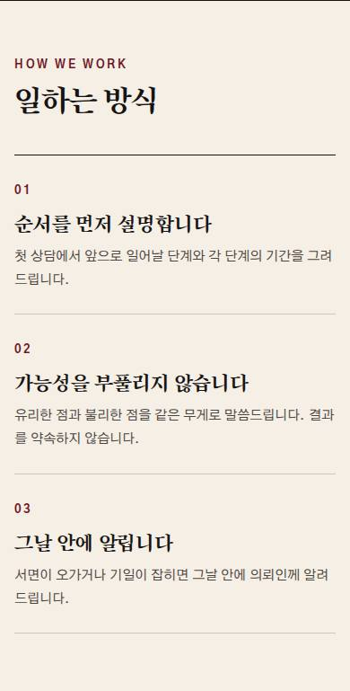 |

<details><summary>스타일 코드 (마크업 구조 + 클래스, 문구는 …) · <a href="code/attorneys-principles.html">code/attorneys-principles.html</a></summary>

```html
<section class="sec">
  <div class="wrap">
    <p class="eyebrow up on">…</p>
    <h2 class="up on">…</h2>
    <div class="principles up on">
      <article>
        <span>…</span>
        <h3>…</h3>
        <p>…</p>
      </article>
      <!-- ↑ 같은 구조 3개 반복 -->
    </div>
  </div>
</section>
```

</details>

### 연락 방법 3단 `contact-channels`

- 종류: `cta` · 사용 사이트: `pro-law-firm/docket` · 페이지: `/contact/`
- 소스: [`src/app/contact/page.tsx`](../../../templates/pro-law-firm/docket/src/app/contact/page.tsx)

| 데스크톱 1440 | 모바일 390 |
|---|---|
|  | 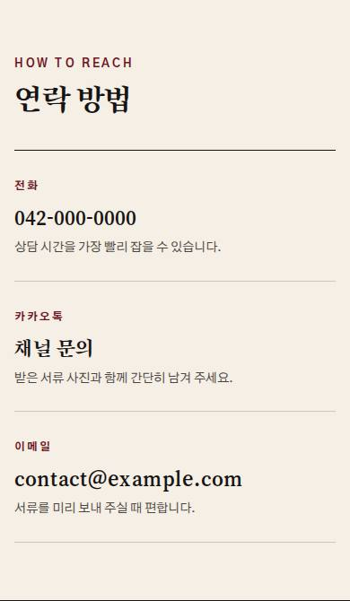 |

<details><summary>스타일 코드 (마크업 구조 + 클래스, 문구는 …) · <a href="code/contact-channels.html">code/contact-channels.html</a></summary>

```html
<section class="sec">
  <div class="wrap">
    <p class="eyebrow up on">…</p>
    <h2 class="up on">…</h2>
    <div class="channels up on">
      <a>
        <span>…</span>
        <b>…</b>
        <p>…</p>
      </a>
      <!-- ↑ 같은 구조 3개 반복 -->
    </div>
  </div>
</section>
```

</details>

### 푸터 (광고책임변호사 표기) `footer`

- 종류: `footer` · 사용 사이트: `pro-law-firm/docket` · 페이지: `/`
- 소스: [`src/components/Foot.tsx`](../../../templates/pro-law-firm/docket/src/components/Foot.tsx)

| 데스크톱 1440 | 모바일 390 |
|---|---|
|  | 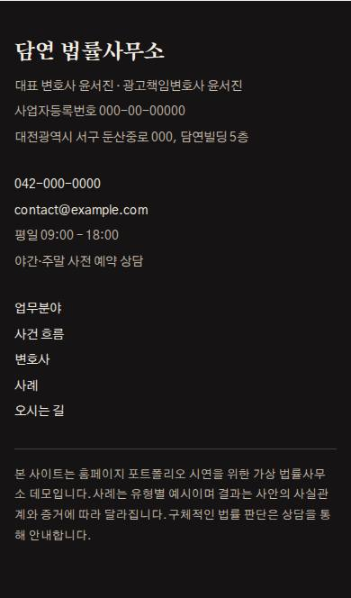 |

<details><summary>스타일 코드 (마크업 구조 + 클래스, 문구는 …) · <a href="code/footer.html">code/footer.html</a></summary>

```html
<footer class="foot">
  <div class="wrap">
    <div>
      <b>…</b>
      <ul>
        <li>
          …
          …
          …
          …
        </li>
        <!-- ↑ 같은 구조 3개 반복 -->
      </ul>
    </div>
    <ul>
      <li>
        <a>…</a>
      </li>
      <!-- ↑ 같은 구조 4개 반복 -->
    </ul>
    <!-- ↑ 같은 구조 2개 반복 -->
    <p class="notice">…</p>
  </div>
</footer>
```

</details>
