# 세무사무소 · almanac

> 자동 생성 문서(`npm run library`). 참고용 스타일 기록이며, 이 코드를 다른 사이트에 그대로 쓰지 않는다.

- 사용 사이트: `pro-tax-office/almanac` (한결세무회계(가상))
- 배포 주소: https://hongjaang-star.github.io/agency-web-templates/pro-tax-office/almanac/
- 소스: [`templates/pro-tax-office/almanac`](../../../templates/pro-tax-office/almanac)

## 디자인 지문

| 항목 | 값 |
|---|---|
| layout | editorial |
| hero | statement |
| typePair | Hahmlet + Pretendard |
| palette | paper·ink·vermilion |
| imageTreatment | no photo, rules·footnotes·seal |
| motion | rule draw + rise |
| signature | 세무 연감 (방문일 기준 D-day) |
| sectionOrder | hero, almanac, index, column, cases, qa, visit |

## 디자인 토큰

서체 설정 (`src/app/layout.tsx`)

```ts
import { Hahmlet } from "next/font/google";

const hahmlet = Hahmlet({
  variable: "--font-hahmlet",
  subsets: ["latin"],
  weight: ["300", "500", "700"],
  display: "swap",
});
```

<details><summary>globals.css (색·서체 토큰, 공용 유틸리티)</summary>

```css
/* almanac — 신문·연감 지면. paper · ink · vermilion
   서체: Hahmlet(제목, next/font) + Pretendard(본문, self-hosted) */
@import "pretendard/dist/web/variable/pretendardvariable-dynamic-subset.css";

:root {
  --paper: #f4efe4;
  --paper-2: #ebe4d4;
  --ink: #1d1b18;
  --ink-2: #4a453d; /* 8.6:1 on paper */
  --rule: #1d1b18;
  --rule-soft: rgba(29, 27, 24, 0.28);
  --red: #c2361f; /* 4.9:1 on paper */
  --red-ink: #9f2a17;
  --serif: var(--font-hahmlet), "Noto Serif KR", serif;
  --sans: "Pretendard Variable", Pretendard, system-ui, sans-serif;
  --gut: clamp(16px, 4vw, 48px);
  --ease: cubic-bezier(0.2, 0.7, 0.2, 1);
}

*,
*::before,
*::after { box-sizing: border-box; margin: 0; padding: 0; }
html { scroll-behavior: smooth; }
body {
  background: var(--paper);
  color: var(--ink);
  font: 400 16px/1.75 var(--sans);
  -webkit-font-smoothing: antialiased;
  overflow-x: hidden;
}
a { color: inherit; }
img, svg { display: block; }
:focus-visible { outline: 2px solid var(--red); outline-offset: 3px; }
.sr-only { position: absolute; width: 1px; height: 1px; overflow: hidden; clip: rect(0 0 0 0); white-space: nowrap; }
.skip { position: absolute; left: -9999px; top: 8px; background: var(--ink); color: var(--paper); padding: 10px 14px; z-index: 100; }
.skip:focus { left: 8px; }
.wrap { max-width: 1240px; margin: 0 auto; padding: 0 var(--gut); }

/* ── 데모 띠 ── */
.demo { background: var(--ink); color: var(--paper); font-size: 12px; letter-spacing: 0.08em; text-align: center; padding: 6px 12px; }

/* ── 마스트헤드 ── */
.mast { border-bottom: 3px double var(--rule); background: var(--paper); }
.mast-top { display: flex; justify-content: space-between; gap: 12px; font-size: 12px; color: var(--ink-2); padding: 10px 0; border-bottom: 1px solid var(--rule); }
.mast-row { display: flex; align-items: flex-end; justify-content: space-between; gap: 20px; padding: 18px 0 14px; flex-wrap: wrap; }
.logo { font: 700 clamp(30px, 5vw, 50px)/1 var(--serif); letter-spacing: -0.02em; text-decoration: none; }
.logo small { display: block; font: 500 12px/1.4 var(--sans); letter-spacing: 0.32em; color: var(--ink-2); margin-top: 8px; }
.mast nav ul { display: flex; gap: clamp(12px, 2.4vw, 28px); list-style: none; font-size: 15px; }
.mast nav a { text-decoration: none; padding: 4px 0; border-bottom: 1px solid transparent; white-space: nowrap; }
.mast nav a:hover, .mast nav a[aria-current="page"] { border-color: var(--ink); }
.mast nav a[aria-current="page"] { color: var(--red); border-color: var(--red); }
.call { font: 700 15px var(--sans); text-decoration: none; background: var(--red); color: #fff; padding: 10px 16px; white-space: nowrap; }
.call:hover { background: var(--red-ink); }

/* ── 버튼 ── */
.btn { display: inline-flex; align-items: center; gap: 8px; font: 600 15px var(--sans); text-decoration: none; padding: 14px 20px; border: 1px solid var(--ink); background: transparent; }
.btn.solid { background: var(--ink); color: var(--paper); }
.btn:hover { background: var(--red); border-color: var(--red); color: #fff; }
.more { display: inline-block; margin-top: 24px; font: 600 15px var(--sans); color: var(--red); text-decoration: none; border-bottom: 1px solid currentColor; }
.more:hover { color: var(--red-ink); }

/* ── 메인 히어로 (statement) ── */
.hero { padding: clamp(48px, 8vw, 110px) 0 clamp(40px, 6vw, 80px); border-bottom: 1px solid var(--rule); position: relative; }
.kicker { font: 500 13px var(--sans); letter-spacing: 0.2em; color: var(--red); }
.hero h1 { font: 300 clamp(44px, 9.2vw, 138px)/1.04 var(--serif); letter-spacing: -0.045em; margin-top: 18px; }
.hero h1 b { font-weight: 700; }
.hero h1 em { font-style: normal; color: var(--red); font-weight: 500; }
.hero-foot { display: grid; grid-template-columns: repeat(12, 1fr); gap: 20px; margin-top: clamp(28px, 4vw, 56px); align-items: end; }
.hero-foot p { grid-column: span 6; font-size: clamp(16px, 1.6vw, 19px); color: var(--ink-2); max-width: 36em; }
.hero-foot .acts { grid-column: 8 / span 5; display: flex; gap: 10px; justify-content: flex-end; flex-wrap: wrap; }
.seal { position: absolute; right: var(--gut); top: clamp(40px, 6vw, 80px); width: clamp(76px, 9vw, 112px); aspect-ratio: 1; border: 2px solid var(--red); color: var(--red); border-radius: 50%; display: grid; place-items: center; text-align: center; font: 700 13px/1.25 var(--serif); transform: rotate(-12deg); }
.seal span { font-size: 22px; display: block; }

/* ── 섹션 머리 ── */
.sec { padding: clamp(56px, 8vw, 104px) 0; border-bottom: 1px solid var(--rule); }
.sec:last-child { border-bottom: 0; }
.sec-head { display: grid; grid-template-columns: 140px 1fr; gap: 20px; align-items: baseline; margin-bottom: clamp(28px, 4vw, 48px); padding-top: 14px; border-top: 1px solid var(--rule); }
.sec-no { font: 500 13px var(--sans); letter-spacing: 0.16em; color: var(--red); }
.sec-head h2 { font: 700 clamp(28px, 4vw, 48px)/1.2 var(--serif); letter-spacing: -0.03em; }
.sec-head h2 small { display: block; font: 400 15px/1.6 var(--sans); color: var(--ink-2); letter-spacing: 0; margin-top: 10px; }

/* ── 서브페이지 머리 ── */
.folio { padding: clamp(40px, 6vw, 80px) 0 clamp(28px, 4vw, 48px); border-bottom: 1px solid var(--rule); }
.crumbs { display: flex; gap: 8px; font-size: 13px; color: var(--ink-2); list-style: none; flex-wrap: wrap; }
.crumbs li + li::before { content: "/"; margin-right: 8px; color: var(--rule-soft); }
.crumbs a { text-decoration: none; }
.crumbs a:hover { text-decoration: underline; }
.folio .kicker { margin-top: 28px; display: block; }
.folio h1 { font: 700 clamp(36px, 6vw, 84px)/1.08 var(--serif); letter-spacing: -0.04em; margin-top: 12px; max-width: 16em; }
.folio p.lead { font-size: clamp(16px, 1.5vw, 18px); color: var(--ink-2); margin-top: 18px; max-width: 40em; }

/* ── 세무 연감 (시그니처) ── */
.alm-now { display: grid; grid-template-columns: repeat(12, 1fr); gap: 20px; align-items: end; margin-bottom: 36px; }
.dday { grid-column: span 5; white-space: nowrap; font: 700 clamp(72px, 11vw, 176px)/0.9 var(--serif); letter-spacing: -0.06em; color: var(--red); font-variant-numeric: tabular-nums; }
.dday-txt { grid-column: span 7; border-left: 1px solid var(--rule); padding-left: 24px; }
.dday-txt b { display: block; font: 700 clamp(22px, 2.6vw, 30px)/1.3 var(--serif); }
.dday-txt p { color: var(--ink-2); margin-top: 8px; }
.months { display: grid; grid-template-columns: repeat(12, 1fr); border-top: 2px solid var(--rule); border-bottom: 1px solid var(--rule); list-style: none; }
.m { padding: 14px 10px 18px; border-right: 1px solid var(--rule-soft); min-height: 150px; position: relative; }
.m:last-child { border-right: 0; }
.m h3 { font: 700 22px var(--serif); }
.m ul { list-style: none; font-size: 12.5px; line-height: 1.5; margin-top: 8px; color: var(--ink-2); }
.m li + li { margin-top: 6px; }
.m.past, .m.past ul { color: #6b655b; } /* 지난 달: 흐리게 하되 대비 4.5:1 유지 */
.m.past h3 { font-weight: 500; }
.m.now { background: var(--ink); color: var(--paper); }
.m.now ul { color: #d9d2c3; }
.m .badge { display: inline-block; margin-top: 4px; font: 600 11px var(--sans); color: #fff; background: var(--red); padding: 2px 6px; }
.alm-note { font-size: 13px; color: var(--ink-2); margin-top: 12px; }

/* 연감 전체 페이지: 월별 표 */
.ledger { width: 100%; border-collapse: collapse; border-top: 2px solid var(--rule); }
.ledger th, .ledger td { text-align: left; padding: 16px 12px; border-bottom: 1px solid var(--rule-soft); vertical-align: top; }
.ledger thead th { font: 500 12px var(--sans); letter-spacing: 0.14em; color: var(--ink-2); }
.ledger tbody th { font: 700 24px/1.2 var(--serif); width: 90px; }
.ledger td.date { font: 500 15px var(--serif); color: var(--red); white-space: nowrap; width: 110px; }
.ledger td b { font: 700 18px/1.4 var(--serif); display: block; }
.ledger td span { font-size: 14px; color: var(--ink-2); }
.ledger tr.now { background: var(--paper-2); }
.ledger a { text-decoration: none; font-size: 14px; color: var(--red); white-space: nowrap; }
.monthly { margin-top: 32px; border: 1px solid var(--rule); padding: 18px 20px; display: flex; gap: 16px; align-items: baseline; flex-wrap: wrap; }
.monthly b { font: 700 18px var(--serif); }

/* ── 업무 색인 ── */
.idx { list-style: none; columns: 2; column-gap: 56px; }
.idx li { break-inside: avoid; display: grid; grid-template-columns: 1fr auto; gap: 4px 12px; padding: 18px 0; border-top: 1px solid var(--rule-soft); }
.idx h3 { font: 700 21px/1.35 var(--serif); }
.idx p { font-size: 14.5px; color: var(--ink-2); grid-column: 1 / -1; }
.idx .pg { font: 500 14px var(--serif); color: var(--red); }
.idx a { text-decoration: none; }
.idx a:hover h3 { text-decoration: underline; text-decoration-thickness: 1px; text-underline-offset: 4px; }
.chapter { display: grid; grid-template-columns: 140px 1fr; gap: 20px; padding: clamp(36px, 5vw, 56px) 0; border-bottom: 1px solid var(--rule); }
.chapter:last-child { border-bottom: 0; }
.chapter > header span { display: block; font: 500 13px var(--sans); letter-spacing: 0.16em; color: var(--red); }
.chapter > header h2 { font: 700 clamp(24px, 2.8vw, 32px)/1.25 var(--serif); margin-top: 6px; }
.chapter .idx { columns: 1; }

/* ── 업무 상세 (기사형) ── */
.article { display: grid; grid-template-columns: repeat(12, 1fr); gap: 20px; padding-block: clamp(40px, 6vw, 72px); }
.article-body { grid-column: 1 / span 8; }
.article-aside { grid-column: 10 / span 3; }
.article-body section + section { margin-top: 40px; }
.article-body h2 { font: 700 24px/1.3 var(--serif); padding-bottom: 10px; border-bottom: 2px solid var(--rule); }
.article-body ol { list-style: none; counter-reset: n; margin-top: 8px; }
.article-body ol li { counter-increment: n; display: grid; grid-template-columns: 40px 1fr; padding: 12px 0; border-bottom: 1px solid var(--rule-soft); }
.article-body ol li::before { content: counter(n, decimal-leading-zero); font: 500 14px/1.9 var(--serif); color: var(--red); }
.aside-box { border-top: 2px solid var(--ink); padding-top: 14px; }
.aside-box + .aside-box { margin-top: 32px; }
.aside-box h2 { font: 500 12px var(--sans); letter-spacing: 0.14em; color: var(--red); }
.aside-box p { font: 700 19px/1.45 var(--serif); margin-top: 8px; }
.aside-box ul { list-style: none; margin-top: 8px; }
.aside-box li { padding: 8px 0; border-bottom: 1px solid var(--rule-soft); }
.aside-box li a { text-decoration: none; }
.aside-box li a:hover { color: var(--red); }
.aside-box .btn { margin-top: 14px; width: 100%; justify-content: center; }

/* ── 대표 칼럼 ── */
.column { display: grid; grid-template-columns: repeat(12, 1fr); gap: 20px; }
.column blockquote { grid-column: 1 / span 8; font: 300 clamp(28px, 3.8vw, 50px)/1.35 var(--serif); letter-spacing: -0.03em; }
.column blockquote::before { content: "\201C"; display: block; font: 700 90px/0.6 var(--serif); color: var(--red); margin-bottom: 12px; }
.byline { grid-column: 10 / span 3; align-self: end; border-top: 2px solid var(--ink); padding-top: 14px; font-size: 14px; color: var(--ink-2); }
.byline b { display: block; font: 700 20px var(--serif); color: var(--ink); }
.byline ul { list-style: none; margin-top: 10px; }

/* ── 사례 (기사 단) ── */
.articles { display: grid; grid-template-columns: repeat(4, 1fr); border-top: 2px solid var(--rule); }
.art { padding: 22px 20px 26px; border-right: 1px solid var(--rule-soft); }
.art:first-child { padding-left: 0; }
.art:last-child { border-right: 0; padding-right: 0; }
.tag { font: 600 12px var(--sans); letter-spacing: 0.12em; color: var(--red); }
.art h3 { font: 700 20px/1.4 var(--serif); margin: 8px 0 12px; }
.art dl { font-size: 14px; color: var(--ink-2); }
.art dt { font-weight: 700; color: var(--ink); font-size: 12px; letter-spacing: 0.08em; margin-top: 10px; }
.foot-note { font-size: 12.5px; color: var(--ink-2); margin-top: 20px; }
.foot-note sup, .sec-head sup { color: var(--red); }
.cases-full { display: grid; grid-template-columns: 1fr 1fr; gap: 0 48px; }
.cases-full .art { padding: 28px 0; border-right: 0; border-bottom: 1px solid var(--rule-soft); }
.cases-full .art h3 { font-size: clamp(22px, 2.4vw, 28px); }
.cases-full .art a { font-size: 14px; color: var(--red); text-decoration: none; display: inline-block; margin-top: 12px; }

/* ── 묻고 답하기 ── */
.qa { max-width: 880px; }
.qa details { border-top: 1px solid var(--rule-soft); }
.qa details:last-child { border-bottom: 1px solid var(--rule-soft); }
.qa summary { list-style: none; cursor: pointer; display: grid; grid-template-columns: 44px 1fr 24px; gap: 8px; padding: 18px 0; font: 500 19px/1.45 var(--serif); }
.qa summary::-webkit-details-marker { display: none; }
.qa summary span:first-child { color: var(--red); font-weight: 700; }
.qa summary::after { content: "+"; font: 300 26px/1 var(--sans); transition: transform 0.2s; }
.qa details[open] summary::after { transform: rotate(45deg); }
.qa p { padding: 0 0 22px 52px; color: var(--ink-2); }

/* ── 사무소: 원칙·구성원·수치 ── */
.principles { display: grid; grid-template-columns: repeat(3, 1fr); border-top: 2px solid var(--rule); }
.principles article { padding: 24px 24px 28px 0; border-right: 1px solid var(--rule-soft); }
.principles article + article { padding-left: 24px; }
.principles article:last-child { border-right: 0; }
.principles span { font: 700 40px/1 var(--serif); color: var(--red); }
.principles h3 { font: 700 22px/1.35 var(--serif); margin: 14px 0 8px; }
.principles p { color: var(--ink-2); font-size: 15px; }
.figures { display: grid; grid-template-columns: repeat(4, 1fr); border-top: 1px solid var(--rule); border-bottom: 1px solid var(--rule); list-style: none; }
.figures li { padding: 22px 16px; border-right: 1px solid var(--rule-soft); }
.figures li:last-child { border-right: 0; }
.figures b { display: block; font: 700 clamp(34px, 4vw, 52px)/1 var(--serif); letter-spacing: -0.03em; }
.figures span { font-size: 14px; color: var(--ink-2); }
.bylines { display: grid; grid-template-columns: repeat(3, 1fr); gap: 32px; }
.bylines article { border-top: 2px solid var(--ink); padding-top: 16px; }
.bylines h3 { font: 700 26px var(--serif); }
.bylines .role { font-size: 14px; color: var(--red); }
.bylines q { display: block; font: 300 19px/1.55 var(--serif); margin: 14px 0; quotes: "\201C" "\201D"; }
.bylines ul { list-style: none; font-size: 14px; color: var(--ink-2); }
.bylines li { padding: 6px 0; border-top: 1px solid var(--rule-soft); }
.steps { list-style: none; display: grid; grid-template-columns: repeat(5, 1fr); border-top: 2px solid var(--rule); }
.steps li { padding: 18px 16px 22px 0; border-right: 1px solid var(--rule-soft); }
.steps li + li { padding-left: 16px; }
.steps li:last-child { border-right: 0; }
.steps span { font: 500 14px var(--serif); color: var(--red); }
.steps b { display: block; font: 700 19px var(--serif); margin: 6px 0; }
.steps p { font-size: 14px; color: var(--ink-2); }

/* ── 찾아오는 길 ── */
.visit { display: grid; grid-template-columns: repeat(12, 1fr); gap: 20px; }
.visit .big { grid-column: span 7; font: 700 clamp(30px, 4.4vw, 60px)/1.15 var(--serif); letter-spacing: -0.03em; }
.visit .big a { text-decoration: none; color: var(--red); }
.visit dl { grid-column: 9 / span 4; font-size: 15px; }
.visit dt { font-size: 12px; letter-spacing: 0.14em; color: var(--red); margin-top: 18px; }
.visit dt:first-child { margin-top: 0; }
.maps { display: flex; gap: 10px; margin-top: 18px; flex-wrap: wrap; }
.channels { display: grid; grid-template-columns: repeat(3, 1fr); border-top: 2px solid var(--rule); }
.channels a { display: block; padding: 22px 20px 26px 0; text-decoration: none; border-right: 1px solid var(--rule-soft); }
.channels a + a { padding-left: 20px; }
.channels a:last-child { border-right: 0; }
.channels span { font: 500 12px var(--sans); letter-spacing: 0.14em; color: var(--red); }
.channels b { display: block; font: 700 clamp(22px, 2.4vw, 30px)/1.3 var(--serif); margin-top: 8px; }
.channels p { font-size: 14px; color: var(--ink-2); margin-top: 6px; }
.channels a:hover b { color: var(--red); }

/* ── 404 ── */
.lost { padding: clamp(80px, 12vw, 160px) 0; text-align: left; }
.lost b { font: 700 clamp(90px, 16vw, 200px)/0.9 var(--serif); color: var(--red); letter-spacing: -0.06em; display: block; }
.lost h1 { font: 700 clamp(26px, 3vw, 36px) var(--serif); margin: 20px 0 10px; }
.lost p { color: var(--ink-2); margin-bottom: 28px; }

/* ── 푸터 ── */
.colophon { border-top: 3px double var(--rule); padding: 32px 0 56px; font-size: 13px; color: var(--ink-2); }
.colophon .wrap { display: grid; grid-template-columns: 1.2fr 1fr 1fr; gap: 24px; }
.colophon b { display: block; font: 700 22px var(--serif); color: var(--ink); margin-bottom: 8px; }
.colophon ul { list-style: none; }
.colophon li + li { margin-top: 4px; }
.colophon a { text-decoration: none; }
.colophon a:hover { text-decoration: underline; }
.colophon .notice { grid-column: 1 / -1; border-top: 1px solid var(--rule-soft); padding-top: 16px; font-size: 12.5px; }

/* ── 모션: 괘선 그리기·떠오름 (JS 가 있을 때만) ── */
.js .draw { border-top-color: transparent; background-image: linear-gradient(var(--rule), var(--rule)); background-repeat: no-repeat; background-size: 0 1px; background-position: 0 0; transition: background-size 1.1s var(--ease); }
.js .draw.on { background-size: 100% 1px; }
.js .rise { opacity: 0; transform: translateY(14px); transition: opacity 0.8s, transform 0.8s; }
.js .rise.on { opacity: 1; transform: none; }
@media (prefers-reduced-motion: reduce) {
  html { scroll-behavior: auto; }
  .js .rise { opacity: 1; transform: none; }
  .js .draw { background-size: 100% 1px; }
  *, *::before, *::after { transition: none !important; }
}

/* ── 반응형 ── */
@media (max-width: 900px) {
  .hero-foot p, .hero-foot .acts { grid-column: 1 / -1; justify-content: flex-start; }
  .seal { display: none; }
  .dday, .dday-txt { grid-column: 1 / -1; }
  .dday-txt { border-left: 0; padding-left: 0; border-top: 1px solid var(--rule); padding-top: 14px; }
  .months { grid-template-columns: repeat(4, 1fr); }
  .m { border-bottom: 1px solid var(--rule-soft); min-height: 120px; }
  .m:nth-child(4n) { border-right: 0; }
  .idx { columns: 1; }
  .column blockquote, .byline { grid-column: 1 / -1; }
  .articles { grid-template-columns: 1fr 1fr; }
  .art, .art:first-child, .art:last-child { padding: 22px 0; border-right: 0; border-bottom: 1px solid var(--rule-soft); }
  .art:nth-child(odd) { padding-right: 16px; border-right: 1px solid var(--rule-soft); }
  .art:nth-child(even) { padding-left: 16px; }
  .cases-full { grid-template-columns: 1fr; }
  .cases-full .art:nth-child(n) { padding: 24px 0; border-right: 0; }
  .visit .big, .visit dl { grid-column: 1 / -1; }
  .sec-head, .chapter { grid-template-columns: 1fr; gap: 6px; }
  .article-body, .article-aside { grid-column: 1 / -1; }
  .principles, .bylines, .channels { grid-template-columns: 1fr; }
  .principles article, .principles article + article, .channels a, .channels a + a { padding: 22px 0; border-right: 0; border-bottom: 1px solid var(--rule-soft); }
  .figures { grid-template-columns: 1fr 1fr; }
  .figures li:nth-child(2n) { border-right: 0; }
  .figures li:nth-child(-n + 2) { border-bottom: 1px solid var(--rule-soft); }
  .steps { grid-template-columns: 1fr; }
  .steps li, .steps li + li { padding: 16px 0; border-right: 0; border-bottom: 1px solid var(--rule-soft); }
  .colophon .wrap { grid-template-columns: 1fr; }
}
@media (max-width: 560px) {
  .mast-top span:last-child { display: none; }
  .mast nav { order: 3; width: 100%; overflow-x: auto; }
  .mast nav ul { font-size: 14px; }
  .months { grid-template-columns: repeat(3, 1fr); }
  .m:nth-child(4n) { border-right: 1px solid var(--rule-soft); }
  .m:nth-child(3n) { border-right: 0; }
  .articles { grid-template-columns: 1fr; }
  .art:nth-child(odd), .art:nth-child(even) { padding: 22px 0; border-right: 0; }
  .ledger thead { display: none; }
  .ledger tr { display: grid; grid-template-columns: 70px 1fr; padding: 12px 0; border-bottom: 1px solid var(--rule-soft); }
  .ledger th, .ledger td { border: 0; padding: 2px 0; }
  .ledger tbody th { grid-row: span 3; }
  .ledger td.date { width: auto; }
}
```

</details>

## 모듈

### 마스트헤드 `masthead`

- 종류: `header` · 사용 사이트: `pro-tax-office/almanac` · 페이지: `/`
- 소스: [`src/components/Masthead.tsx`](../../../templates/pro-tax-office/almanac/src/components/Masthead.tsx)

| 데스크톱 1440 | 모바일 390 |
|---|---|
| 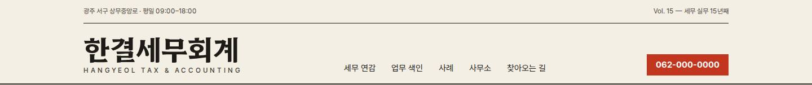 |  |

<details><summary>스타일 코드 (마크업 구조 + 클래스, 문구는 …) · <a href="code/masthead.html">code/masthead.html</a></summary>

```html
<header class="mast">
  <div class="wrap">
    <div class="mast-top">
      <span>…</span>
      <!-- ↑ 같은 구조 2개 반복 -->
    </div>
    <div class="mast-row">
      <a class="logo">
        …
        <small>…</small>
      </a>
      <nav>
        <ul>
          <li>
            <a>…</a>
          </li>
          <!-- ↑ 같은 구조 5개 반복 -->
        </ul>
      </nav>
      <a class="call">…</a>
    </div>
  </div>
</header>
```

</details>

### 한 문장 히어로 `home-hero`

- 종류: `hero` · 사용 사이트: `pro-tax-office/almanac` · 페이지: `/`
- 소스: [`src/app/page.tsx`](../../../templates/pro-tax-office/almanac/src/app/page.tsx)

| 데스크톱 1440 | 모바일 390 |
|---|---|
| 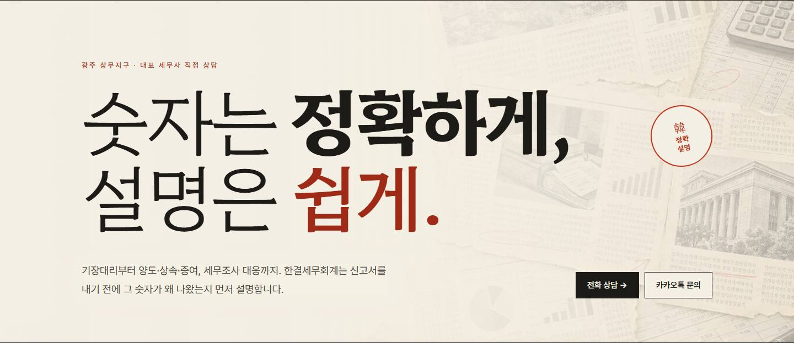 |  |

<details><summary>스타일 코드 (마크업 구조 + 클래스, 문구는 …) · <a href="code/home-hero.html">code/home-hero.html</a></summary>

```html
<section class="hero">
  <div class="wrap">
    <p class="kicker">…</p>
    <h1>
      …
      <b>…</b>
      <br />
      …
      <em>…</em>
    </h1>
    <div class="hero-foot">
      <p>…</p>
      <div class="acts">
        <a class="btn solid">…</a>
        <a class="btn">
          …
          <span class="sr-only">…</span>
        </a>
      </div>
    </div>
    <div class="seal">
      <div>
        <span>…</span>
        …
        <br />
        …
      </div>
    </div>
  </div>
</section>
```

</details>

### 세무 연감 (D-day) `home-almanac`

- 종류: `signature` · 사용 사이트: `pro-tax-office/almanac` · 페이지: `/`
- 소스: [`src/components/Almanac.tsx`](../../../templates/pro-tax-office/almanac/src/components/Almanac.tsx)

| 데스크톱 1440 | 모바일 390 |
|---|---|
| 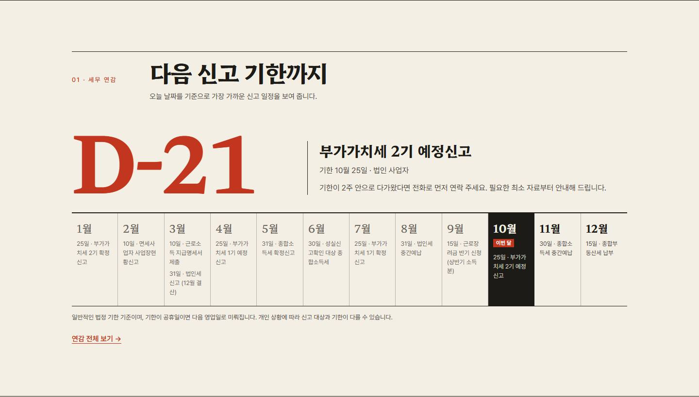 | 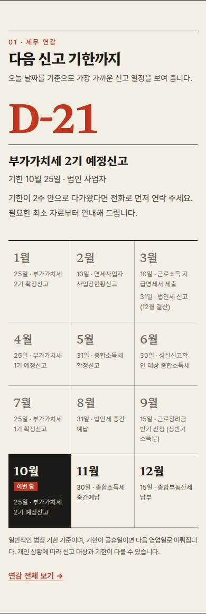 |

<details><summary>스타일 코드 (마크업 구조 + 클래스, 문구는 …) · <a href="code/home-almanac.html">code/home-almanac.html</a></summary>

```html
<section class="sec">
  <div class="wrap">
    <div class="sec-head draw on">
      <span class="sec-no">…</span>
      <h2>
        …
        <small>…</small>
      </h2>
    </div>
    <div class="alm-now rise on">
      <div class="dday">…</div>
      <div class="dday-txt">
        <b>…</b>
        <p>
          …
          …
          …
          …
          …
          …
        </p>
        <!-- ↑ 같은 구조 2개 반복 -->
      </div>
    </div>
    <ol class="months rise on">
      <li class="m past">
        <h3>
          …
          …
        </h3>
        <ul>
          <li>
            …
            …
            …
          </li>
        </ul>
      </li>
      <!-- ↑ 같은 구조 9개 반복 -->
      <li class="m now">
        <h3>
          …
          …
        </h3>
        <span class="badge">…</span>
        <ul>
          <li>
            …
            …
            …
          </li>
        </ul>
      </li>
      <li class="m">
        <h3>
          …
          …
        </h3>
        <ul>
          <li>
            …
            …
            …
          </li>
        </ul>
      </li>
      <!-- ↑ 같은 구조 2개 반복 -->
    </ol>
    <p class="alm-note">…</p>
    <a class="more">…</a>
  </div>
</section>
```

</details>

### 업무 색인 `home-index`

- 종류: `services` · 사용 사이트: `pro-tax-office/almanac` · 페이지: `/`
- 소스: [`src/components/ServiceIndex.tsx`](../../../templates/pro-tax-office/almanac/src/components/ServiceIndex.tsx)

| 데스크톱 1440 | 모바일 390 |
|---|---|
| 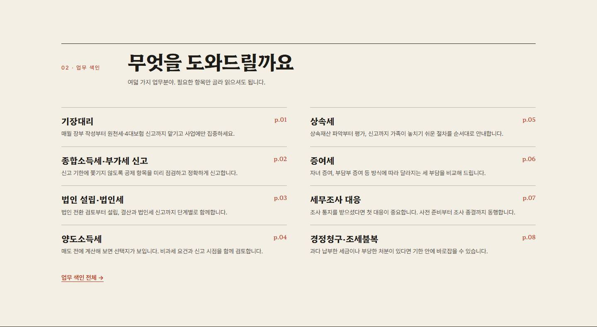 | 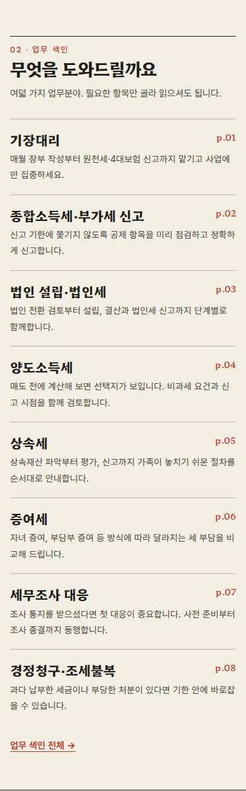 |

<details><summary>스타일 코드 (마크업 구조 + 클래스, 문구는 …) · <a href="code/home-index.html">code/home-index.html</a></summary>

```html
<section class="sec">
  <div class="wrap">
    <div class="sec-head draw on">
      <span class="sec-no">…</span>
      <h2>
        …
        <small>…</small>
      </h2>
    </div>
    <ol class="idx rise on">
      <li>
        <a>
          <h3>…</h3>
        </a>
        <span class="pg">
          …
          …
        </span>
        <p>…</p>
      </li>
      <!-- ↑ 같은 구조 8개 반복 -->
    </ol>
    <a class="more">…</a>
  </div>
</section>
```

</details>

### 대표 칼럼 `home-column`

- 종류: `intro` · 사용 사이트: `pro-tax-office/almanac` · 페이지: `/`
- 소스: [`src/app/page.tsx`](../../../templates/pro-tax-office/almanac/src/app/page.tsx)

| 데스크톱 1440 | 모바일 390 |
|---|---|
| 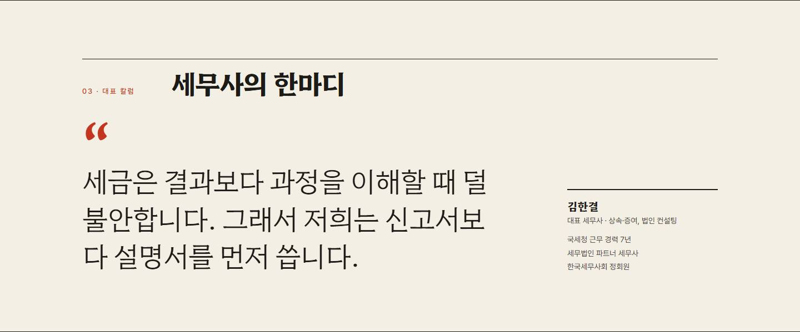 | 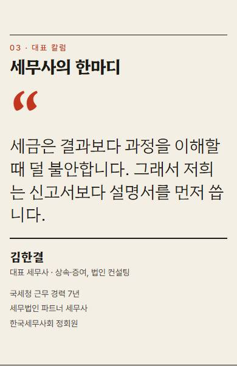 |

<details><summary>스타일 코드 (마크업 구조 + 클래스, 문구는 …) · <a href="code/home-column.html">code/home-column.html</a></summary>

```html
<section class="sec">
  <div class="wrap">
    <div class="sec-head draw on">
      <span class="sec-no">…</span>
      <h2>…</h2>
    </div>
    <div class="column rise on">
      <blockquote>…</blockquote>
      <div class="byline">
        <b>…</b>
        …
        <ul>
          <li>…</li>
          <!-- ↑ 같은 구조 3개 반복 -->
        </ul>
      </div>
    </div>
  </div>
</section>
```

</details>

### 사례 기사 단 `home-cases`

- 종류: `cases` · 사용 사이트: `pro-tax-office/almanac` · 페이지: `/`
- 소스: [`src/components/CaseArticles.tsx`](../../../templates/pro-tax-office/almanac/src/components/CaseArticles.tsx)

| 데스크톱 1440 | 모바일 390 |
|---|---|
| 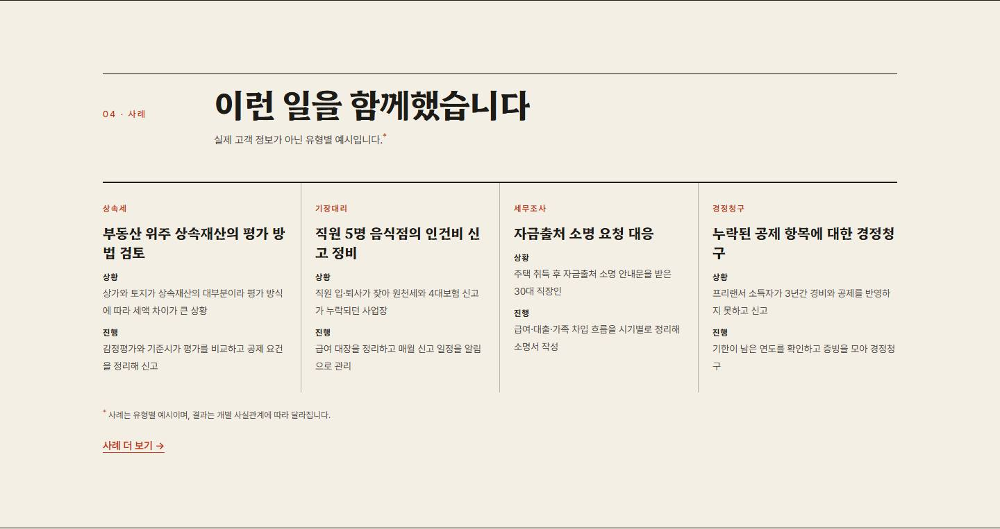 | 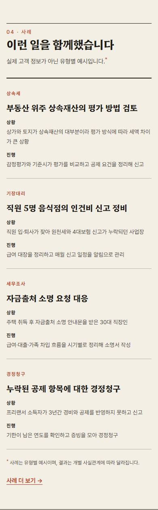 |

<details><summary>스타일 코드 (마크업 구조 + 클래스, 문구는 …) · <a href="code/home-cases.html">code/home-cases.html</a></summary>

```html
<section class="sec">
  <div class="wrap">
    <div class="sec-head draw on">
      <span class="sec-no">…</span>
      <h2>
        …
        <small>
          …
          <sup>…</sup>
        </small>
      </h2>
    </div>
    <div class="articles rise on">
      <article class="art">
        <span class="tag">…</span>
        <h3>…</h3>
        <dl>
          <dt>…</dt>
          <dd>…</dd>
          <dt>…</dt>
          <dd>…</dd>
        </dl>
      </article>
      <!-- ↑ 같은 구조 4개 반복 -->
    </div>
    <p class="foot-note">
      <sup>…</sup>
      …
    </p>
    <a class="more">…</a>
  </div>
</section>
```

</details>

### 묻고 답하기 `home-qa`

- 종류: `faq` · 사용 사이트: `pro-tax-office/almanac` · 페이지: `/`
- 소스: [`src/components/QandA.tsx`](../../../templates/pro-tax-office/almanac/src/components/QandA.tsx)

| 데스크톱 1440 | 모바일 390 |
|---|---|
| 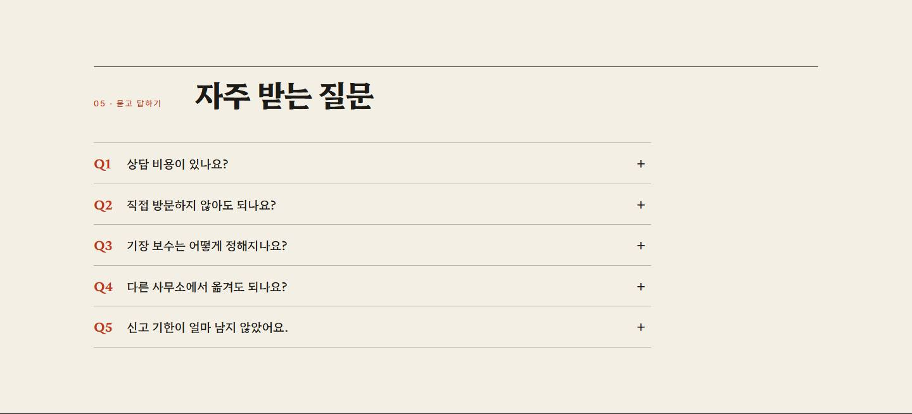 | 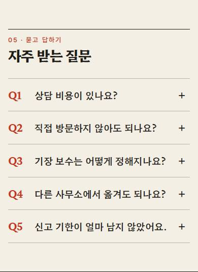 |

<details><summary>스타일 코드 (마크업 구조 + 클래스, 문구는 …) · <a href="code/home-qa.html">code/home-qa.html</a></summary>

```html
<section class="sec">
  <div class="wrap">
    <div class="sec-head draw on">
      <span class="sec-no">…</span>
      <h2>…</h2>
    </div>
    <div class="qa rise on">
      <details>
        <summary>
          <span>
            …
            …
          </span>
          <!-- ↑ 같은 구조 2개 반복 -->
        </summary>
        <p>…</p>
      </details>
      <!-- ↑ 같은 구조 5개 반복 -->
    </div>
    <script>…</script>
  </div>
</section>
```

</details>

### 찾아오는 길 `home-visit`

- 종류: `visit` · 사용 사이트: `pro-tax-office/almanac` · 페이지: `/`
- 소스: [`src/components/Visit.tsx`](../../../templates/pro-tax-office/almanac/src/components/Visit.tsx)

| 데스크톱 1440 | 모바일 390 |
|---|---|
| 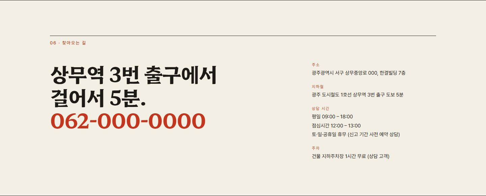 | 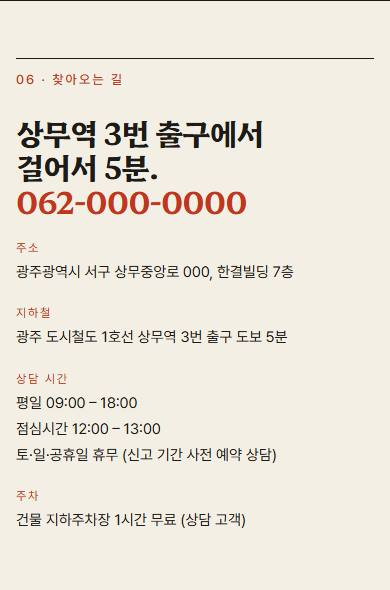 |

<details><summary>스타일 코드 (마크업 구조 + 클래스, 문구는 …) · <a href="code/home-visit.html">code/home-visit.html</a></summary>

```html
<section class="sec">
  <div class="wrap">
    <div class="sec-head draw on">
      <span class="sec-no">…</span>
      <h2 class="sr-only">…</h2>
    </div>
    <div class="visit rise on">
      <p class="big">
        <span>
          …
          <br />
        </span>
        <!-- ↑ 같은 구조 2개 반복 -->
        <a>…</a>
      </p>
      <dl>
        <dt>…</dt>
        <dd>…</dd>
        <dt>…</dt>
        <dd>…</dd>
        <dt>…</dt>
        <dd>
          <span>
            …
            …
            <br />
          </span>
          <!-- ↑ 같은 구조 3개 반복 -->
        </dd>
        <dt>…</dt>
        <dd>…</dd>
      </dl>
    </div>
  </div>
</section>
```

</details>

### 서브페이지 머리 (폴리오) `folio`

- 종류: `page-hero` · 사용 사이트: `pro-tax-office/almanac` · 페이지: `/about/`
- 소스: [`src/components/Folio.tsx`](../../../templates/pro-tax-office/almanac/src/components/Folio.tsx)

| 데스크톱 1440 | 모바일 390 |
|---|---|
| 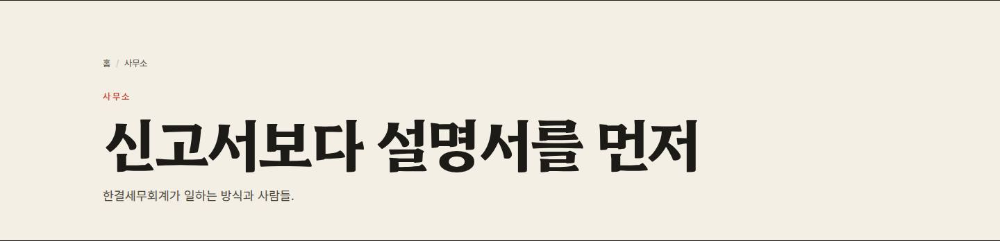 | 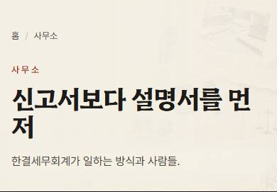 |

<details><summary>스타일 코드 (마크업 구조 + 클래스, 문구는 …) · <a href="code/folio.html">code/folio.html</a></summary>

```html
<section class="folio">
  <script>…</script>
  <div class="wrap">
    <nav>
      <ol class="crumbs">
        <li>
          <a>…</a>
        </li>
        <!-- ↑ 같은 구조 2개 반복 -->
      </ol>
    </nav>
    <span class="kicker">…</span>
    <h1>…</h1>
    <p class="lead">…</p>
  </div>
</section>
```

</details>

### 세 가지 약속 `about-principles`

- 종류: `intro` · 사용 사이트: `pro-tax-office/almanac` · 페이지: `/about/`
- 소스: [`src/app/about/page.tsx`](../../../templates/pro-tax-office/almanac/src/app/about/page.tsx)

| 데스크톱 1440 | 모바일 390 |
|---|---|
| 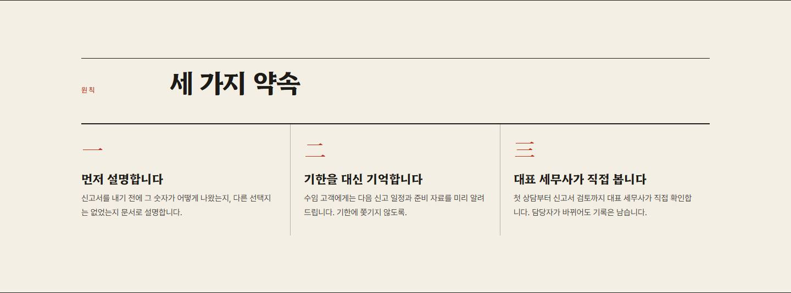 | 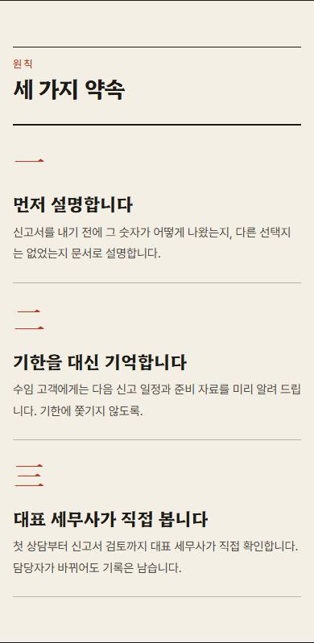 |

<details><summary>스타일 코드 (마크업 구조 + 클래스, 문구는 …) · <a href="code/about-principles.html">code/about-principles.html</a></summary>

```html
<section class="sec">
  <div class="wrap">
    <div class="sec-head draw on">
      <span class="sec-no">…</span>
      <h2>…</h2>
    </div>
    <div class="principles rise on">
      <article>
        <span>…</span>
        <h3>…</h3>
        <p>…</p>
      </article>
      <!-- ↑ 같은 구조 3개 반복 -->
    </div>
  </div>
</section>
```

</details>

### 현황 수치 `about-figures`

- 종류: `stats` · 사용 사이트: `pro-tax-office/almanac` · 페이지: `/about/`
- 소스: [`src/app/about/page.tsx`](../../../templates/pro-tax-office/almanac/src/app/about/page.tsx)

| 데스크톱 1440 | 모바일 390 |
|---|---|
| 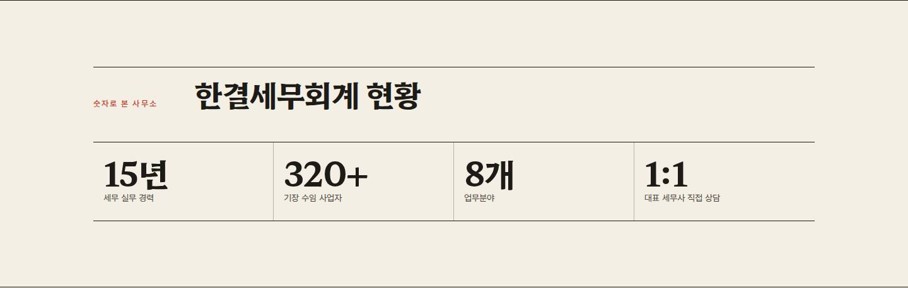 | 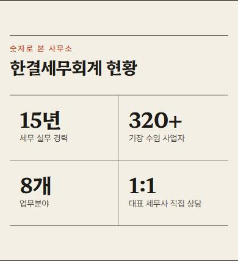 |

<details><summary>스타일 코드 (마크업 구조 + 클래스, 문구는 …) · <a href="code/about-figures.html">code/about-figures.html</a></summary>

```html
<section class="sec">
  <div class="wrap">
    <div class="sec-head draw on">
      <span class="sec-no">…</span>
      <h2>…</h2>
    </div>
    <ul class="figures rise on">
      <li>
        <b>…</b>
        <span>…</span>
      </li>
      <!-- ↑ 같은 구조 4개 반복 -->
    </ul>
  </div>
</section>
```

</details>

### 필진 (구성원) `about-bylines`

- 종류: `team` · 사용 사이트: `pro-tax-office/almanac` · 페이지: `/about/`
- 소스: [`src/app/about/page.tsx`](../../../templates/pro-tax-office/almanac/src/app/about/page.tsx)

| 데스크톱 1440 | 모바일 390 |
|---|---|
| 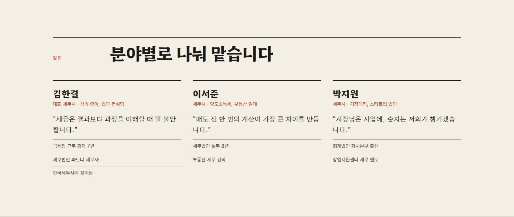 | 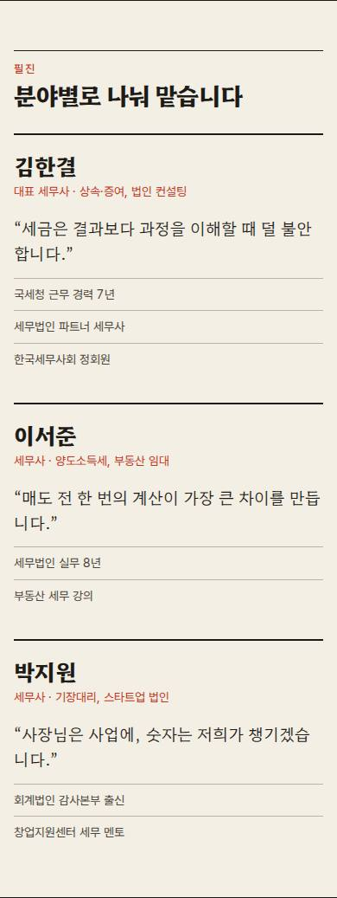 |

<details><summary>스타일 코드 (마크업 구조 + 클래스, 문구는 …) · <a href="code/about-bylines.html">code/about-bylines.html</a></summary>

```html
<section class="sec">
  <div class="wrap">
    <div class="sec-head draw on">
      <span class="sec-no">…</span>
      <h2>…</h2>
    </div>
    <div class="bylines rise on">
      <article>
        <h3>…</h3>
        <p class="role">
          …
          …
          …
        </p>
        <q>…</q>
        <ul>
          <li>…</li>
          <!-- ↑ 같은 구조 3개 반복 -->
        </ul>
      </article>
      <!-- ↑ 같은 구조 3개 반복 -->
    </div>
  </div>
</section>
```

</details>

### 진행 방식 `about-steps`

- 종류: `process` · 사용 사이트: `pro-tax-office/almanac` · 페이지: `/about/`
- 소스: [`src/app/about/page.tsx`](../../../templates/pro-tax-office/almanac/src/app/about/page.tsx)

| 데스크톱 1440 | 모바일 390 |
|---|---|
| 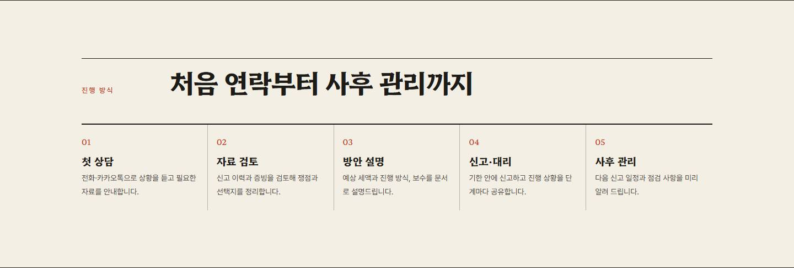 | 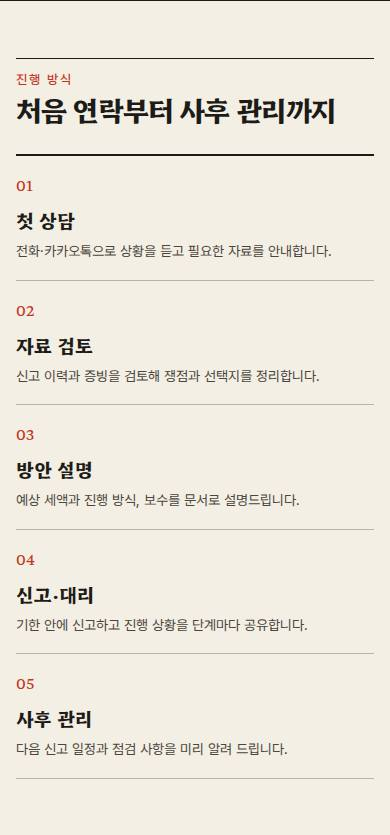 |

<details><summary>스타일 코드 (마크업 구조 + 클래스, 문구는 …) · <a href="code/about-steps.html">code/about-steps.html</a></summary>

```html
<section class="sec">
  <div class="wrap">
    <div class="sec-head draw on">
      <span class="sec-no">…</span>
      <h2>…</h2>
    </div>
    <ol class="steps rise on">
      <li>
        <span>…</span>
        <b>…</b>
        <p>…</p>
      </li>
      <!-- ↑ 같은 구조 5개 반복 -->
    </ol>
  </div>
</section>
```

</details>

### 열두 달 신고 일정표 `calendar-ledger`

- 종류: `signature` · 사용 사이트: `pro-tax-office/almanac` · 페이지: `/calendar/`
- 소스: [`src/app/calendar/page.tsx`](../../../templates/pro-tax-office/almanac/src/app/calendar/page.tsx)

| 데스크톱 1440 | 모바일 390 |
|---|---|
| 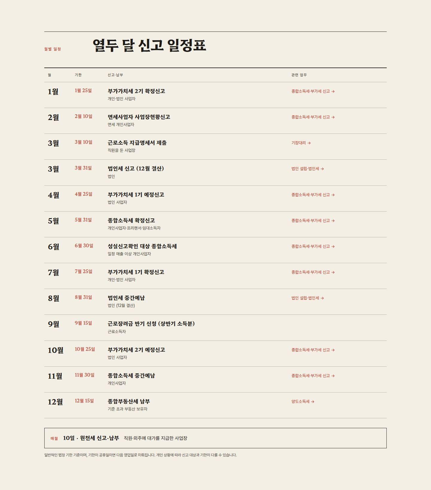 | 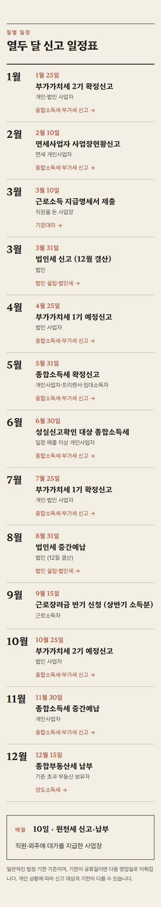 |

<details><summary>스타일 코드 (마크업 구조 + 클래스, 문구는 …) · <a href="code/calendar-ledger.html">code/calendar-ledger.html</a></summary>

```html
<section class="sec">
  <div class="wrap">
    <div class="sec-head draw">
      <span class="sec-no">…</span>
      <h2>…</h2>
    </div>
    <table class="ledger rise on">
      <thead>
        <tr>
          <th>…</th>
          <!-- ↑ 같은 구조 4개 반복 -->
        </tr>
      </thead>
      <tbody>
        <tr>
          <th>
            …
            …
          </th>
          <td class="date">
            …
            …
            …
            …
          </td>
          <td>
            <b>…</b>
            <span>…</span>
          </td>
          <!-- ↑ 같은 구조 2개 반복 -->
        </tr>
        <!-- ↑ 같은 구조 13개 반복 -->
      </tbody>
    </table>
    <p class="monthly">
      <span class="sec-no">…</span>
      <b>
        …
        …
        …
      </b>
      <span>…</span>
    </p>
    <p class="alm-note">…</p>
  </div>
</section>
```

</details>

### 업무 상세 (기사형) `service-article`

- 종류: `services` · 사용 사이트: `pro-tax-office/almanac` · 페이지: `/services/bookkeeping/`
- 소스: [`src/app/services/[slug]/page.tsx`](../../../templates/pro-tax-office/almanac/src/app/services/[slug]/page.tsx)

| 데스크톱 1440 | 모바일 390 |
|---|---|
| 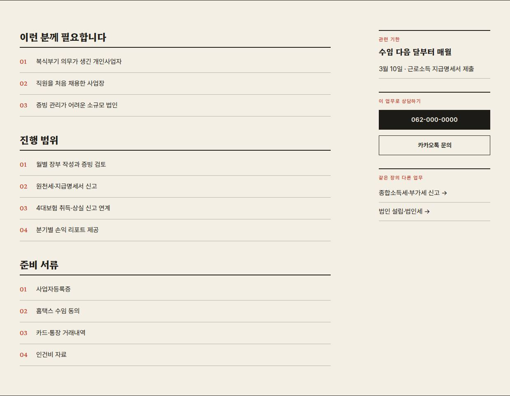 | 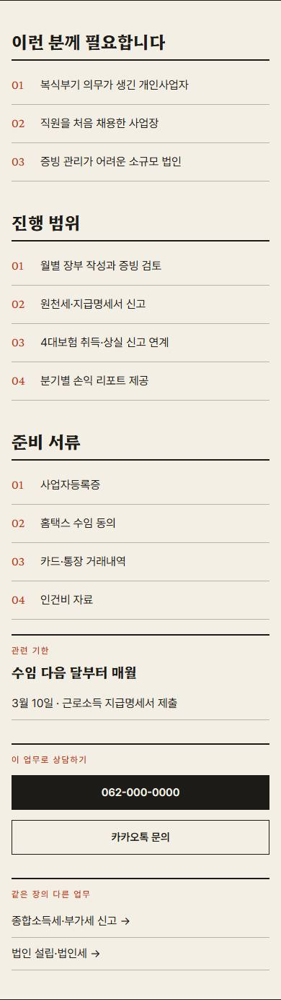 |

<details><summary>스타일 코드 (마크업 구조 + 클래스, 문구는 …) · <a href="code/service-article.html">code/service-article.html</a></summary>

```html
<div class="wrap article">
  <div class="article-body">
    <section class="rise on">
      <h2>…</h2>
      <ol>
        <li>…</li>
        <!-- ↑ 같은 구조 3개 반복 -->
      </ol>
    </section>
    <!-- ↑ 같은 구조 3개 반복 -->
  </div>
  <aside class="article-aside">
    <div class="aside-box">
      <h2>…</h2>
      <p>…</p>
      <ul>
        <li>
          …
          …
          …
          …
          …
        </li>
      </ul>
    </div>
    <!-- ↑ 같은 구조 3개 반복 -->
  </aside>
</div>
```

</details>

### 상담 방법 `contact-channels`

- 종류: `cta` · 사용 사이트: `pro-tax-office/almanac` · 페이지: `/contact/`
- 소스: [`src/app/contact/page.tsx`](../../../templates/pro-tax-office/almanac/src/app/contact/page.tsx)

| 데스크톱 1440 | 모바일 390 |
|---|---|
| 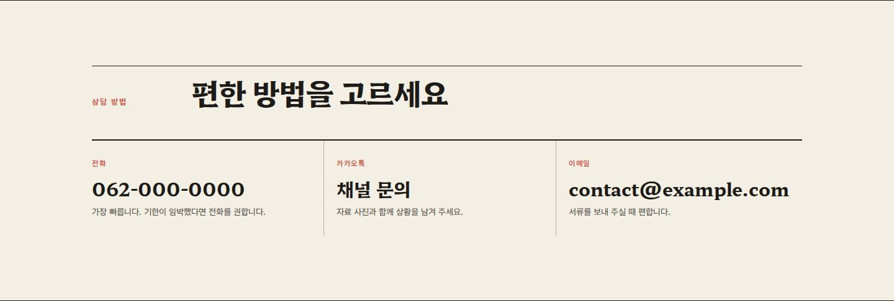 | 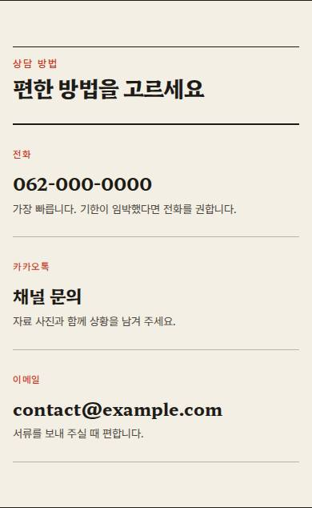 |

<details><summary>스타일 코드 (마크업 구조 + 클래스, 문구는 …) · <a href="code/contact-channels.html">code/contact-channels.html</a></summary>

```html
<section class="sec">
  <div class="wrap">
    <div class="sec-head draw on">
      <span class="sec-no">…</span>
      <h2>…</h2>
    </div>
    <div class="channels rise on">
      <a>
        <span>…</span>
        <b>…</b>
        <p>…</p>
      </a>
      <!-- ↑ 같은 구조 3개 반복 -->
    </div>
  </div>
</section>
```

</details>

### 판권란 (푸터) `colophon`

- 종류: `footer` · 사용 사이트: `pro-tax-office/almanac` · 페이지: `/`
- 소스: [`src/components/Colophon.tsx`](../../../templates/pro-tax-office/almanac/src/components/Colophon.tsx)

| 데스크톱 1440 | 모바일 390 |
|---|---|
| 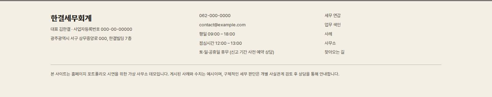 | 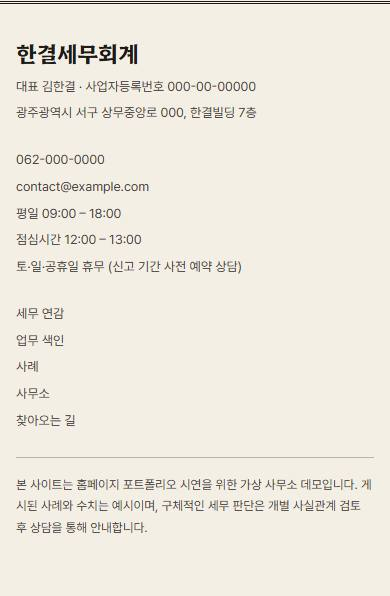 |

<details><summary>스타일 코드 (마크업 구조 + 클래스, 문구는 …) · <a href="code/colophon.html">code/colophon.html</a></summary>

```html
<footer class="colophon">
  <div class="wrap">
    <div>
      <b>…</b>
      <ul>
        <li>
          …
          …
          …
          …
        </li>
        <!-- ↑ 같은 구조 2개 반복 -->
      </ul>
    </div>
    <ul>
      <li>
        <a>…</a>
      </li>
      <!-- ↑ 같은 구조 5개 반복 -->
    </ul>
    <!-- ↑ 같은 구조 2개 반복 -->
    <p class="notice">…</p>
  </div>
</footer>
```

</details>
