# 세무사무소 · trust

> 자동 생성 문서(`npm run library`). 참고용 스타일 기록이며, 이 코드를 다른 사이트에 그대로 쓰지 않는다.

- 사용 사이트: `pro-tax-office/trust` (한결세무회계(가상))
- 배포 주소: https://hongjaang-star.github.io/agency-web-templates/pro-tax-office/trust/
- 소스: [`templates/pro-tax-office/trust`](../../../templates/pro-tax-office/trust)

## 디자인 지문

| 항목 | 값 |
|---|---|
| layout | swiss-grid |
| hero | split-media |
| typePair | Cormorant + Nanum Myeongjo + Pretendard |
| palette | navy·paper·brass |
| imageTreatment | no photo, ledger grid pattern |
| motion | reveal fade |
| signature | 주요 신고 일정 카드 |
| sectionOrder | hero, stats, services, clients, process, team, cases, faq, visit |

## 디자인 토큰

서체 설정 (`src/app/layout.tsx`)

```ts
import { Cormorant, Nanum_Myeongjo } from "next/font/google";

const cormorant = Cormorant({
  variable: "--font-cormorant",
  subsets: ["latin"],
  style: ["normal", "italic"],
  display: "swap",
});

const nanumMyeongjo = Nanum_Myeongjo({
  variable: "--font-nanum-myeongjo",
  subsets: ["latin"],
  // 사이트에서는 400 굵기만 사용합니다. 굵기를 추가하면 한글 글자 범위별 선언이 90여 개씩 늘어납니다.
  weight: "400",
  display: "swap",
  preload: false,
});
```

<details><summary>globals.css (색·서체 토큰, 공용 유틸리티)</summary>

```css
@import "tailwindcss";
/* Pretendard — self-hosted (was CDN; render-blocking 제거) */
@import "pretendard/dist/web/variable/pretendardvariable-dynamic-subset.css";

/* ─────────────────────────────────────────────
   Theme preset: trust
   Navy + Paper White + Brass accent
   (토큰 이름은 템플릿 공통 — 값만 프리셋별로 교체)
   ───────────────────────────────────────────── */
@theme {
  /* Surfaces */
  --color-ivory: #f7f7f5;      /* page background */
  --color-cream: #eef0f3;      /* alt section */
  --color-sand: #e2e6ec;       /* muted fill */
  --color-line: #d8dde5;       /* borders, dividers */

  /* Text */
  --color-ink: #13233d;        /* primary text, primary button (navy) */
  --color-ink-soft: #4a5568;   /* secondary text (7.0:1 on paper) */
  --color-ink-mute: #5f6b7a;   /* captions (5.3:1 on paper) */

  /* Brand */
  --color-gold: #a8834a;       /* decorative only: lines, icons */
  --color-gold-deep: #7a5c2a;  /* accent text/links (5.9:1 on paper) */
  --color-gold-soft: #d8c6a3;

  /* Type */
  --font-sans: "Pretendard Variable", Pretendard, -apple-system, BlinkMacSystemFont, system-ui, "Apple SD Gothic Neo", "Malgun Gothic", sans-serif;
  --font-display: var(--font-cormorant), "Times New Roman", serif;
  --font-serif-kr: var(--font-nanum-myeongjo), serif;

  /* Motion */
  --ease-soft: cubic-bezier(0.22, 1, 0.36, 1);

  --animate-fade-up: fade-up 0.9s var(--ease-soft) both;
  /* above-the-fold text: movement only, never invisible (keeps LCP early) */
  --animate-rise: rise 0.9s var(--ease-soft) both;
  @keyframes rise {
    from { transform: translateY(14px); }
    to { transform: translateY(0); }
  }
  @keyframes fade-up {
    from { opacity: 0; transform: translateY(16px); }
    to { opacity: 1; transform: translateY(0); }
  }
}

@layer base {
  html {
    scroll-behavior: smooth;
    -webkit-text-size-adjust: 100%;
  }
  body {
    background: var(--color-ivory);
    color: var(--color-ink);
    font-family: var(--font-sans);
    font-size: 16px;
    line-height: 1.7;
    word-break: keep-all;
    overflow-wrap: break-word;
  }
  ::selection {
    background: var(--color-gold-soft);
    color: var(--color-ink);
  }
  :focus-visible {
    outline: 2px solid var(--color-gold-deep);
    outline-offset: 3px;
    border-radius: 2px;
  }
  h1, h2, h3 {
    text-wrap: balance;
  }
}

/* Scroll reveal — content is visible by default; JS opts into the animation */
.js [data-reveal] {
  opacity: 0;
  transform: translateY(20px);
  transition: opacity 0.9s var(--ease-soft), transform 0.9s var(--ease-soft);
  transition-delay: var(--reveal-delay, 0ms);
}
.js [data-reveal][data-visible="true"] {
  opacity: 1;
  transform: none;
}

@media (prefers-reduced-motion: reduce) {
  html { scroll-behavior: auto; }
  .js [data-reveal] {
    opacity: 1;
    transform: none;
    transition: none;
  }
  *, *::before, *::after {
    animation-duration: 0.01ms !important;
    animation-iteration-count: 1 !important;
    transition-duration: 0.01ms !important;
  }
}

/* Utilities */
@utility container-page {
  width: 100%;
  max-width: 1280px;
  margin-inline: auto;
  padding-inline: 1.25rem;
  @media (width >= 768px) { padding-inline: 2rem; }
  @media (width >= 1280px) { padding-inline: 3rem; }
}

@utility eyebrow {
  font-family: var(--font-display);
  font-size: 0.95rem;
  letter-spacing: 0.28em;
  text-transform: uppercase;
  color: var(--color-gold-deep);
}
```

</details>

## 모듈

### 상단 공지 띠 `top-banner`

- 종류: `banner` · 사용 사이트: `pro-tax-office/trust` · 페이지: `/`
- 소스: [`src/components/TopBanner.tsx`](../../../templates/pro-tax-office/trust/src/components/TopBanner.tsx)

| 데스크톱 1440 | 모바일 390 |
|---|---|
|  |  |

<details><summary>스타일 코드 (마크업 구조 + 클래스, 문구는 …) · <a href="code/top-banner.html">code/top-banner.html</a></summary>

```html
<div class="relative bg-ink text-ivory">
  <div class="container-page flex min-h-11 items-center justify-center py-2 pr-12 text-center">
    <a class="group inline-flex items-center gap-2 text-[13px] tracking-wide text-ivory/90 transition-colors hover:text-white md:text-sm">
      <span class="font-display text-base italic text-gold-soft">…</span>
      <span>…</span>
      <svg class="lucide lucide-arrow-right size-3.5 transition-transform duration-300 group-hover:translate-x-0.5" /> <!-- 아이콘: arrow-right -->
    </a>
  </div>
  <button class="absolute right-2 top-1/2 inline-flex size-10 -translate-y-1/2 cursor-pointer items-center justify-center text-ivory/70 transition-colors hover:text-white">
    <svg class="lucide lucide-x size-4" /> <!-- 아이콘: x -->
  </button>
</div>
```

</details>

### 헤더 `header`

- 종류: `header` · 사용 사이트: `pro-tax-office/trust` · 페이지: `/`
- 소스: [`src/components/Header.tsx`](../../../templates/pro-tax-office/trust/src/components/Header.tsx)

| 데스크톱 1440 | 모바일 390 |
|---|---|
|  |  |

<details><summary>스타일 코드 (마크업 구조 + 클래스, 문구는 …) · <a href="code/header.html">code/header.html</a></summary>

```html
<header class="sticky top-0 z-40" style="">
  <div class="hidden border-b border-line bg-ivory md:block">
    <div class="container-page flex h-10 items-center justify-between text-[13px] text-ink-soft">
      <p>
        …
        <strong class="font-semibold text-ink">…</strong>
      </p>
      <div class="flex items-center gap-6">
        <span class="inline-flex items-center gap-1.5">
          <svg class="lucide lucide-clock size-3.5 text-gold" /> <!-- 아이콘: clock -->
          …
        </span>
        <a class="inline-flex items-center gap-1.5 hover:text-ink">
          <svg class="lucide lucide-phone size-3.5 text-gold" /> <!-- 아이콘: phone -->
          …
        </a>
      </div>
    </div>
  </div>
  <div class="border-b bg-white/95 backdrop-blur-md transition-shadow duration-300 border-transparent">
    <div class="container-page flex h-[72px] items-center justify-between gap-6 md:h-20">
      <a class="group inline-flex flex-col leading-none">
        <span class="font-display text-[1.7rem] font-medium tracking-[0.18em] text-ink">…</span>
        <span class="mt-1 text-[10px] font-medium tracking-[0.42em] text-gold-deep">…</span>
        <span class="sr-only">
          …
          …
        </span>
      </a>
      <nav class="hidden lg:block">
        <ul class="flex items-center gap-1">
          <li>
            <a class="relative inline-flex h-11 items-center px-4 text-[15px] font-medium transition-colors duration-300 after:absolute after:bottom-1.5 after:left-4 after:right-4 after:h-px after:origin-left after:bg-gold after:transition-transform after:duration-300 text-ink-soft hover:text-ink after:scale-x-0 hover:after:scale-x-100">…</a>
          </li>
          <li class="relative">
            <div class="flex items-center">
              <a class="relative inline-flex h-11 items-center px-4 text-[15px] font-medium transition-colors duration-300 after:absolute after:bottom-1.5 after:left-4 after:right-4 after:h-px after:origin-left after:bg-gold after:transition-transform after:duration-300 text-ink-soft hover:text-ink after:scale-x-0 hover:after:scale-x-100">…</a>
              <button class="-ml-3 inline-flex size-8 cursor-pointer items-center justify-center text-ink-soft hover:text-ink">
                <svg class="lucide lucide-chevron-down size-4 transition-transform duration-300" /> <!-- 아이콘: chevron-down -->
              </button>
            </div>
            <div class="absolute left-1/2 top-full w-[560px] -translate-x-1/2 pt-3 transition-all duration-300 invisible -translate-y-1 opacity-0">
              <div class="grid grid-cols-2 gap-8 border border-line bg-white p-8 shadow-[0_24px_60px_-30px_rgba(28,25,23,0.35)]">
                <div>
                  <p class="eyebrow !text-xs">…</p>
                  <p class="mt-1 font-serif-kr text-lg text-ink">…</p>
                  <ul class="mt-4 space-y-1 border-t border-line pt-4">
                    <li>
                      <a class="block py-1.5 text-[15px] text-ink-soft transition-colors hover:text-gold-deep">…</a>
                    </li>
                    <!-- ↑ 같은 구조 3개 반복 -->
                  </ul>
                </div>
                <!-- ↑ 같은 구조 3개 반복 -->
              </div>
            </div>
          </li>
          <li>
            <a class="relative inline-flex h-11 items-center px-4 text-[15px] font-medium transition-colors duration-300 after:absolute after:bottom-1.5 after:left-4 after:right-4 after:h-px after:origin-left after:bg-gold after:transition-transform after:duration-300 text-ink-soft hover:text-ink after:scale-x-0 hover:after:scale-x-100">…</a>
          </li>
          <!-- ↑ 같은 구조 2개 반복 -->
        </ul>
      </nav>
      <div class="flex items-center gap-2">
        <a class="hidden h-11 items-center bg-ink px-6 text-sm font-medium tracking-wide text-ivory transition-colors duration-300 hover:bg-gold-deep sm:inline-flex">…</a>
        <button class="inline-flex size-11 cursor-pointer items-center justify-center text-ink lg:hidden">
          <svg class="lucide lucide-menu size-6" /> <!-- 아이콘: menu -->
        </button>
      </div>
    </div>
  </div>
  <div class="fixed inset-0 z-50 lg:hidden invisible" style="">
    <div class="absolute inset-0 bg-ink/40 transition-opacity duration-300 opacity-0"></div>
    <div class="absolute right-0 top-0 flex h-dvh w-[88%] max-w-sm flex-col bg-ivory transition-transform duration-500 ease-[cubic-bezier(0.22,1,0.36,1)] translate-x-full">
      <div class="flex h-[72px] items-center justify-between border-b border-line px-5">
        <a class="group inline-flex flex-col leading-none">
          <span class="font-display text-[1.7rem] font-medium tracking-[0.18em] text-ink">…</span>
          <span class="mt-1 text-[10px] font-medium tracking-[0.42em] text-gold-deep">…</span>
          <span class="sr-only">
            …
            …
          </span>
        </a>
        <button class="inline-flex size-11 cursor-pointer items-center justify-center">
          <svg class="lucide lucide-x size-6" /> <!-- 아이콘: x -->
        </button>
      </div>
      <nav class="flex-1 overflow-y-auto px-5 py-4">
        <ul>
          <li class="border-b border-line">
            <a class="flex items-center justify-between py-4 text-[17px] font-medium ">
              …
              <span class="font-display text-sm tracking-widest text-ink-mute">…</span>
            </a>
          </li>
          <!-- ↑ 같은 구조 4개 반복 -->
        </ul>
      </nav>
      <div class="space-y-2 border-t border-line p-5">
        <a class="flex h-12 items-center justify-center bg-ink text-[15px] font-medium text-ivory">…</a>
        <a class="flex h-12 items-center justify-center gap-2 border border-line text-[15px]">
          <svg class="lucide lucide-phone size-4 text-gold" /> <!-- 아이콘: phone -->
          …
        </a>
      </div>
    </div>
  </div>
</header>
```

</details>

### 히어로 `home-hero`

- 종류: `hero` · 사용 사이트: `pro-tax-office/trust` · 페이지: `/`
- 소스: [`src/components/blocks/Hero.tsx`](../../../templates/pro-tax-office/trust/src/components/blocks/Hero.tsx)

| 데스크톱 1440 | 모바일 390 |
|---|---|
|  | 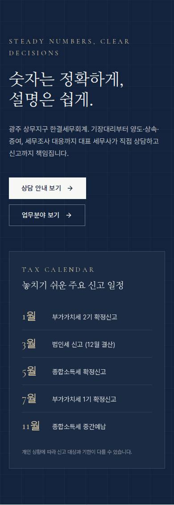 |

<details><summary>스타일 코드 (마크업 구조 + 클래스, 문구는 …) · <a href="code/home-hero.html">code/home-hero.html</a></summary>

```html
<section class="relative overflow-hidden bg-ink text-ivory">
  <svg aria-hidden="true" class="absolute inset-0 size-full opacity-[0.07]"><defs><pattern id="ledger" width="48" height="48" patternUnits="userSpaceOnUse"><path d="M48 0H0V48" fill="none" stroke="currentColor" stroke-width="1"></path></pattern></defs><rect width="100%" height="100%" fill="url(#ledger)"></rect></svg>
  <div class="container-page relative grid gap-14 py-20 md:py-28 lg:grid-cols-12 lg:items-center">
    <div class="animate-rise lg:col-span-7">
      <p class="eyebrow !text-gold-soft">…</p>
      <h1 class="mt-6 font-serif-kr text-[2.25rem] leading-tight md:text-6xl md:leading-[1.15]">
        …
        <br />
        …
      </h1>
      <p class="mt-7 max-w-xl text-ivory/75 md:text-lg">
        …
        …
        …
      </p>
      <div class="mt-10 flex flex-wrap gap-3">
        <a class="group inline-flex h-12 items-center justify-center gap-3 px-7 text-[15px] font-medium tracking-wide transition-colors duration-300 bg-ivory text-ink hover:bg-gold-soft ">
          …
          <svg class="lucide lucide-arrow-right size-4 transition-transform duration-300 group-hover:translate-x-1" /> <!-- 아이콘: arrow-right -->
        </a>
        <a class="group inline-flex h-12 items-center justify-center gap-3 px-7 text-[15px] font-medium tracking-wide transition-colors duration-300 border border-ink/80 text-ink hover:bg-ink hover:text-ivory border border-ivory/40 text-ivory hover:bg-ivory/10">
          …
          <svg class="lucide lucide-arrow-right size-4 transition-transform duration-300 group-hover:translate-x-1" /> <!-- 아이콘: arrow-right -->
        </a>
      </div>
    </div>
    <aside class="border border-ivory/15 bg-ivory/[0.04] p-7 backdrop-blur-sm md:p-9 lg:col-span-5">
      <p class="eyebrow !text-gold-soft">…</p>
      <p class="mt-2 font-serif-kr text-xl">…</p>
      <ul class="mt-6 divide-y divide-ivory/10">
        <li class="flex items-baseline gap-5 py-3.5">
          <span class="w-12 shrink-0 font-display text-2xl text-gold-soft">…</span>
          <span class="text-[15px] text-ivory/85">…</span>
        </li>
        <!-- ↑ 같은 구조 5개 반복 -->
      </ul>
      <p class="mt-5 text-xs text-ivory/50">…</p>
    </aside>
  </div>
</section>
```

</details>

### 수치 `home-stats`

- 종류: `stats` · 사용 사이트: `pro-tax-office/trust` · 페이지: `/`
- 소스: [`src/components/blocks/Stats.tsx`](../../../templates/pro-tax-office/trust/src/components/blocks/Stats.tsx)

| 데스크톱 1440 | 모바일 390 |
|---|---|
|  | 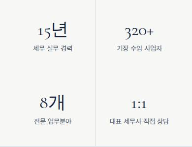 |

<details><summary>스타일 코드 (마크업 구조 + 클래스, 문구는 …) · <a href="code/home-stats.html">code/home-stats.html</a></summary>

```html
<section class="border-b border-line bg-ivory">
  <dl class="container-page grid grid-cols-2 md:grid-cols-4">
    <div data-reveal="true" style="--reveal-delay:0ms" class="border-line py-10 text-center odd:border-r md:border-r md:last:border-r-0">
      <dd class="font-display text-4xl text-ink md:text-5xl">…</dd>
      <dt class="mt-2 text-sm text-ink-soft">…</dt>
    </div>
    <!-- ↑ 같은 구조 4개 반복 -->
  </dl>
</section>
```

</details>

### 업무분야 `home-services`

- 종류: `services` · 사용 사이트: `pro-tax-office/trust` · 페이지: `/`
- 소스: [`src/components/blocks/Services.tsx`](../../../templates/pro-tax-office/trust/src/components/blocks/Services.tsx)

| 데스크톱 1440 | 모바일 390 |
|---|---|
|  | 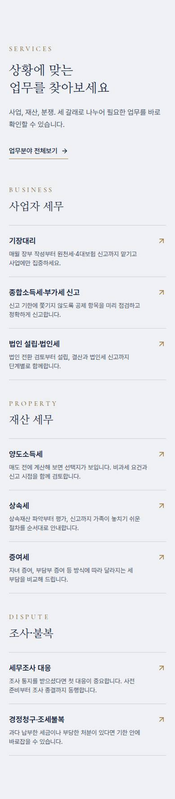 |

<details><summary>스타일 코드 (마크업 구조 + 클래스, 문구는 …) · <a href="code/home-services.html">code/home-services.html</a></summary>

```html
<section class="bg-cream py-24 md:py-32">
  <div class="container-page">
    <div class="flex flex-wrap items-end justify-between gap-8">
      <div data-reveal="true" class=" max-w-2xl ">
        <p class="eyebrow">…</p>
        <h2 class="mt-4 font-serif-kr text-[1.75rem] leading-snug text-ink md:text-4xl md:leading-snug">…</h2>
        <p class="mt-5 text-ink-soft md:text-[17px]">…</p>
      </div>
      <a class="group inline-flex items-center gap-2 border-b border-gold pb-1 text-[15px] font-medium text-ink transition-colors hover:text-gold-deep">
        …
        <svg class="lucide lucide-arrow-right size-4 transition-transform duration-300 group-hover:translate-x-1" /> <!-- 아이콘: arrow-right -->
      </a>
    </div>
    <div class="mt-14 grid gap-10 lg:grid-cols-3">
      <div data-reveal="true">
        <p class="eyebrow">…</p>
        <h3 class="mt-2 font-serif-kr text-2xl text-ink">…</h3>
        <ul class="mt-6 border-t border-ink/15">
          <li class="border-b border-ink/15">
            <a class="group flex items-start justify-between gap-4 py-5">
              <span>
                <span class="block text-[17px] font-semibold text-ink group-hover:text-gold-deep">…</span>
                <span class="mt-1 block text-sm text-ink-soft">…</span>
              </span>
              <svg class="lucide lucide-arrow-up-right mt-1 size-5 shrink-0 text-gold transition-transform group-hover:-translate-y-0.5 group-hover:translate-x-0.5" /> <!-- 아이콘: arrow-up-right -->
            </a>
          </li>
          <!-- ↑ 같은 구조 3개 반복 -->
        </ul>
      </div>
      <!-- ↑ 같은 구조 3개 반복 -->
    </div>
  </div>
</section>
```

</details>

### 고객군 `home-clients`

- 종류: `clients` · 사용 사이트: `pro-tax-office/trust` · 페이지: `/`
- 소스: [`src/components/blocks/Clients.tsx`](../../../templates/pro-tax-office/trust/src/components/blocks/Clients.tsx)

| 데스크톱 1440 | 모바일 390 |
|---|---|
|  | 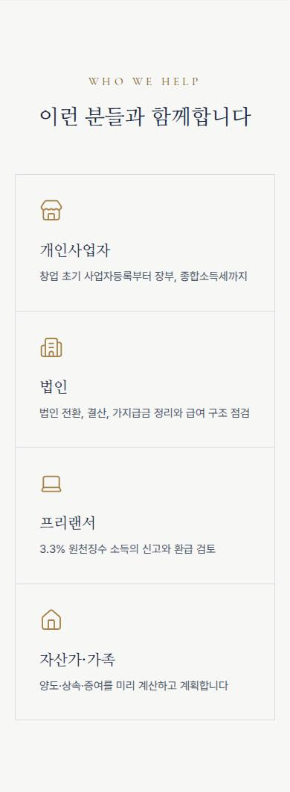 |

<details><summary>스타일 코드 (마크업 구조 + 클래스, 문구는 …) · <a href="code/home-clients.html">code/home-clients.html</a></summary>

```html
<section class="py-24 md:py-32">
  <div class="container-page">
    <div data-reveal="true" class="mx-auto text-center max-w-2xl ">
      <p class="eyebrow">…</p>
      <h2 class="mt-4 font-serif-kr text-[1.75rem] leading-snug text-ink md:text-4xl md:leading-snug">…</h2>
    </div>
    <ul class="mt-14 grid gap-px overflow-hidden border border-line bg-line sm:grid-cols-2 lg:grid-cols-4">
      <li data-reveal="true" class="bg-ivory p-8">
        <svg class="lucide lucide-store size-8 text-gold" /> <!-- 아이콘: store -->
        <h3 class="mt-6 font-serif-kr text-xl text-ink">…</h3>
        <p class="mt-2 text-[15px] text-ink-soft">…</p>
      </li>
      <!-- ↑ 같은 구조 4개 반복 -->
    </ul>
  </div>
</section>
```

</details>

### 진행 절차 `home-process`

- 종류: `process` · 사용 사이트: `pro-tax-office/trust` · 페이지: `/`
- 소스: [`src/components/blocks/Process.tsx`](../../../templates/pro-tax-office/trust/src/components/blocks/Process.tsx)

| 데스크톱 1440 | 모바일 390 |
|---|---|
|  | 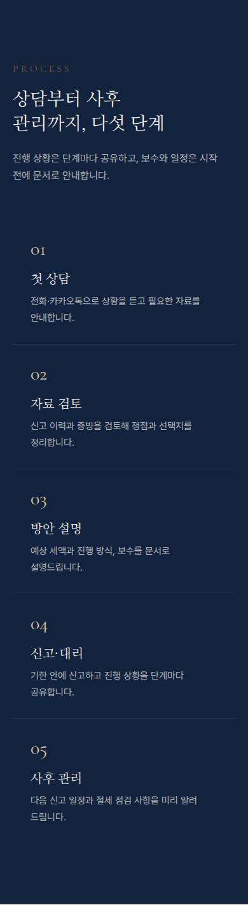 |

<details><summary>스타일 코드 (마크업 구조 + 클래스, 문구는 …) · <a href="code/home-process.html">code/home-process.html</a></summary>

```html
<section class="bg-ink py-24 text-ivory md:py-32">
  <div class="container-page">
    <div data-reveal="true" class=" max-w-2xl ">
      <p class="eyebrow">…</p>
      <h2 class="mt-4 font-serif-kr text-[1.75rem] leading-snug text-ink md:text-4xl md:leading-snug">
        <span class="text-ivory">…</span>
      </h2>
      <p class="mt-5 text-ink-soft md:text-[17px]">
        <span class="text-ivory/70">…</span>
      </p>
    </div>
    <ol class="mt-14 grid gap-px bg-ivory/10 md:grid-cols-5">
      <li data-reveal="true" class="bg-ink p-7 md:pt-10">
        <span class="font-display text-3xl text-gold-soft">…</span>
        <h3 class="mt-4 font-serif-kr text-xl">…</h3>
        <p class="mt-2 text-[15px] text-ivory/70">…</p>
      </li>
      <!-- ↑ 같은 구조 5개 반복 -->
    </ol>
  </div>
</section>
```

</details>

### 구성원 `home-team`

- 종류: `team` · 사용 사이트: `pro-tax-office/trust` · 페이지: `/`
- 소스: [`src/components/blocks/Team.tsx`](../../../templates/pro-tax-office/trust/src/components/blocks/Team.tsx)

| 데스크톱 1440 | 모바일 390 |
|---|---|
|  | 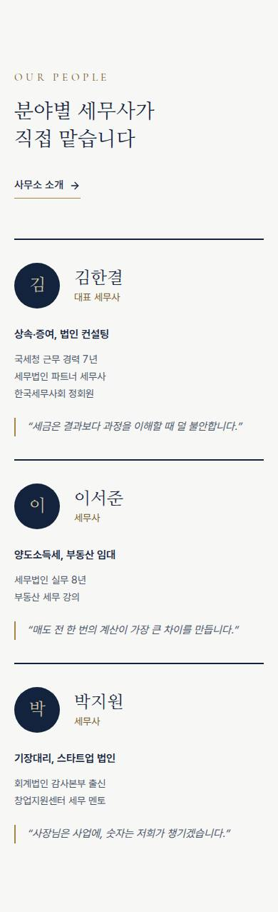 |

<details><summary>스타일 코드 (마크업 구조 + 클래스, 문구는 …) · <a href="code/home-team.html">code/home-team.html</a></summary>

```html
<section class="py-24 md:py-32">
  <div class="container-page">
    <div class="flex flex-wrap items-end justify-between gap-8">
      <div data-reveal="true" class=" max-w-2xl ">
        <p class="eyebrow">…</p>
        <h2 class="mt-4 font-serif-kr text-[1.75rem] leading-snug text-ink md:text-4xl md:leading-snug">…</h2>
      </div>
      <a class="group inline-flex items-center gap-2 border-b border-gold pb-1 text-[15px] font-medium text-ink transition-colors hover:text-gold-deep">
        …
        <svg class="lucide lucide-arrow-right size-4 transition-transform duration-300 group-hover:translate-x-1" /> <!-- 아이콘: arrow-right -->
      </a>
    </div>
    <ul class="mt-14 grid gap-8 md:grid-cols-3">
      <li data-reveal="true" class="border-t-2 border-ink pt-8">
        <div class="flex items-center gap-5">
          <span class="flex size-16 items-center justify-center rounded-full bg-ink font-serif-kr text-2xl text-gold-soft">…</span>
          <div>
            <p class="font-serif-kr text-2xl text-ink">…</p>
            <p class="text-sm text-gold-deep">…</p>
          </div>
        </div>
        <p class="mt-6 text-[15px] font-semibold text-ink">…</p>
        <ul class="mt-3 space-y-1 text-sm text-ink-soft">
          <li>…</li>
          <!-- ↑ 같은 구조 3개 반복 -->
        </ul>
        <p class="mt-6 border-l-2 border-gold pl-4 text-[15px] italic text-ink-soft">
          …
          …
          …
        </p>
      </li>
      <!-- ↑ 같은 구조 3개 반복 -->
    </ul>
  </div>
</section>
```

</details>

### 업무 사례 `home-cases`

- 종류: `cases` · 사용 사이트: `pro-tax-office/trust` · 페이지: `/`
- 소스: [`src/components/blocks/Cases.tsx`](../../../templates/pro-tax-office/trust/src/components/blocks/Cases.tsx)

| 데스크톱 1440 | 모바일 390 |
|---|---|
|  | 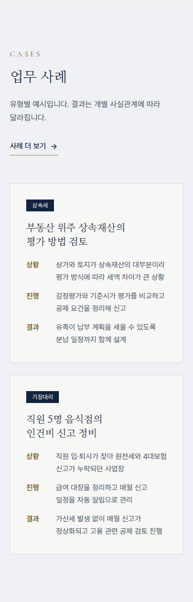 |

<details><summary>스타일 코드 (마크업 구조 + 클래스, 문구는 …) · <a href="code/home-cases.html">code/home-cases.html</a></summary>

```html
<section class="bg-cream py-24 md:py-32">
  <div class="container-page">
    <div class="flex flex-wrap items-end justify-between gap-8">
      <div data-reveal="true" class=" max-w-2xl ">
        <p class="eyebrow">…</p>
        <h2 class="mt-4 font-serif-kr text-[1.75rem] leading-snug text-ink md:text-4xl md:leading-snug">…</h2>
        <p class="mt-5 text-ink-soft md:text-[17px]">…</p>
      </div>
      <a class="group inline-flex items-center gap-2 border-b border-gold pb-1 text-[15px] font-medium text-ink transition-colors hover:text-gold-deep">
        …
        <svg class="lucide lucide-arrow-right size-4 transition-transform duration-300 group-hover:translate-x-1" /> <!-- 아이콘: arrow-right -->
      </a>
    </div>
    <div class="mt-14 grid gap-6 md:grid-cols-2">
      <article data-reveal="true" class="flex h-full flex-col border border-line bg-ivory p-8">
        <p class="inline-flex w-fit bg-ink px-3 py-1 text-xs tracking-wider text-ivory">…</p>
        <h3 class="mt-5 font-serif-kr text-xl text-ink">…</h3>
        <dl class="mt-5 space-y-3 text-[15px]">
          <div class="grid grid-cols-[3rem_1fr] gap-3">
            <dt class="font-semibold text-gold-deep">…</dt>
            <dd class="text-ink-soft">…</dd>
          </div>
          <!-- ↑ 같은 구조 3개 반복 -->
        </dl>
      </article>
      <!-- ↑ 같은 구조 2개 반복 -->
    </div>
  </div>
</section>
```

</details>

### 자주 묻는 질문 `home-faq`

- 종류: `faq` · 사용 사이트: `pro-tax-office/trust` · 페이지: `/`
- 소스: [`src/components/blocks/Faq.tsx`](../../../templates/pro-tax-office/trust/src/components/blocks/Faq.tsx)

| 데스크톱 1440 | 모바일 390 |
|---|---|
|  | 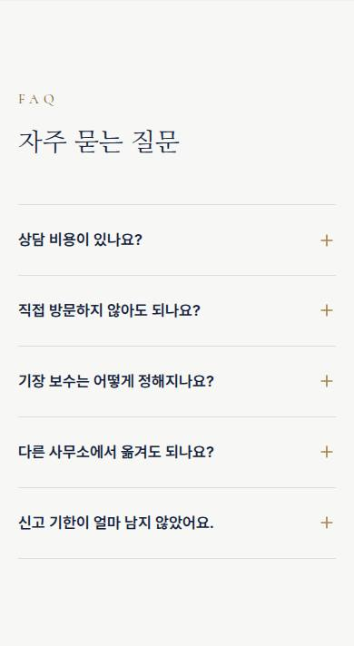 |

<details><summary>스타일 코드 (마크업 구조 + 클래스, 문구는 …) · <a href="code/home-faq.html">code/home-faq.html</a></summary>

```html
<section class="py-24 md:py-32">
  <script>…</script>
  <div class="container-page grid gap-12 lg:grid-cols-12">
    <div data-reveal="true" class=" max-w-2xl lg:col-span-4">
      <p class="eyebrow">…</p>
      <h2 class="mt-4 font-serif-kr text-[1.75rem] leading-snug text-ink md:text-4xl md:leading-snug">…</h2>
    </div>
    <div class="divide-y divide-line border-y border-line lg:col-span-8">
      <details class="group py-6">
        <summary class="flex cursor-pointer list-none items-center justify-between gap-6 text-[17px] font-semibold text-ink">
          …
          <svg class="lucide lucide-plus size-5 shrink-0 text-gold transition-transform group-open:rotate-45" /> <!-- 아이콘: plus -->
        </summary>
        <p class="mt-4 text-ink-soft">…</p>
      </details>
      <!-- ↑ 같은 구조 5개 반복 -->
    </div>
  </div>
</section>
```

</details>

### 오시는 길 `home-visit`

- 종류: `visit` · 사용 사이트: `pro-tax-office/trust` · 페이지: `/`
- 소스: [`src/components/blocks/Visit.tsx`](../../../templates/pro-tax-office/trust/src/components/blocks/Visit.tsx)

| 데스크톱 1440 | 모바일 390 |
|---|---|
|  | 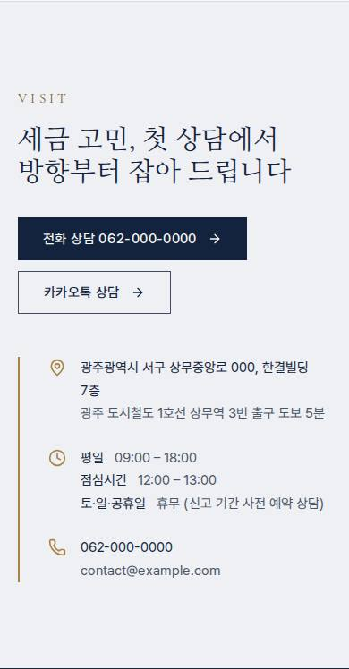 |

<details><summary>스타일 코드 (마크업 구조 + 클래스, 문구는 …) · <a href="code/home-visit.html">code/home-visit.html</a></summary>

```html
<section class="border-t border-line bg-cream py-24 md:py-28">
  <div class="container-page grid gap-12 lg:grid-cols-2 lg:items-center">
    <div data-reveal="true">
      <p class="eyebrow">…</p>
      <h2 class="mt-4 font-serif-kr text-3xl text-ink md:text-4xl">…</h2>
      <div class="mt-8 flex flex-wrap gap-3">
        <a class="group inline-flex h-12 items-center justify-center gap-3 px-7 text-[15px] font-medium tracking-wide transition-colors duration-300 bg-ink text-ivory hover:bg-gold-deep ">
          …
          …
          <svg class="lucide lucide-arrow-right size-4 transition-transform duration-300 group-hover:translate-x-1" /> <!-- 아이콘: arrow-right -->
        </a>
        <a class="group inline-flex h-12 items-center justify-center gap-3 px-7 text-[15px] font-medium tracking-wide transition-colors duration-300 border border-ink/80 text-ink hover:bg-ink hover:text-ivory ">
          …
          <svg class="lucide lucide-arrow-right size-4 transition-transform duration-300 group-hover:translate-x-1" /> <!-- 아이콘: arrow-right -->
          <span class="sr-only">…</span>
        </a>
      </div>
    </div>
    <dl data-reveal="true" class="space-y-6 border-l-2 border-gold pl-8 text-[15px]">
      <div class="flex gap-4">
        <svg class="lucide lucide-map-pin mt-0.5 size-5 shrink-0 text-gold" /> <!-- 아이콘: map-pin -->
        <div>
          <dt class="sr-only">…</dt>
          <dd class="text-ink">…</dd>
          <dd class="text-ink-soft">…</dd>
        </div>
      </div>
      <!-- ↑ 같은 구조 3개 반복 -->
    </dl>
  </div>
</section>
```

</details>

### 서브페이지 상단 `page-hero`

- 종류: `page-hero` · 사용 사이트: `pro-tax-office/trust` · 페이지: `/about/`
- 소스: [`src/components/ui.tsx#PageHero`](../../../templates/pro-tax-office/trust/src/components/ui.tsx) (PageHero)

| 데스크톱 1440 | 모바일 390 |
|---|---|
|  | 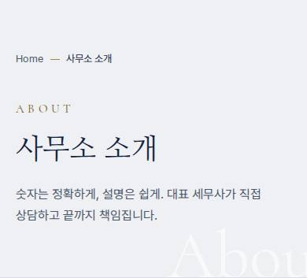 |

<details><summary>스타일 코드 (마크업 구조 + 클래스, 문구는 …) · <a href="code/page-hero.html">code/page-hero.html</a></summary>

```html
<section class="relative overflow-hidden border-b border-line bg-cream">
  <span class="pointer-events-none absolute -right-10 bottom-[-0.2em] select-none font-display text-[22vw] leading-none text-white/60 md:text-[14rem]">…</span>
  <div class="container-page relative py-16 md:py-24">
    <script>…</script>
    <nav class="text-[13px] text-ink-soft">
      <ol class="flex flex-wrap items-center gap-2">
        <li>
          <a class="hover:text-ink">…</a>
        </li>
        <li class="flex items-center gap-2">
          <span class="h-px w-3 bg-gold"></span>
          <span class="text-ink">…</span>
        </li>
      </ol>
    </nav>
    <p class="eyebrow mt-10 animate-fade-up">…</p>
    <h1 class="mt-4 animate-rise font-serif-kr text-4xl leading-tight text-ink md:text-5xl" style="animation-delay:80ms">…</h1>
    <p class="mt-5 max-w-xl animate-rise text-ink-soft md:text-[17px]" style="animation-delay:160ms">…</p>
  </div>
</section>
```

</details>

### 상담 유도 띠 `cta-band`

- 종류: `cta` · 사용 사이트: `pro-tax-office/trust` · 페이지: `/cases/`
- 소스: [`src/components/ui.tsx#CtaBand`](../../../templates/pro-tax-office/trust/src/components/ui.tsx) (CtaBand)

| 데스크톱 1440 | 모바일 390 |
|---|---|
|  | 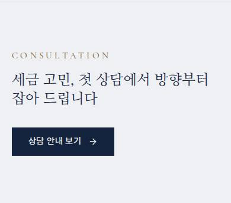 |

<details><summary>스타일 코드 (마크업 구조 + 클래스, 문구는 …) · <a href="code/cta-band.html">code/cta-band.html</a></summary>

```html
<section class="border-t border-line bg-cream py-20">
  <div data-reveal="true" class="container-page flex flex-col items-start justify-between gap-8 md:flex-row md:items-center">
    <div>
      <p class="eyebrow">…</p>
      <p class="mt-3 font-serif-kr text-2xl text-ink md:text-3xl">…</p>
    </div>
    <a class="group inline-flex h-12 items-center justify-center gap-3 px-7 text-[15px] font-medium tracking-wide transition-colors duration-300 bg-ink text-ivory hover:bg-gold-deep ">
      …
      <svg class="lucide lucide-arrow-right size-4 transition-transform duration-300 group-hover:translate-x-1" /> <!-- 아이콘: arrow-right -->
    </a>
  </div>
</section>
```

</details>

### 푸터 `footer`

- 종류: `footer` · 사용 사이트: `pro-tax-office/trust` · 페이지: `/`
- 소스: [`src/components/Footer.tsx`](../../../templates/pro-tax-office/trust/src/components/Footer.tsx)

| 데스크톱 1440 | 모바일 390 |
|---|---|
|  | 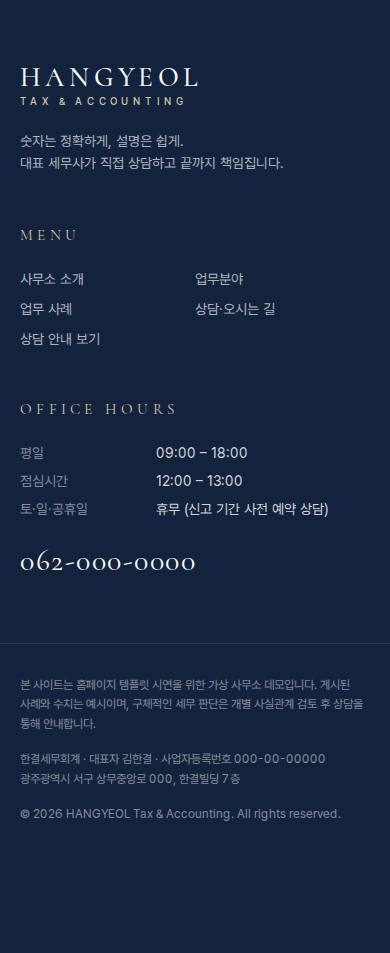 |

<details><summary>스타일 코드 (마크업 구조 + 클래스, 문구는 …) · <a href="code/footer.html">code/footer.html</a></summary>

```html
<footer class="bg-ink pb-24 text-ivory/70 lg:pb-0">
  <div class="container-page grid gap-12 py-16 md:grid-cols-12 md:py-20">
    <div class="md:col-span-4">
      <a class="group inline-flex flex-col leading-none">
        <span class="font-display text-[1.7rem] font-medium tracking-[0.18em] text-ivory">…</span>
        <span class="mt-1 text-[10px] font-medium tracking-[0.42em] text-gold-soft">…</span>
        <span class="sr-only">
          …
          …
        </span>
      </a>
      <p class="mt-6 max-w-xs text-sm leading-relaxed">
        …
        <br />
        …
      </p>
    </div>
    <div class="md:col-span-3">
      <h2 class="eyebrow !text-gold-soft">…</h2>
      <ul class="mt-5 grid grid-cols-2 gap-y-2.5 text-sm">
        <li>
          <a class="transition-colors hover:text-white">…</a>
        </li>
        <!-- ↑ 같은 구조 5개 반복 -->
      </ul>
    </div>
    <div class="md:col-span-5">
      <h2 class="eyebrow !text-gold-soft">…</h2>
      <dl class="mt-5 space-y-2 text-sm">
        <div class="flex gap-6">
          <dt class="w-28 shrink-0 text-ivory/50">…</dt>
          <dd class="text-ivory/85">…</dd>
        </div>
        <!-- ↑ 같은 구조 3개 반복 -->
      </dl>
      <a class="mt-6 inline-block font-display text-3xl tracking-wider text-ivory transition-colors hover:text-gold-soft">…</a>
    </div>
  </div>
  <div class="border-t border-white/10">
    <div class="container-page space-y-4 py-8 text-xs leading-relaxed text-ivory/50">
      <p>…</p>
      <!-- ↑ 같은 구조 3개 반복 -->
    </div>
  </div>
</footer>
```

</details>

### 고정 상담 버튼 `floating-contact`

- 종류: `floating` · 사용 사이트: `pro-tax-office/trust` · 페이지: `/`
- 소스: [`src/components/FloatingContact.tsx`](../../../templates/pro-tax-office/trust/src/components/FloatingContact.tsx)

| 데스크톱 1440 | 모바일 390 |
|---|---|
|  |  |

<details><summary>스타일 코드 (마크업 구조 + 클래스, 문구는 …) · <a href="code/floating-contact.html">code/floating-contact.html</a></summary>

```html
<aside class="fixed right-5 top-1/2 z-30 hidden -translate-y-1/2 flex-col border border-line bg-white/95 shadow-[0_20px_50px_-25px_rgba(28,25,23,0.35)] backdrop-blur lg:flex" style="">
  <a class="group flex w-[76px] flex-col items-center gap-1.5 border-b border-line px-2 py-4 text-[11px] font-medium text-ink-soft transition-colors last:border-b-0 hover:bg-cream hover:text-ink">
    <svg class="lucide lucide-message-circle size-5 text-gold transition-colors group-hover:text-gold-deep" /> <!-- 아이콘: message-circle -->
    …
    <span class="sr-only">…</span>
  </a>
  <!-- ↑ 같은 구조 3개 반복 -->
  <button class="flex h-12 cursor-pointer items-center justify-center bg-ink text-ivory transition-opacity duration-300 hover:bg-gold-deep pointer-events-none opacity-0">
    <svg class="lucide lucide-arrow-up size-4" /> <!-- 아이콘: arrow-up -->
  </button>
</aside>
```

</details>
