# 인테리어·리모델링 · forme

> 자동 생성 문서(`npm run library`). 참고용 스타일 기록이며, 이 코드를 다른 사이트에 그대로 쓰지 않는다.

- 사용 사이트: `space-interior/forme` (포름07 공간실험실(가상))
- 배포 주소: https://hongjaang-star.github.io/agency-web-templates/space-interior/forme/
- 소스: [`templates/space-interior/forme`](..\..\..\templates\space-interior\forme)

## 디자인 지문

| 항목 | 값 |
|---|---|
| layout | spatial-archive |
| hero | landscape-photo-with-caption |
| typePair | Forme Sans (Pretendard content subset) + Georgia wordmark |
| palette | warm gray · olive · charcoal |
| imageTreatment | AI architectural editorial photography |
| motion | subtle image zoom; reduced-motion alternative |
| signature | 재료 분위기 선택 + 공간 상담 준비 요약 |
| sectionOrder | hero, living-notes, project-archive, material-study, services, principles, process, brief-builder, faq |

## 디자인 토큰


<details><summary>globals.css (색·서체 토큰, 공용 유틸리티)</summary>

```css
:root{--paper:#f3f1eb;--ink:#272c25;--muted:#5c6157;--line:#d6d8cf;--olive:#687151;--white:#fff;--sans:"Forme Sans",Arial,sans-serif}*{box-sizing:border-box}html{scroll-behavior:smooth;scroll-padding-top:110px}body{margin:0;background:var(--paper);color:var(--ink);font-family:var(--sans);word-break:keep-all}a{color:inherit;text-decoration:none}button,input,select{font:inherit}button,a,select,input{touch-action:manipulation}button{cursor:pointer}img{display:block;width:100%;height:auto}p{line-height:1.9;color:var(--muted)}h1,h2,h3{margin:0;font-weight:500;letter-spacing:-.055em}h2{font-size:clamp(30px,3.2vw,48px);line-height:1.45}h3{font-size:24px;line-height:1.4}.skip{position:absolute;top:-100px;padding:16px;background:white;z-index:99}.skip:focus{top:0}:focus-visible{outline:3px solid #976746;outline-offset:5px}.site-header{position:sticky;top:0;z-index:40;display:flex;align-items:center;justify-content:space-between;gap:24px;padding:24px 4.5%;background:rgba(243,241,235,.97);border-bottom:1px solid var(--line)}.wordmark{font-family:Georgia,serif;font-size:28px;letter-spacing:.045em;white-space:nowrap}.wordmark span{display:block;font-family:var(--sans);font-size:9px;letter-spacing:.18em;margin-top:5px}.site-header nav{display:flex;gap:30px;font-size:13px}.site-header nav a:hover{color:var(--olive)}.header-note{font-size:9px;letter-spacing:.15em;line-height:1.8}.eyebrow{display:block;font-size:10px;letter-spacing:.15em;margin-bottom:28px}.hero{padding:60px 4.5% 0}.hero-title{display:grid;grid-template-columns:1.5fr 1fr;gap:24px;align-items:end;padding-bottom:45px}.hero-title .eyebrow{grid-column:1/-1;margin-bottom:0}.hero h1{font-size:clamp(36px,5.1vw,76px);line-height:1.25}.hero h1 em{font-style:normal;color:var(--olive)}.hero-title p{font-size:14px;max-width:360px;justify-self:end;margin:0}.hero-image{position:relative;height:clamp(340px,42vw,630px);overflow:hidden}.hero-image>img{height:100%;object-fit:cover}.image-caption{position:absolute;top:25px;left:25px;color:#fff;font-size:9px;letter-spacing:.12em;text-shadow:0 1px 5px #333}.hero-project{position:absolute;bottom:25px;right:25px;background:var(--paper);padding:25px 32px;font-size:19px}.hero-project span{display:block;font-size:10px;margin-top:10px;color:var(--muted)}.hero-foot{display:flex;justify-content:space-between;border-bottom:1px solid var(--line);padding:20px 0;font-size:9px;letter-spacing:.12em}.section{padding:100px 4.5%}.intro{display:grid;grid-template-columns:1.2fr 1fr;gap:35px}.intro .eyebrow{grid-column:1/-1;margin:0}.intro p{margin:0 0 24px;font-size:15px}.text-link{display:inline-block;font-size:12px;border-bottom:1px solid var(--ink);padding:8px 0}.section-heading{display:flex;justify-content:space-between;align-items:end;gap:25px;margin-bottom:45px}.section-heading .eyebrow{margin-bottom:15px}.works{padding-top:35px}.project-grid{display:grid;grid-template-columns:repeat(3,minmax(0,1fr));gap:24px}.project-image{position:relative;overflow:hidden}.project-image img{aspect-ratio:4/5;object-fit:cover;transition:transform .7s}.project-card:hover img{transform:scale(1.04)}.open-mark{position:absolute;bottom:15px;right:15px;background:var(--paper);border-radius:50%;width:42px;height:42px;display:grid;place-items:center}.project-caption{padding-top:20px;display:grid;grid-template-columns:25px 1fr;gap:10px}.project-caption h3{font-size:19px}.project-caption>span:last-child{grid-column:2;color:var(--muted);font-size:11px}.serial{font-size:10px;padding-top:5px}.small{font-size:11px;line-height:1.8}.material-study{padding:80px 4.5%;display:grid;grid-template-columns:1fr 1fr;gap:60px;background:#e6e9df}.material-study p{font-size:13px}.swatches{display:flex;gap:12px;margin-top:35px}.swatches button{background:transparent;border:1px solid transparent;padding:8px;font-size:11px;color:var(--ink)}.swatches button[aria-pressed=true]{border-color:var(--olive)}.swatches button span{display:block;width:44px;height:44px;border-radius:50%;margin-bottom:10px}.material-note{padding:45px;min-height:300px;display:flex;flex-direction:column;justify-content:space-between;color:#161b14;transition:background .3s}.material-note>span:first-child{font-size:10px;letter-spacing:.12em}.material-note h3{font-family:Georgia,serif;font-size:50px}.material-note p{max-width:320px;color:inherit}.material-note .small{color:inherit}.service-row{display:grid;grid-template-columns:70px 1fr 1.1fr 35px;gap:20px;border-top:1px solid var(--line);align-items:center;padding:28px 0}.service-row>span{font-size:12px}.service-row p{font-size:13px}.principles{background:var(--ink);color:var(--paper)}.principles p{color:#bfc4b6}.principle-grid{display:grid;grid-template-columns:repeat(3,minmax(0,1fr));gap:45px}.principles .principle-grid{margin-top:60px}.principle-grid article>span{font-size:12px;display:block;margin-bottom:25px}.principle-grid h3{font-size:22px}.principle-grid p{font-size:13px;max-width:320px}.steps{display:grid;grid-template-columns:repeat(4,minmax(0,1fr));gap:30px}.steps article{border-top:1px solid var(--line);padding-top:25px}.steps span{font-size:11px;color:var(--olive)}.steps h3{font-size:18px;margin:25px 0 15px}.steps p{font-size:12px}.brief-section{padding-top:0}.brief-builder{display:grid;grid-template-columns:1fr 1fr;border:1px solid var(--line)}.brief-fields{padding:45px}.brief-fields h2{font-size:32px;margin-bottom:30px}.brief-fields>label{display:block;font-size:12px;margin-top:22px}.brief-fields select{display:block;width:100%;margin-top:10px;padding:13px;border:1px solid var(--line);background:transparent;color:var(--ink)}fieldset{border:0;padding:0;margin:25px 0 0}legend{font-size:12px;margin-bottom:15px}.check{display:inline-flex;align-items:center;gap:7px;font-size:11px;margin:5px 15px 5px 0}input{accent-color:var(--olive)}.brief-summary{padding:45px;background:#e6e9df;display:flex;flex-direction:column;justify-content:center}.brief-summary h3{font-size:30px}.brief-summary pre{font:14px/2.3 var(--sans);white-space:pre-wrap;margin:30px 0}.brief-summary p{font-size:12px}.button{display:flex;justify-content:space-between;align-items:center;background:var(--ink);color:var(--paper);border:0;padding:18px 22px;font-size:13px;margin-top:20px}.faq{padding-top:0}.faq h2{margin-bottom:40px}details{border-top:1px solid var(--line);padding:25px 0}summary{cursor:pointer;list-style:none;display:flex;justify-content:space-between;gap:20px;font-size:16px}details p{font-size:13px;max-width:850px;padding-right:25px}.site-footer{padding:65px 4.5% 30px;background:#22271f;color:var(--paper)}.footer-top{display:grid;grid-template-columns:1fr 1fr 1fr;gap:30px;align-items:start;padding-bottom:65px}.footer-top p{font-size:24px;line-height:1.6;color:var(--paper);margin:0}.footer-link{justify-self:end;font-size:15px;border-bottom:1px solid #747b6b;padding-bottom:10px}.footer-bottom{display:flex;justify-content:space-between;flex-wrap:wrap;gap:20px;border-top:1px solid #454b3f;padding-top:25px;font-size:9px;color:#c3c8ba}.page-heading{padding-top:75px;padding-bottom:55px;border-bottom:1px solid var(--line)}.page-heading h1{font-size:clamp(35px,5vw,68px);line-height:1.35}.page-heading p{font-size:15px;max-width:700px}.filters{display:flex;gap:12px;margin-bottom:35px;flex-wrap:wrap}.filters button{padding:10px 20px;border:1px solid var(--line);background:transparent;color:var(--ink)}.filters button[aria-pressed=true]{background:var(--ink);color:var(--paper)}.service-details{display:grid;grid-template-columns:repeat(3,minmax(0,1fr));gap:40px}.service-details article{border-top:1px solid var(--line);padding-top:30px}.service-details h2{font-size:30px}.service-details p,.service-details li{font-size:13px;line-height:2}.service-details ul{padding-left:20px;margin-bottom:30px}.studio-photo img{max-height:650px;object-fit:cover}.process-list{max-width:1000px;margin:auto}.process-list article{display:flex;gap:60px;border-top:1px solid var(--line);padding:40px 0}.process-list article>span{font-size:13px;padding-top:10px;color:var(--olive)}.process-list h2{font-size:28px}.contact-notes{margin-top:40px;font-size:12px}.privacy{max-width:1000px;margin:auto}.privacy h2{font-size:26px;margin-top:40px}.privacy p{font-size:14px}.project-full{padding:0 4.5%}.project-full img{max-height:800px;object-fit:cover}.project-story{display:grid;grid-template-columns:1fr 1fr;gap:50px}.project-story p,.project-story li{font-size:14px;line-height:2}.story-links{display:flex;justify-content:space-between;gap:20px;margin-top:40px}
@media(max-width:800px){.header-note{display:none}.site-header{padding:18px 5%;flex-wrap:wrap;gap:15px}.wordmark{font-size:23px}.site-header nav{width:100%;justify-content:space-between;gap:9px;font-size:11px}.hero{padding-top:40px}.hero-title{grid-template-columns:1fr;gap:22px;padding-bottom:30px}.hero-title p{justify-self:start;max-width:500px;font-size:13px}.hero-image{height:410px}.hero-project{bottom:15px;right:15px;padding:20px;font-size:16px}.hero-foot{font-size:7px;gap:10px}.section{padding:65px 5%}.intro,.material-study,.brief-builder,.project-story{grid-template-columns:1fr}.intro{gap:25px}.project-grid{grid-template-columns:1fr 1fr;gap:20px}.project-card:last-child{grid-column:1/-1}.project-card:last-child .project-image img{aspect-ratio:16/9}.project-caption h3{font-size:16px}.material-study{padding:60px 5%;gap:30px}.material-note{padding:30px}.service-row{grid-template-columns:25px 1fr 20px;gap:12px}.service-row h3{font-size:22px}.service-row p{grid-column:2;grid-row:2;margin:0}.service-row>span:last-child{grid-column:3;grid-row:1}.principle-grid{grid-template-columns:1fr;gap:30px}.principle-grid article{border-top:1px solid #555c4d;padding-top:25px}.steps{grid-template-columns:1fr 1fr}.brief-fields,.brief-summary{padding:30px}.section-heading h2{font-size:30px}.section-heading>p{font-size:12px}.footer-top{grid-template-columns:1fr 1fr;gap:35px}.footer-top p{font-size:19px}.footer-link{grid-column:1/-1;justify-self:start}.footer-bottom{font-size:9px;line-height:1.8}.service-details{grid-template-columns:1fr}.page-heading{padding-top:50px}.process-list article{gap:25px}.process-list h2{font-size:23px}.project-story{gap:25px}.brief-section,.faq{padding-top:20px}}
@media(max-width:430px){.hero h1{font-size:34px}.hero-image{height:350px}.image-caption{left:15px;top:15px;font-size:8px}.project-grid{grid-template-columns:1fr}.project-card:last-child{grid-column:auto}.project-card .project-image img,.project-card:last-child .project-image img{aspect-ratio:4/3}.project-caption{margin-bottom:15px}.section-heading{align-items:start}.section-heading .text-link{white-space:nowrap;font-size:10px}.steps{gap:22px}.steps h3{font-size:16px}.brief-fields,.brief-summary{padding:25px}.swatches{gap:8px}.hero-foot span:last-child{display:none}.footer-top{grid-template-columns:1fr}.footer-link{grid-column:auto}.footer-top p{font-size:24px}.story-links{flex-direction:column;align-items:start}}
@media(prefers-reduced-motion:reduce){html{scroll-behavior:auto}*,*:before,*:after{transition:none!important;animation:none!important}}
```

</details>

## 모듈

### 공간 스튜디오 헤더 `header`

- 종류: `header` · 사용 사이트: `space-interior/forme` · 페이지: `/`
- 소스: [`src/app/layout.tsx`](..\..\..\templates\space-interior\forme/src/app/layout.tsx)

| 데스크톱 1440 | 모바일 390 |
|---|---|
| 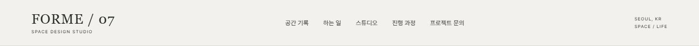 | 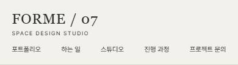 |

<details><summary>스타일 코드 (마크업 구조 + 클래스, 문구는 …) · <a href="code/header.html">code/header.html</a></summary>

```html
<header class="site-header">
  <a class="wordmark">
    …
    <span>…</span>
  </a>
  <nav>
    <a>…</a>
    <!-- ↑ 같은 구조 5개 반복 -->
  </nav>
  <span class="header-note">
    …
    <br />
    …
  </span>
</header>
```

</details>

### 공간 사진과 프로젝트 캡션 `hero`

- 종류: `hero` · 사용 사이트: `space-interior/forme` · 페이지: `/`
- 소스: [`src/app/page.tsx`](..\..\..\templates\space-interior\forme/src/app/page.tsx)

| 데스크톱 1440 | 모바일 390 |
|---|---|
| 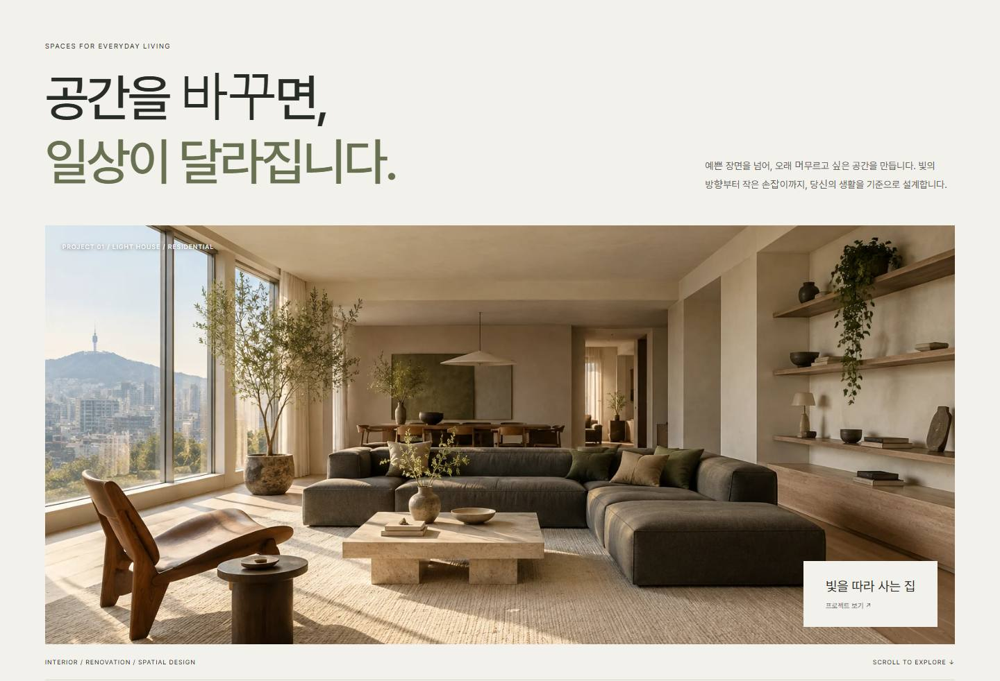 | 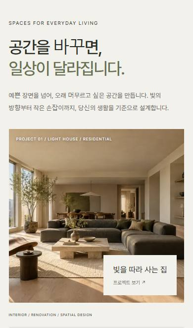 |

<details><summary>스타일 코드 (마크업 구조 + 클래스, 문구는 …) · <a href="code/hero.html">code/hero.html</a></summary>

```html
<section class="hero">
  <div class="hero-title">
    <span class="eyebrow">…</span>
    <h1>
      …
      <br />
      <em>…</em>
    </h1>
    <p>…</p>
  </div>
  <div class="hero-image">
    
    <span class="image-caption">…</span>
    <a class="hero-project">
      …
      <span>…</span>
    </a>
  </div>
  <div class="hero-foot">
    <span>…</span>
    <!-- ↑ 같은 구조 2개 반복 -->
  </div>
</section>
```

</details>

### 주제별 포트폴리오 그리드 `projects`

- 종류: `gallery` · 사용 사이트: `space-interior/forme` · 페이지: `/`
- 소스: [`src/components/StudioTools.tsx`](..\..\..\templates\space-interior\forme/src/components/StudioTools.tsx)

| 데스크톱 1440 | 모바일 390 |
|---|---|
| 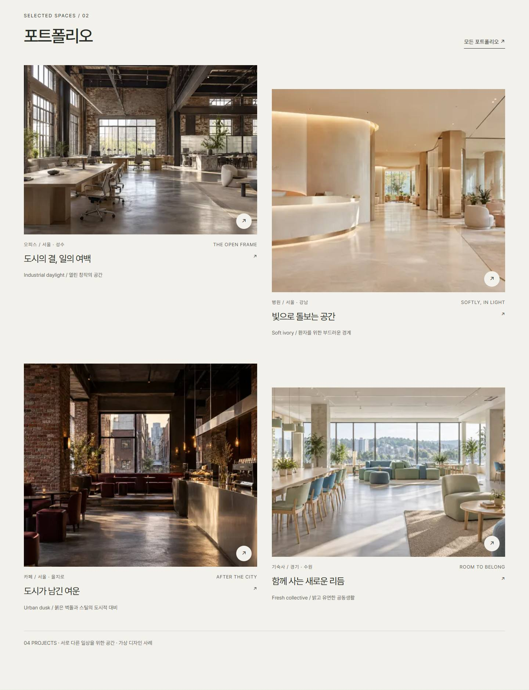 | 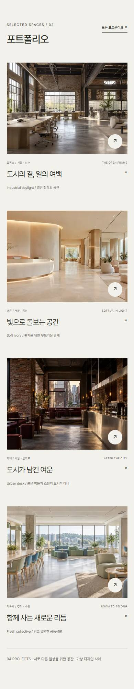 |

<details><summary>스타일 코드 (마크업 구조 + 클래스, 문구는 …) · <a href="code/projects.html">code/projects.html</a></summary>

```html
<section class="section works">
  <div class="section-heading">
    <div>
      <span class="eyebrow">…</span>
      <h2>…</h2>
    </div>
    <a class="text-link">…</a>
  </div>
  <div class="project-gallery">
    <div class="project-grid">
      <a class="project-card">
        <div class="project-image">
          
          <span class="open-mark">…</span>
        </div>
        <div class="project-caption">
          <span class="card-topic">
            <span>
              …
              …
              …
            </span>
            <!-- ↑ 같은 구조 2개 반복 -->
          </span>
          <h3>…</h3>
          <span class="serial">…</span>
          <p class="card-concept">…</p>
        </div>
      </a>
      <!-- ↑ 같은 구조 4개 반복 -->
    </div>
    <p class="small">
      …
      …
      …
      …
    </p>
  </div>
</section>
```

</details>

### 재료 분위기 선택 `materials`

- 종류: `interactive` · 사용 사이트: `space-interior/forme` · 페이지: `/`
- 소스: [`src/components/StudioTools.tsx`](..\..\..\templates\space-interior\forme/src/components/StudioTools.tsx)

| 데스크톱 1440 | 모바일 390 |
|---|---|
| 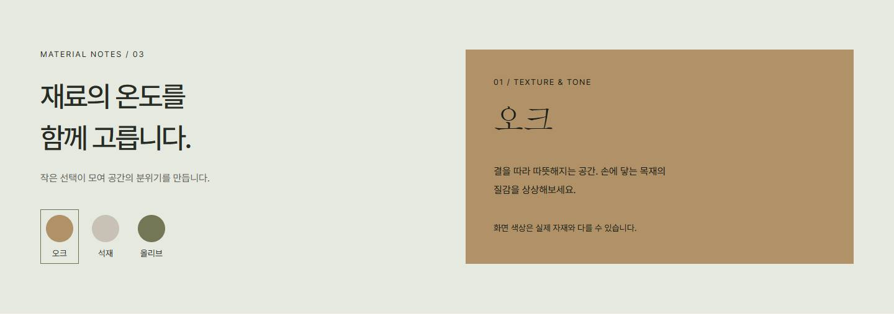 | 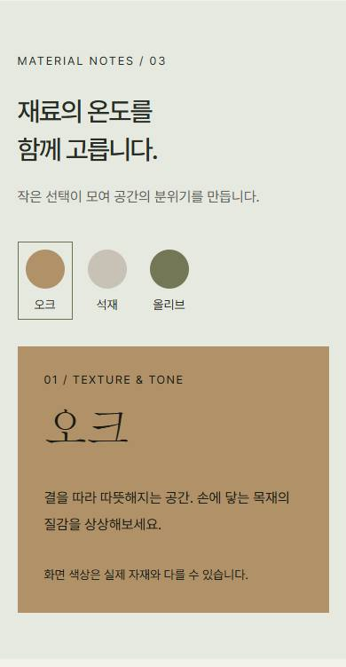 |

<details><summary>스타일 코드 (마크업 구조 + 클래스, 문구는 …) · <a href="code/materials.html">code/materials.html</a></summary>

```html
<section class="material-study">
  <div>
    <span class="eyebrow">…</span>
    <h2>
      …
      <br />
      …
    </h2>
    <p>…</p>
    <div class="swatches">
      <button>
        <span style="background:#b19168"></span>
        …
      </button>
      <!-- ↑ 같은 구조 3개 반복 -->
    </div>
  </div>
  <div class="material-note" style="background:#b19168">
    <span>
      …
      …
      …
    </span>
    <h3>…</h3>
    <p>…</p>
    <span class="small">…</span>
  </div>
</section>
```

</details>

### 상담 준비 요약 `brief`

- 종류: `finder` · 사용 사이트: `space-interior/forme` · 페이지: `/`
- 소스: [`src/components/StudioTools.tsx`](..\..\..\templates\space-interior\forme/src/components/StudioTools.tsx)

| 데스크톱 1440 | 모바일 390 |
|---|---|
| 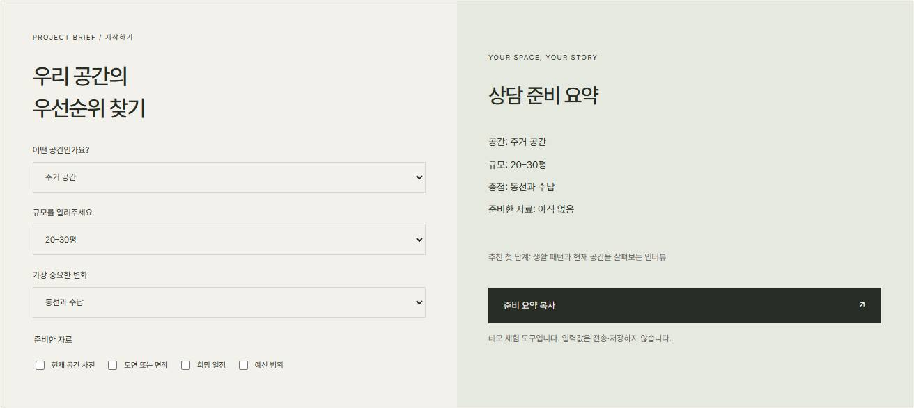 | 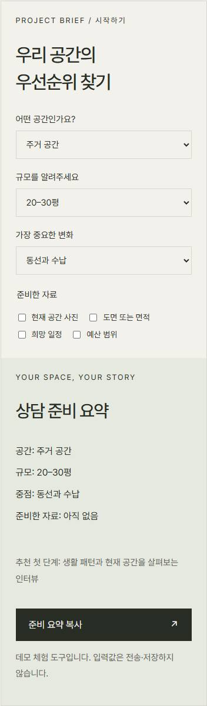 |

<details><summary>스타일 코드 (마크업 구조 + 클래스, 문구는 …) · <a href="code/brief.html">code/brief.html</a></summary>

```html
<div class="brief-builder">
  <div class="brief-fields">
    <span class="eyebrow">…</span>
    <h2>
      …
      <br />
      …
    </h2>
    <label>
      …
      <select>
        <option>…</option>
        <!-- ↑ 같은 구조 3개 반복 -->
      </select>
    </label>
    <!-- ↑ 같은 구조 3개 반복 -->
    <fieldset>
      <legend>…</legend>
      <label class="check">
        <input style="" />
        …
      </label>
      <!-- ↑ 같은 구조 4개 반복 -->
    </fieldset>
  </div>
  <div class="brief-summary">
    <span class="eyebrow">…</span>
    <h3>…</h3>
    <pre>…</pre>
    <p>
      …
      …
    </p>
    <button class="button">
      …
      <span>…</span>
    </button>
    <p class="small">…</p>
  </div>
</div>
```

</details>

### 차콜 스튜디오 푸터 `footer`

- 종류: `footer` · 사용 사이트: `space-interior/forme` · 페이지: `/`
- 소스: [`src/app/layout.tsx`](..\..\..\templates\space-interior\forme/src/app/layout.tsx)

| 데스크톱 1440 | 모바일 390 |
|---|---|
| 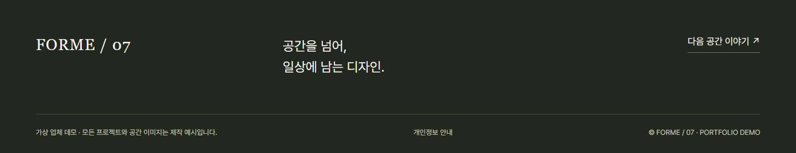 | 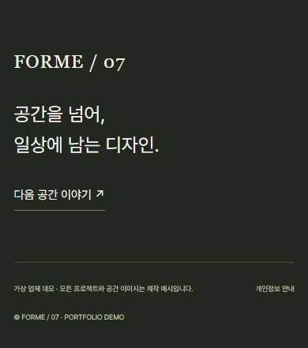 |

<details><summary>스타일 코드 (마크업 구조 + 클래스, 문구는 …) · <a href="code/footer.html">code/footer.html</a></summary>

```html
<footer class="site-footer">
  <div class="footer-top">
    <a class="wordmark">…</a>
    <p>
      …
      <br />
      …
    </p>
    <a class="footer-link">…</a>
  </div>
  <div class="footer-bottom">
    <span>…</span>
    <a>…</a>
    <span>…</span>
  </div>
</footer>
```

</details>

### 프로젝트 주제와 콘셉트 `project-masthead`

- 종류: `content` · 사용 사이트: `space-interior/forme` · 페이지: `/projects/cafe-coast/`
- 소스: [`src/app/projects/[id]/page.tsx`](..\..\..\templates\space-interior\forme/src/app/projects/[id]/page.tsx)

| 데스크톱 1440 | 모바일 390 |
|---|---|
| 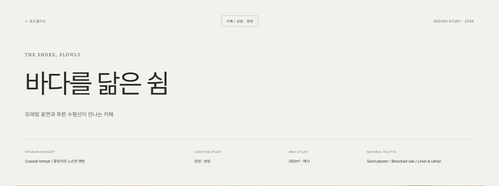 | 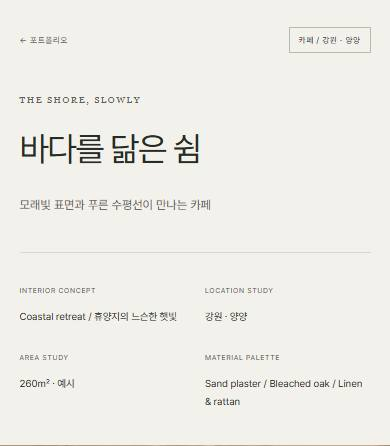 |

<details><summary>스타일 코드 (마크업 구조 + 클래스, 문구는 …) · <a href="code/project-masthead.html">code/project-masthead.html</a></summary>

```html
<section class="project-masthead">
  <div class="project-topline">
    <a>…</a>
    <span class="project-topic">
      …
      …
      …
    </span>
    <span>
      …
      …
    </span>
  </div>
  <span class="project-en">…</span>
  <h1>…</h1>
  <p class="project-subtitle">…</p>
  <div class="project-meta">
    <div>
      <span>…</span>
      <p>…</p>
    </div>
    <!-- ↑ 같은 구조 4개 반복 -->
  </div>
</section>
```

</details>

### 와이드 공간 사진과 캡션 `project-photo`

- 종류: `gallery` · 사용 사이트: `space-interior/forme` · 페이지: `/projects/cafe-coast/`
- 소스: [`src/components/ProjectExperience.tsx`](..\..\..\templates\space-interior\forme/src/components/ProjectExperience.tsx)

| 데스크톱 1440 | 모바일 390 |
|---|---|
| 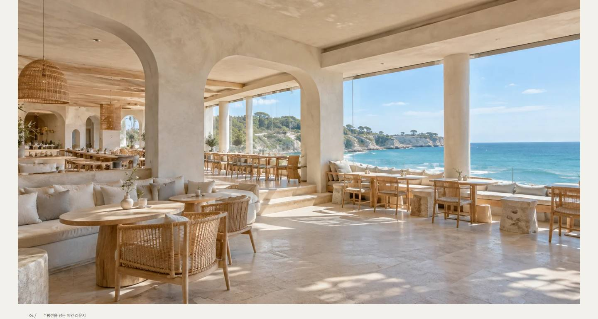 | 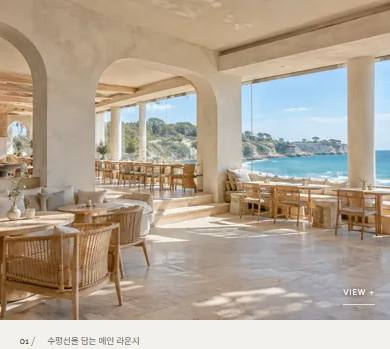 |

<details><summary>스타일 코드 (마크업 구조 + 클래스, 문구는 …) · <a href="code/project-photo.html">code/project-photo.html</a></summary>

```html
<div class="journal-hero">
  <figure class="journal-photo photo-wide">
    <button class="photo-frame">
      
      <span class="photo-open">…</span>
    </button>
    <figcaption>
      <span>
        …
        …
        …
      </span>
      <!-- ↑ 같은 구조 2개 반복 -->
    </figcaption>
  </figure>
</div>
```

</details>

### 진행 과정 사진과 설명 `process-step`

- 종류: `process` · 사용 사이트: `space-interior/forme` · 페이지: `/process/`
- 소스: [`src/components/ProcessSteps.tsx`](..\..\..\templates\space-interior\forme/src/components/ProcessSteps.tsx)

| 데스크톱 1440 | 모바일 390 |
|---|---|
| 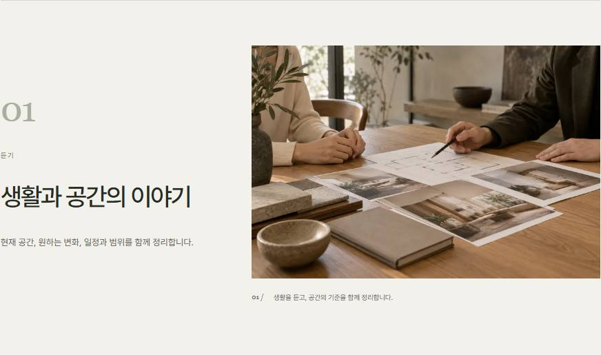 | 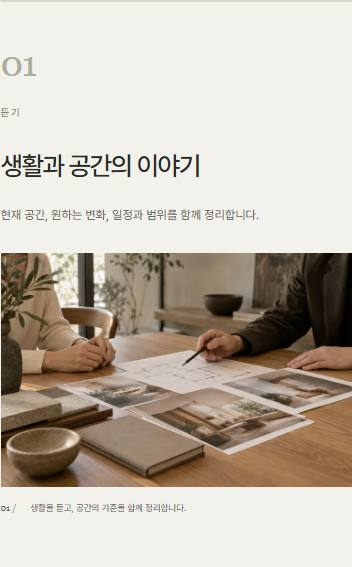 |

<details><summary>스타일 코드 (마크업 구조 + 클래스, 문구는 …) · <a href="code/process-step.html">code/process-step.html</a></summary>

```html
<article class="process-photo-step">
  <div class="process-step-copy">
    <span class="process-number">
      …
      …
    </span>
    <span class="eyebrow">…</span>
    <h2>…</h2>
    <p>…</p>
  </div>
  <figure>
    
    <figcaption>
      <span>
        …
        …
        …
      </span>
      …
    </figcaption>
  </figure>
</article>
```

</details>
